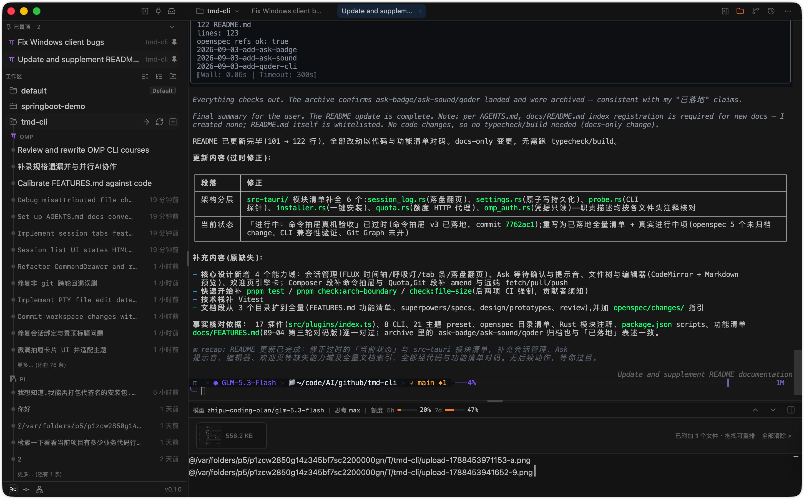
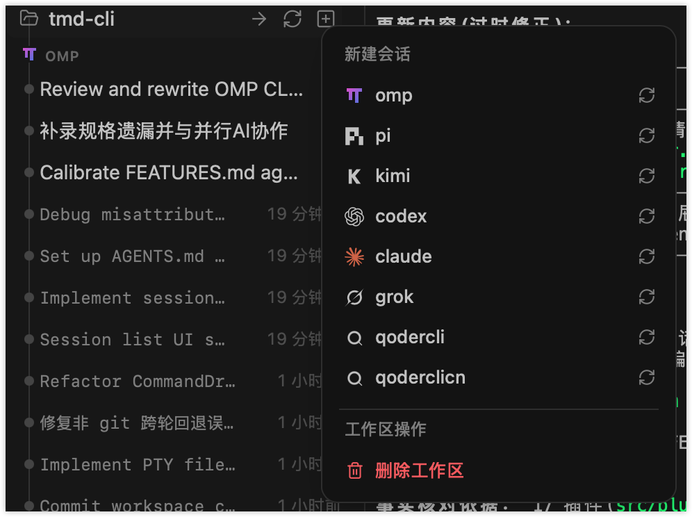
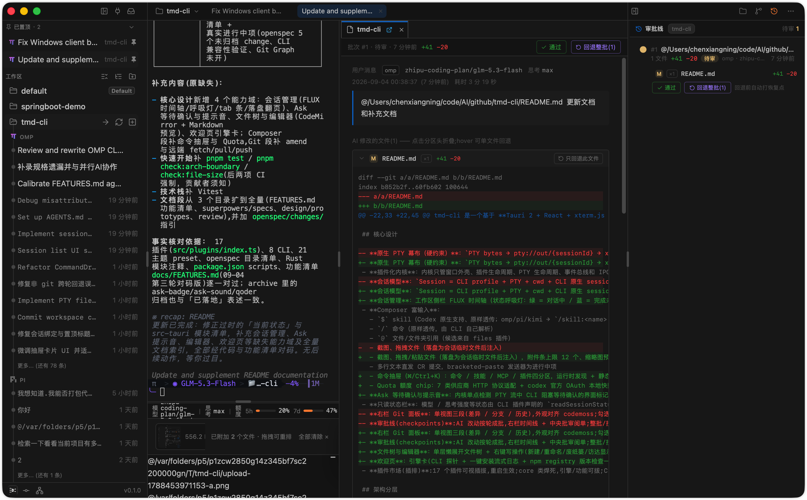
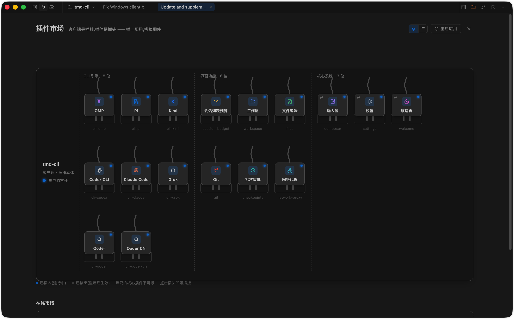
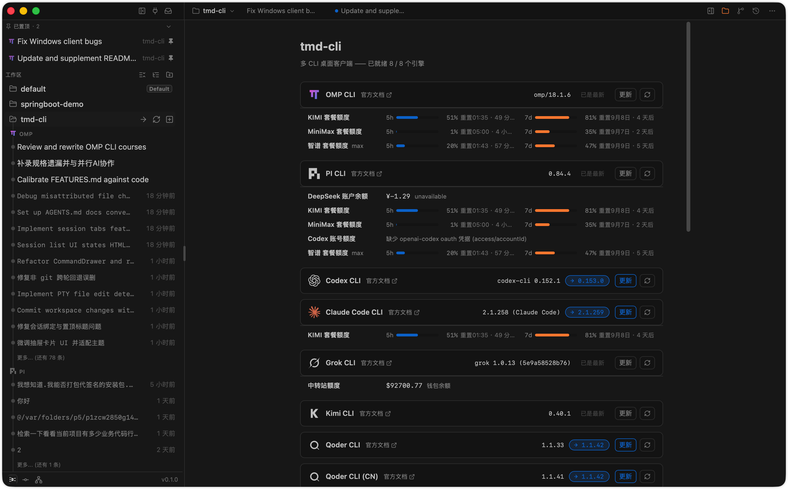

# tmd-cli

<p align="center">
  
</p>

<p align="center">
  <a href="./LICENSE"></a>
  <a href="https://github.com/chenxiangning/tmd-cli/actions/workflows/ci.yml"></a>
  <a href="https://github.com/chenxiangning/tmd-cli/releases"></a>
  
  
</p>

<p align="center">
  <strong>插件化的多 CLI 桌面客户端 —— 一块原生终端幕布 + 一个富输入 Composer，统一驱动 omp / pi / codex / claude / grok / kimi / qoder / qoder-cn 共 8 个 CLI。</strong>
</p>

---

## 这是什么？

tmd-cli 是一个基于 **Tauri 2 + React + xterm.js + PTY** 的桌面应用，把多个 AI Coding CLI（`omp`、`pi`、`codex`、`claude`、`grok`、`kimi`、`qoder`、`qoder-cn`）装进同一个窗口里。它**不重新渲染** CLI 的消息流——中央幕布通过真实 PTY 透传 CLI 原生 TUI 输出，所有增强（模型状态、文件引用、skill 触发、Git、文件树）都发生在幕布之外。

一句话：**CLI 的输出原样呈现，输入侧做富体验增强。**

## 界面速览

**主界面** —— 左栏工作区 FLUX 时间轴(状态呼吸灯)+ 顶栏会话 tab 条 + 中央原生终端幕布(omp 实况透传)+ 底部 Composer(附件 / 模型 / 思考强度 / 额度)



**新建会话菜单** —— 按已注册 CLI 列出 8 个引擎,单项刷新;工作区操作(删除)收在同一菜单



**审批线(checkpoints)** —— 中央批审阅单(用户消息 + AI 修改文件着色 diff)+ 右栏时间线(待审 / 通过 / 回退整批)



**插件市场(插排)** —— 17 个插件可视插拔:CLI 引擎 8 位 / 界面功能 6 位 / 核心系统 3 位(core 焊死)



**欢迎页** —— 引擎卡(CLI 探针 / 版本检查一键更新 / 官方文档外链)+ 多供应商额度盘点



## 核心设计

- **原生 PTY 幕布（硬约束）**：`PTY bytes → pty://out/{sessionId} → xterm.js`，零消息气泡 / Markdown / Diff 二次渲染。⌘/Ctrl+F 幕布内搜索、链接系统浏览器打开、WebGL 上下文丢失自动回退 DOM 渲染。
- **插件化内核**：内核只管窗口外壳、插件生命周期、PTY 生命周期、事件总线和 IPC 边界；插件不互相依赖，通过 `PluginContext` + `EventBus` 协作。
- **会话模型**：`Session = CLI profile + PTY + cwd + CLI 原生 session id`，一个会话固定一个 CLI，恢复由各 CLI 自己的 `resume` 机制承担。磁盘历史扫描 + 身份绑定守护（一个磁盘会话只准一个活会话持有）。
- **会话管理**：工作区侧栏 FLUX 时间轴（状态呼吸灯：绿 = 对话中 / 蓝 = 完成未读 / 灰 = 静止）、置顶双作用域、重命名覆盖层、输出落盘 64MB 旋转日志 + 幕布往前翻页；顶栏会话 tab 条最多同屏 4 个会话一键切换，× 仅摘除不杀会话。
- **Composer 富输入**：
  - `$` skill（Codex 原生支持、原样透传；omp/pi/kimi → `/skill:<name>`、claude → `/<name>`、grok → `/skills <name>`，发送时翻译）
  - `/` 命令（原样透传，由 CLI 自己解析）
  - `@` 文件/文件夹引用（候选来自 files 插件）
  - 截图、拖拽/粘贴文件（落盘为会话临时文件后注入），附件条上限 12 个、缩略图预览
  - 多行文本直发 CR 提交，bracketed-paste 发送器为进行中项
  - 命令抽屉（⌘/Ctrl+K）：命令 / 技能 / MCP / 插件四分区，运行时发现 + 静态表回退
  - Quota 额度 chip：7 类供应商 HTTP 协议适配 + codex 官方 OAuth 本地快照，凭据仅 `$ENV_VAR` 白名单只读解析
- **Ask 等待确认与提示音**：内核单点检测 PTY 流中 CLI 阻塞等待确认的界面标记，会话行绿色胶囊标签 + Ask/轮次结束两路提示音，后台失焦也计未读；全部可在设置页配置。
- **只读状态栏**：模型 / 思考强度等状态由 CLI 插件声明的 `readSessionStatus` 适配器读取各家私有 session JSONL，内核不理解 CLI 私有格式，缺失时显示 `—`。
- **右栏 Git 面板**：单视图三段(差异 / 分支 / 历史),外观对齐 codemoss;勾选文件 + 写消息 + 提交一次完成,支持 amend 与空提交防线;远端 fetch / pull / push 一键执行;commit 执行权仅在面板按钮,composer `/commit <msg>` 仅预填。契约见 `openspec/changes/git-right-panel/`。
- **审批线(checkpoints)**:AI 改动按轮成批,右栏时间线 + 中央批审阅单;整批/按文件回退、应用、反悔恢复;events 双归因,非 git 工作区同样可用;影子对象库只写 blob,永不触碰用户仓库。
- **文件树与编辑器**：单层懒展开文件树 + 右键写操作(新建/重命名/废纸篓/访达显示);CodeMirror 6 中央 tab 编辑器(⌘S 保存、脏标记、按扩展名懒加载语言包);Markdown 预览(GFM + KaTeX 数学 + Mermaid 图 + 大纲浮窗 + 渐进渲染)。
- **欢迎页**：引擎卡(CLI 探针 + 一键安装流式日志 + npm registry 版本检查一键更新)、凭据盘点(已登录供应商与额度一览)、最近会话快速进入。
- **插件市场(插排)**:17 个插件可视插拔,重启生效;core 类焊死,引擎/功能可拔;CLI 品牌字形 + 语义彩色图标。

## 架构分层

```text
React Host
├── src/kernel/       插件契约、生命周期、事件总线、IPC、PTY TerminalView、主题引擎
├── src/app-shell/    外壳(顶栏 / 左栏 / 幕布 / 右栏 / 底部)与挂载点、会话 tab 条
└── src/plugins/      cli-* × 8(omp / pi / kimi / codex / claude / grok / qoder / qoder-cn) · session-budget · workspace · files · git · checkpoints · composer · settings · network-proxy · welcome

Tauri Rust (src-tauri/)
├── pty.rs          portable-pty：spawn / read / write / resize / kill
├── session.rs      Session 元数据注册表
├── session_log.rs  会话输出落盘(64MB 旋转) + 幕布往前翻页读取
├── fs.rs           文件树读取(只读) + fs_edit.rs 文件写操作
├── settings.rs     设置持久化(~/.tmd-cli/settings.json，原子写)
├── probe.rs        CLI 探针(found / path / version，8s 超时)
├── installer.rs    CLI 一键安装(npm -g / claude native，流式日志)
├── quota.rs        额度查询通用 HTTP 代理
├── omp_auth.rs     omp 凭据只读(agent.db sqlite)
├── proxy.rs        进程级代理 env 注入
└── git/ + checkpoints/   libgit2 原语 / 审批线账本 sidecar
```

新增能力的标准路径：

- **UI / CLI 能力** → 新建 `src/plugins/<id>/`，实现 `Plugin` 接口，在 `src/plugins/index.ts` 加一行注册。
- **插件插拔** → 声明 `PluginMeta.category`(engine/feature/core),插件市场写 `settings.disabledPlugins`,重启生效。
- **跨插件基础契约** → 先在 `src/kernel/` 增加稳定类型/原语，再由插件实现。

## 技术栈

| 层 | 选型 |
|---|---|
| 外壳 | Tauri 2（Rust，`portable-pty`） |
| 前端 | React 19 + TypeScript + Vite 8 |
| 终端 | xterm.js + addon-fit |
| 样式 | Tailwind CSS 4 |
| 文件编辑/预览 | CodeMirror 6 · highlight.js · react-markdown · KaTeX · Mermaid |
| 测试 | Vitest |
| 图标 | lucide-react |

## 快速开始

前置：Rust toolchain、Node.js / pnpm，以及本机已安装至少一个目标 CLI（`omp` / `pi` / `codex` / `claude` / `grok` / `kimi` / `qoder` / `qoder-cn`）。

```bash
pnpm install              # 安装依赖
pnpm tauri:dev            # 开发模式（Vite dev server + Tauri 窗口）
pnpm tauri:build          # 打包桌面应用
pnpm typecheck            # TypeScript 检查
pnpm test                 # Vitest 单元测试
pnpm build                # 仅构建前端产物
pnpm check:arch-boundary  # 架构边界检查（CI 强制）
pnpm check:file-size      # 单文件 ≤500 行检查（CI 强制）
```

## 下载安装

从 [GitHub Releases](https://github.com/chenxiangning/tmd-cli/releases) 获取对应平台安装包。产物由 CI 在推送 `v*` tag 时自动构建(macOS universal / Windows x86_64 / Linux x86_64),以 Draft Release 形式落盘,确认后发布。当前产物未签名 / 未公证:macOS 首次打开需在「系统设置 → 隐私与安全性」手动放行。

## 文档

完整设计文档见 [`docs/`](docs/README.md)（索引表随文档同步登记）：

- `docs/FEATURES.md` — 功能清单，需求变更验收总文档，随代码演进逐条对码
- `docs/brainstorm/` — 需求澄清记录
- `docs/research/` — omp / pi / codex / claude / grok / kimi / qoder 能力矩阵（触发器、会话存储、恢复机制实测）
- `docs/architecture/` — 已落地的架构与契约
- `docs/superpowers/specs/` — 正式设计 spec（Composer 工具栏、checkpoints、插件市场、会话 tab 条等）
- `docs/design/` · `docs/prototypes/` — 交互设计原型 html
- `docs/review/` — 评审记录（架构 / 平台 / 冗余）

进行中的变更契约见 `openspec/changes/`（已归档 `archive/`），正式能力规格见 `openspec/specs/`。

## 参与贡献

欢迎 issue 与 PR:

- 贡献指南(环境前置 / 提交规范 / 架构铁则 / 交付前验证):[`CONTRIBUTING.md`](.github/CONTRIBUTING.md)
- 安全漏洞报告:[`SECURITY.md`](.github/SECURITY.md)(走 GitHub 私密安全报告,勿在公开 issue 描述细节)
- 行为准则:[`CODE_OF_CONDUCT.md`](.github/CODE_OF_CONDUCT.md)

## 当前状态

已落地:插件宿主与插件市场(17 个注册插件)、八 CLI profile(omp/pi/codex/claude/grok/kimi/qoder/qoder-cn)、PTY 全生命周期与会话输出落盘翻页、xterm 幕布、工作区 FLUX 时间轴会话列表(呼吸灯/置顶/预算分页)、顶栏会话 tab 条、Composer 全量(触发符/拖拽/截图/命令抽屉 v3/消息锚点栏/Quota/bracketed-paste)、Ask 等待确认检测与双路提示音、右栏 Git 面板全量(差异/分支/历史/远端 fetch/pull/push)、文件树 + CodeMirror 编辑器 + Markdown 预览、审批线(checkpoints 账本:双归因/回退/应用/反悔/影子对象库)、主题引擎(21 个 VS Code preset)、网络代理、欢迎页引擎卡与凭据盘点、只读 session 状态栏。

进行中:CLI 交互式兼容性验证;未归档变更契约见 `openspec/changes/`(composer-command-drawer、git-right-panel、session-budget-standalone、session-list-budget-plugin、fix-checkpoint-session-leak);Git Graph(提交拓扑图)未开,差异视图留有禁用占位。

## License

本项目基于 [MIT License](LICENSE) 开源。Copyright © 2026 Chen Xiangning。
