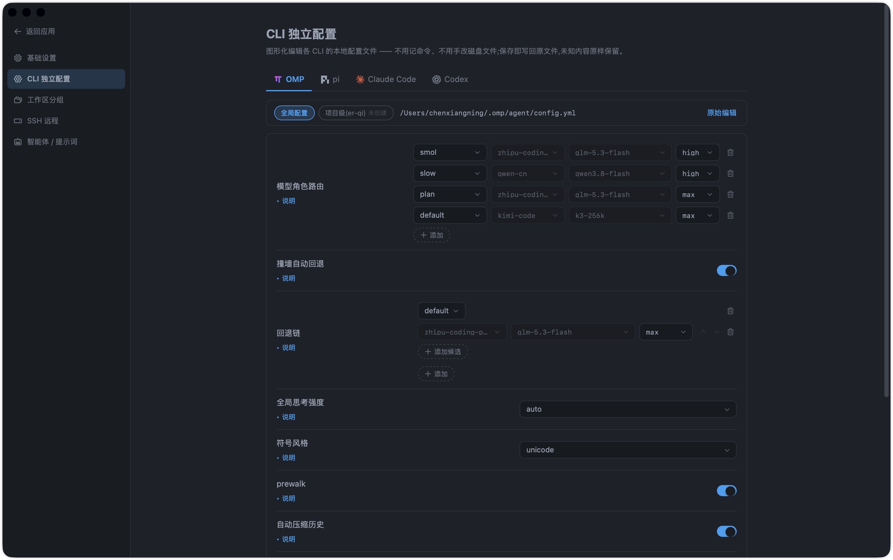

# tmd-cli

<p align="center">
  
</p>

<p align="center">
  中文 | <a href="README_EN.md">English</a>
</p>

<p align="center">
  <a href="./LICENSE"></a>
  <a href="https://github.com/chenxiangning/tmd-cli/actions/workflows/ci.yml"></a>
  <a href="https://github.com/chenxiangning/tmd-cli/releases"></a>
  
  
  <a href="https://linux.do"></a>
</p>

<p align="center">
  <strong>插件化的多 CLI 桌面客户端 —— 一块原生终端幕布 + 一个富输入 Composer，统一驱动 omp / pi / kimi / codex / claude / grok / qoder / qoder-cn / dsh / opencode 共 10 个 CLI，并一等支持 SSH 远程会话。</strong>
</p>

---

## 这是什么？

tmd-cli 是一个基于 **Tauri 2 + React + xterm.js + PTY** 的桌面应用，把多个 AI Coding CLI（`omp`、`pi`、`kimi`、`codex`、`claude`、`grok`、`qoder`、`qoder-cn`、`dsh`、`opencode`）装进同一个窗口里，并可用内建 SSH 引擎把远程主机开成一等会话。它**不重新渲染** CLI 的消息流——中央幕布通过真实 PTY 透传 CLI 原生 TUI 输出，所有增强（模型状态、文件引用、skill 触发、Git、文件树）都发生在幕布之外。

一句话：**CLI 的输出原样呈现，输入侧做富体验增强。** 客户端是插排，插件是插头——插上即用，拔掉即停。

## 界面速览

**主界面** —— 左栏置顶 + 工作区分组会话列表(状态呼吸灯)+ 顶栏会话 tab 条 + 中央原生终端幕布(omp 实况透传)+ 右栏文件树 + 底部 Composer(附件 / 模型 / 思考强度 / 额度状态栏)


**新建会话菜单** —— 按已注册 CLI 列出 10 个引擎 + SSH 连接,单项刷新;会话「移动到组」分组管理收在同一菜单


**审批线(checkpoints)** —— 右栏「审批线 / 时间线」双 tab:AI 改动按轮成批,待审文件逐批列出(+/- 统计),整批通过 / 回退 / 反悔恢复


**插件市场(插排)** —— 内置 24 位可视插拔(CLI 引擎 10 / 界面功能 11 / 核心系统 3 焊死),重启生效;本机插件(`~/.tmd-cli/plugins/`)免重启装载、对话即变自动重扫;在线市场入口预留


**CLI 独立配置** —— 图形化编辑各 CLI 的本地配置文件(OMP / pi / Claude Code / Codex):模型角色路由、撞墙自动回退与回退链、思考强度;保存即写回原文件,未知内容原样保留



**欢迎页** —— 引擎卡(CLI 探针 / 版本检查一键更新 / 官方文档外链)+ 多供应商额度盘点


## 核心设计

- **原生 PTY 幕布（硬约束）**：`PTY bytes → pty://out/{sessionId} → xterm.js`，零消息气泡 / Markdown / Diff 二次渲染。⌘/Ctrl+F 幕布内搜索、链接系统浏览器打开、WebGL 上下文丢失自动回退 DOM 渲染。
- **插件化内核**：内核只管窗口外壳、插件生命周期、PTY 生命周期、事件总线和 IPC 边界；插件不互相依赖，通过 `PluginContext` + `EventBus` 协作。
- **会话模型**：`Session = CLI profile + PTY + cwd + CLI 原生 session id`，一个会话固定一个 CLI，恢复由各 CLI 自己的 `resume` 机制承担。磁盘历史扫描 + 身份绑定守护（一个磁盘会话只准一个活会话持有）。
- **会话管理**：工作区侧栏 FLUX 时间轴（状态呼吸灯：绿 = 对话中 / 蓝 = 完成未读 / 灰 = 静止）、置顶双作用域、自定分组（「移动到组」）、重命名覆盖层、输出落盘 64MB 旋转日志 + 幕布往前翻页；顶栏会话 tab 条最多同屏 4 个会话一键切换，× 仅摘除不杀会话。
- **Composer 富输入**：
  - `$` skill（Codex 原生支持、原样透传；omp/pi/kimi → `/skill:<name>`、claude → `/<name>`、grok → `/skills <name>`，发送时翻译；候选以各 CLI 自身为真相源 —— RPC 副车 / 磁盘扫描，静态表兜底）
  - `/` 命令（原样透传，由 CLI 自己解析；候选来源同 `$`）
  - 截图、拖拽/粘贴文件（落盘为会话临时文件后注入），附件条上限 12 个、缩略图预览
  - 多行文本直发 CR 提交，bracketed-paste 按 profile 声明生效(pi-tui 系,正文包序列防吞回车)
  - 命令抽屉（⌘/Ctrl+K）：命令 / 技能 / MCP / 插件四分区，运行时发现 + 静态表回退
  - Quota 额度 chip：7 类供应商 HTTP 协议适配 + codex 官方 OAuth 本地快照，凭据仅 `$ENV_VAR` 白名单只读解析
- **智能体 / 提示词资产(assets)**：可复用智能体与提示词资产库,Composer 内 `!!`(提示词)/ `##`(智能体)触发消费。
- **CLI 独立配置(cli-config)**：图形化编辑各 CLI 本地配置文件(OMP / pi / Claude Code / Codex)——模型角色路由、撞墙自动回退与回退链、全局思考强度、符号风格等;保存即写回原文件,未知字段原样保留,不用记命令、不用手改磁盘文件。
- **Ask 等待确认与提示音**：内核单点检测 PTY 流中 CLI 阻塞等待确认的界面标记，会话行绿色胶囊标签 + Ask/轮次结束两路提示音，后台失焦也计未读；全部可在设置页配置。
- **只读状态栏**：模型 / 思考强度等状态由 CLI 插件声明的 `readSessionStatus` 适配器读取各家私有 session JSONL，内核不理解 CLI 私有格式，缺失时显示 `—`。
- **右栏 Git 面板**：单视图三段(差异 / 分支 / 历史),外观对齐 codemoss;勾选文件 + 写消息 + 提交一次完成,支持 amend 与空提交防线;远端 fetch / pull / push 一键执行;历史视图 Graph 化(泳道拓扑 + ahead/behind「传入/传出」合成行),点击提交/文件开中央 diff tab;commit 执行权仅在面板按钮,composer `/commit <msg>` 仅预填。契约见 `openspec/changes/git-right-panel/`。
- **审批线(checkpoints)**:AI 改动按轮成批,右栏「审批线 / 时间线」+ 中央批审阅单;整批/按文件回退、应用、反悔恢复;events 双归因,非 git 工作区同样可用;影子对象库只写 blob,永不触碰用户仓库。
- **SSH 一等会话**：russh 引擎，输出与 PTY 会话同构直进幕布（tab 条/缓冲/翻页零分叉）；右栏面板承载连接卡 / 本地端口转发(-L) / SFTP 远端文件树，远端文件可开编辑 tab（mtime+size 乐观并发写回）；known_hosts 信任卡、断线退避重连、HTTP CONNECT / SOCKS5 代理；主机簿与 `~/.ssh/config` 导入在设置页。
- **文件树与编辑器**：单层懒展开文件树 + 右键写操作(新建/重命名/废纸篓/访达显示);CodeMirror 6 中央 tab 编辑器(⌘S 保存、脏标记、按扩展名懒加载语言包);文件渲染档案:图片 / PDF / 表格(csv·xlsx) / docx(mammoth 转换 + 大纲) / 结构化预览,二进制显占位;文件 tab 右键菜单与编辑区最大化切换;Markdown 预览(GFM + KaTeX 数学 + Mermaid 图 + 大纲浮窗 + 渐进渲染)。
- **欢迎页**：引擎卡(CLI 探针 + 一键安装流式日志 + npm registry 版本检查一键更新)、凭据盘点(已登录供应商与额度一览)、最近会话快速进入。
- **内置终端**:头部左区一键新建本地默认 shell 会话(kind=shell 第三类一等会话),幕布 / tab 条 / 缓冲 / 翻页全链路复用;生命周期归内核,拔插件不孤儿化会话。
- **全局快捷键**:内核命令注册表 + 逐作用域分发(global / pty / composer),设置页可视化改键(录制 / 重置 / 冲突检测);macOS 仅 ⌘ 平台分流,Ctrl+M/N/P/W 等按原义透传 PTY 不被劫持。
- **记忆协调(memory-coordinator)**:接入 Magic Context 外部共享记忆库(`~/.magic-context` SQLite,多 CLI 宿主共享,应用零直写);右栏 Memory 面板(FTS 关键词检索 + 项目规则 / 架构 / 约束 / 配置值分类筛选)+ 状态栏 Memory 胶囊 + 控制台中央 tab,二期自动蒸馏 opt-in。
- **版本号弹窗**:底栏版本号点击弹更新记录(内嵌 CHANGELOG 分页),并可在线检查 GitHub 最新发布。
- **插件市场(插排)**:内置 24 个插件可视插拔(引擎 10 / 功能 11 / 核心 3),重启生效;core 类焊死,引擎/功能可拔;CLI 品牌字形 + 语义彩色图标;本机插件(local-loader)管理 `~/.tmd-cli/plugins/`——对话造插件、免重启装载、版本回退,附「复制插件开发提示词」一键上手。

## 架构分层

```text
React Host
├── src/kernel/       插件契约、生命周期、事件总线、IPC、PTY TerminalView、主题引擎
├── src/app-shell/    外壳(顶栏 / 左栏 / 幕布 / 右栏 / 底部)与挂载点、会话 tab 条
└── src/plugins/      cli-* × 10(omp / pi / kimi / codex / claude / grok / qoder / qoder-cn / dsh / opencode) · session-budget · workspace · files · git · checkpoints · composer · settings · network-proxy · ssh · terminal · memory-coordinator · welcome · assets · cli-config · local-loader

Tauri Rust (src-tauri/)
├── pty.rs               portable-pty：spawn / read / write / resize / kill
├── session.rs           Session 元数据注册表
├── session_commands.rs  session_* 命令自 lib.rs 拆件(PTY/SSH 会话按 kind 路由)
├── session_log.rs       会话输出落盘(64MB 旋转) + 幕布往前翻页读取
├── fs.rs                文件树读取(只读) + fs_edit.rs 文件写操作
├── fs_walk.rs           全仓文件索引(gitignore 系) + proc_run.rs 通用短进程通道
├── settings.rs          设置持久化(~/.tmd-cli/settings.json，原子写)
├── probe.rs             CLI 探针(found / path / version，8s 超时)
├── installer.rs         CLI 一键安装(npm -g / claude native，流式日志)
├── quota.rs             额度查询通用 HTTP 代理
├── sqlite.rs            通用 sqlite 代读/代写(READ_ONLY + 参数化;CLI 私有库知识在插件侧)
├── proxy.rs             进程级代理 env 注入
├── ssh/                 russh SSH 会话引擎(transport/auth/forward/sftp,输出走 pty://out 同构事件)
└── git/ + checkpoints/  libgit2 原语 / 审批线账本 sidecar
```

新增能力的标准路径：

- **UI / CLI 能力** → 新建 `src/plugins/<id>/`，实现 `Plugin` 接口，在 `src/plugins/index.ts` 加一行注册。
- **插件插拔** → 声明 `PluginMeta.category`(engine/feature/core),插件市场写 `settings.disabledPlugins`,重启生效;本机插件放 `~/.tmd-cli/plugins/` 由 local-loader 免重启装载。
- **跨插件基础契约** → 先在 `src/kernel/` 增加稳定类型/原语，再由插件实现。

## 技术栈

| 层 | 选型 |
|---|---|
| 外壳 | Tauri 2（Rust，`portable-pty`） |
| 前端 | React 19 + TypeScript + Vite 8 |
| 终端 | xterm.js + addon-fit |
| 样式 | Tailwind CSS 4 |
| 文件编辑/预览 | CodeMirror 6 · highlight.js · react-markdown · KaTeX · Mermaid |
| 测试 | Vitest |
| 图标 | @phosphor-icons/react + CLI 品牌字形 |

## 快速开始

前置：Rust toolchain、Node.js / pnpm，以及本机已安装至少一个目标 CLI（`omp` / `pi` / `kimi` / `codex` / `claude` / `grok` / `qoder` / `qoder-cn` / `dsh` / `opencode`；未装可在欢迎页一键安装）。

```bash
pnpm install              # 安装依赖
pnpm tauri:dev            # 开发模式（Vite dev server + Tauri 窗口）
pnpm tauri:build          # 打包桌面应用
pnpm typecheck            # TypeScript 检查
pnpm test                 # Vitest 单元测试
pnpm build                # 仅构建前端产物
pnpm check:arch-boundary  # 架构边界检查（CI 强制）
pnpm check:file-size      # 单文件 ≤300 行检查（CI 强制）
```

## 下载安装

从 [GitHub Releases](https://github.com/chenxiangning/tmd-cli/releases) 获取对应平台安装包。产物由 CI 在推送 `v*` tag 时自动构建(macOS universal / Windows x86_64 / Linux x86_64),以 Draft Release 形式落盘,确认后发布。

当前 v0.1.4 产物矩阵:

| 平台 | 产物 |
|---|---|
| macOS(universal:arm64 + x86_64) | `tmd-cli_0.1.4_universal.dmg`、`tmd-cli_universal.app.tar.gz` |
| Windows(x86_64) | `tmd-cli_0.1.4_x64-setup.exe`(NSIS)、`tmd-cli_0.1.4_x64_en-US.msi` |
| Linux(x86_64) | `tmd-cli_0.1.4_amd64.AppImage`、`tmd-cli_0.1.4_amd64.deb`、`tmd-cli-0.1.4-1.x86_64.rpm` |

当前产物未签名 / 未公证:macOS 首次打开需在「系统设置 → 隐私与安全性」手动放行。

## 文档

完整设计文档见 [`docs/`](docs/README.md)（索引表随文档同步登记）：

- `docs/FEATURES.md` — 功能清单，需求变更验收总文档，随代码演进逐条对码
- `docs/brainstorm/` — 需求澄清记录
- `docs/research/` — omp / pi / codex / claude / grok / kimi / qoder 能力矩阵（触发器、会话存储、恢复机制实测）
- `docs/architecture/` — 已落地的架构与契约
- `docs/superpowers/specs/` — 正式设计 spec（Composer 工具栏、checkpoints、插件市场、会话 tab 条等）
- `docs/design/` · `docs/prototypes/` — 交互设计原型 html
- `docs/review/` — 评审记录（架构 / 平台 / 冗余）

进行中的变更契约见 `openspec/changes/`（已归档 `archive/`），正式能力规格见 `openspec/specs/`。

## 参与贡献

欢迎 issue 与 PR:

- 贡献指南(环境前置 / 提交规范 / 架构铁则 / 交付前验证):[`CONTRIBUTING.md`](.github/CONTRIBUTING.md)
- 安全漏洞报告:[`SECURITY.md`](.github/SECURITY.md)(走 GitHub 私密安全报告,勿在公开 issue 描述细节)
- 行为准则:[`CODE_OF_CONDUCT.md`](.github/CODE_OF_CONDUCT.md)

## 当前状态

已落地:插件宿主与插件市场(25 个注册插件:CLI 引擎 10 + 界面功能 11 + 核心 3 + 本机插件加载器)、十 CLI profile(omp/pi/kimi/codex/claude/grok/qoder/qoder-cn/dsh/opencode)+ SSH 一等会话(russh 引擎)+ 内置终端(kind=shell)、PTY 全生命周期与会话输出落盘翻页、xterm 幕布、工作区 FLUX 时间轴会话列表(呼吸灯/状态 label/置顶/预算分页/自定分组)、顶栏会话 tab 条、Composer 全量(触发符/拖拽/截图/命令抽屉 v3/消息锚点栏/Quota/bracketed-paste,触发补全以 CLI 为真相源)、智能体/提示词资产库(!! / ## 消费)、CLI 独立配置(图形化编辑各 CLI 配置文件,模型角色路由 / 撞墙回退链)、本机插件(~/.tmd-cli/plugins/ 免重启装载 / 对话造插件 / 版本回退)、Ask 等待确认检测(字节流 + 屏幕态双通道)与双路提示音、右栏 Git 面板全量(差异/分支/历史 Graph 化/提交 diff 中央 tab/远端 fetch/pull/push)、文件树 + CodeMirror 编辑器 + 文件渲染档案(图片/PDF/表格/docx/结构化)+ Markdown 预览、文件 tab 右键菜单与编辑区最大化、审批线(checkpoints 账本:双归因/回退/应用/反悔/影子对象库)、主题引擎(21 个 VS Code preset)、全局界面字号、网络代理、欢迎页引擎卡与凭据盘点、只读 session 状态栏、全局快捷键与可视化改键、版本号弹窗、记忆协调(Memory 面板 FTS 检索 / 胶囊 / 控制台)、Git 分支右键菜单与远端操作对话框、会话 tab 右键菜单。

进行中:命令抽屉真机验收(余 5 项 `[V]`)与 CLI 交互式兼容性验证;未归档变更契约见 `openspec/changes/`(ssh-plugin、composer-command-drawer、git-right-panel、memory-coordinator、session-budget-standalone、session-list-budget-plugin、cli-gui-config、fix-checkpoint-session-leak)。

## License

本项目基于 [MIT License](LICENSE) 开源。Copyright © 2026 Chen Xiangning。

## Friendship Link

Thanks for the support and feedback from the friends at [LINUX DO](https://linux.do).
