# tmd-cli

<p align="center">
  
</p>

<p align="center">
  中文 | <a href="README_EN.md">English</a>
</p>

<p align="center">
  <a href="./LICENSE"></a>
  <a href="https://github.com/chenxiangning/tmd-cli/actions/workflows/ci.yml"></a>
  <a href="https://github.com/chenxiangning/tmd-cli/releases"></a>
  
  
  <a href="https://linux.do"></a>
</p>

<p align="center">
  <strong>插件化的多 CLI 桌面客户端 —— 一块原生终端幕布 + 一个富输入 Composer，统一驱动 omp / pi / kimi / codex / claude / grok / qoder / qoder-cn / dsh / opencode 共 10 个 CLI，一等支持 SSH 远程会话，并配原生手机 App 与浏览器远程访问（内网直连 / Cloudflare / 自建中继）。</strong>
</p>

---

## 这是什么？

tmd-cli 是一个基于 **Tauri 2 + React + xterm.js + PTY** 的桌面应用，把多个 AI Coding CLI（`omp`、`pi`、`kimi`、`codex`、`claude`、`grok`、`qoder`、`qoder-cn`、`dsh`、`opencode`）装进同一个窗口里，并可用内建 SSH 引擎把远程主机开成一等会话。它**不重新渲染** CLI 的消息流——中央幕布通过真实 PTY 透传 CLI 原生 TUI 输出，所有增强（模型状态、文件引用、skill 触发、Git、文件树）都发生在幕布之外。

一句话：**CLI 的输出原样呈现，输入侧做富体验增强。** 客户端是插排，插件是插头——插上即用，拔掉即停。

## 界面速览

**主界面** —— 左栏置顶 + 工作区分组会话列表(状态呼吸灯)+ 顶栏会话 tab 条 + 中央原生终端幕布(omp 实况透传)+ 右栏文件树 + 底部 Composer(附件 / 模型 / 思考强度 / 额度状态栏)

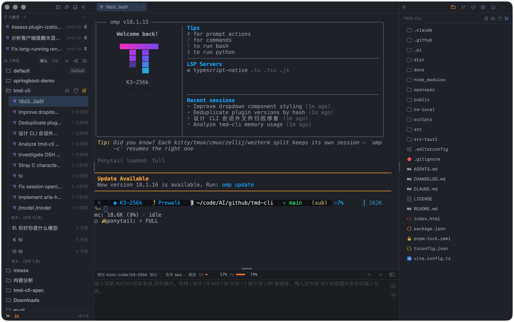

**多会话平铺** —— 打开的会话 tab 全部并排同屏(≥2 个生效),点分栏即聚焦;平铺态 Composer 出现「广播」开关,一次输入喂全部幕布;右栏审批线照常在岗

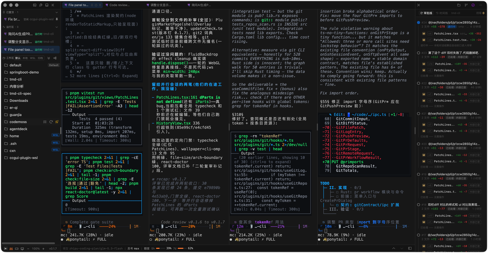

**Git 面板** —— 右栏单视图三段(差异 / 分支 / 历史):变更文件逐条列出(+/- 统计),勾选 + 写消息一键提交(支持 amend 与空提交防线),远端 fetch / pull / push 一键执行;历史视图 Graph 化泳道拓扑

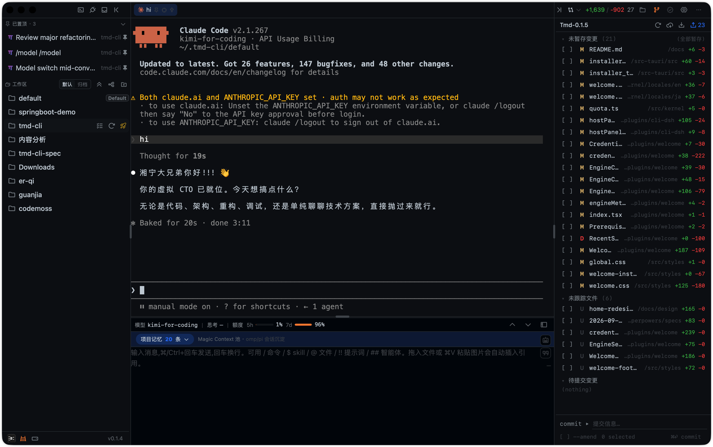

**新建会话菜单** —— 按已注册 CLI 列出 10 个引擎 + SSH 连接,单项刷新;会话「移动到组」分组管理收在同一菜单

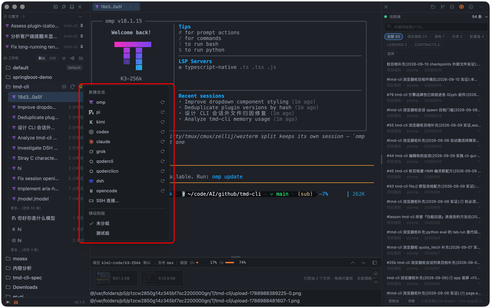

**审批线(checkpoints)** —— 右栏「审批线 / 时间线」双 tab:AI 改动按轮成批,待审文件逐批列出(+/- 统计),整批通过 / 回退 / 反悔恢复

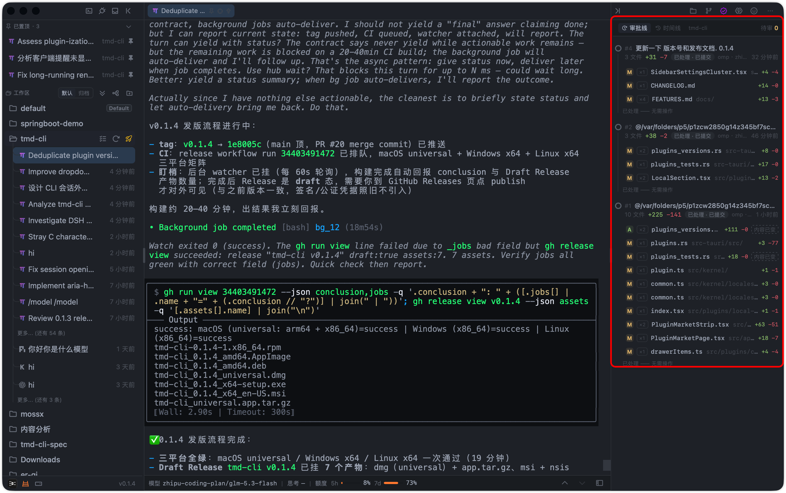

**插件市场(插排)** —— 内置 40 位可视插拔(CLI 引擎 10 / 界面功能 30;另有核心系统 3 焊死与本机插件加载器,共 44 注册),界面功能细分六子组横带铺排;重启生效;本机插件(`~/.tmd-cli/plugins/`)免重启装载、对话即变自动重扫;在线市场入口预留

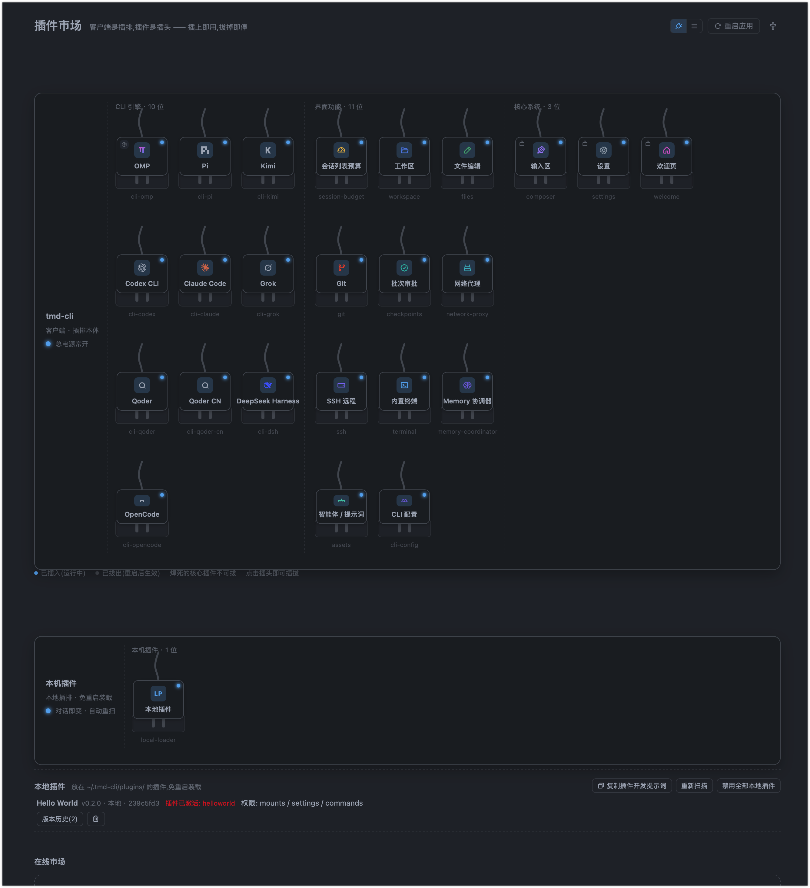

**CLI 独立配置** —— 图形化编辑各 CLI 的本地配置文件(OMP / pi / Claude Code / Codex):模型角色路由、撞墙自动回退与回退链、思考强度;保存即写回原文件,未知内容原样保留

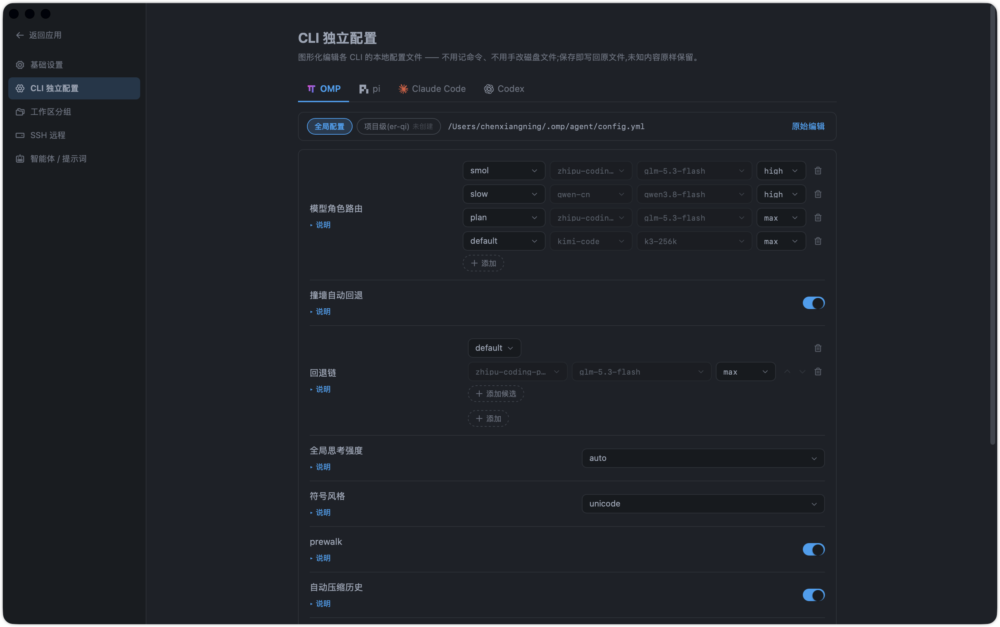

**欢迎页(引擎选择器)** —— 终端窗体造型:prompt 行选工作区 + 引擎全动作行(版本探针 / 凭据 ● 展开额度 / 新会话 / 重装 / 版本回退 / 官方文档),页脚 RESUME 最近会话 / QUOTA 套餐水位 / TOKENS 近 7 日用量

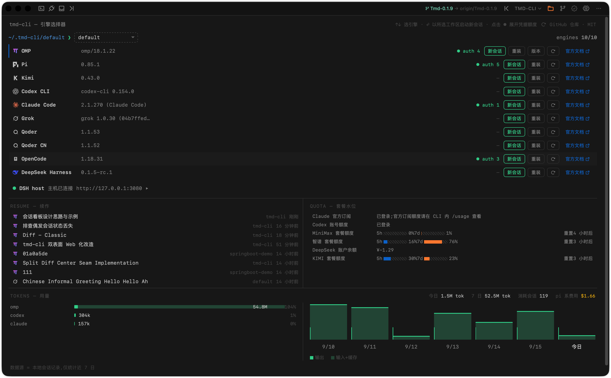

**手机 App** —— 原生壳(iOS / Android),扫码配对桌面后远程驾驶本机会话:会话列表(运行中 / 工作区分组 / 归档)、实况会话屏(终端透传 + 对话分层)、审批卡、键盘工具条、横屏、Git 面板、历史续聊

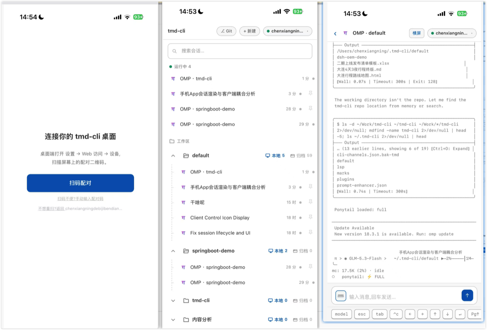

**Web 访问 · 设备配对** —— 桌面端「设置 → Web 访问 → 设备」出配对二维码 / 配对码;设备凭证每台独立 token(桌面只存 sha-256),授权一次长期有效,踢除立即断开该设备全部连接

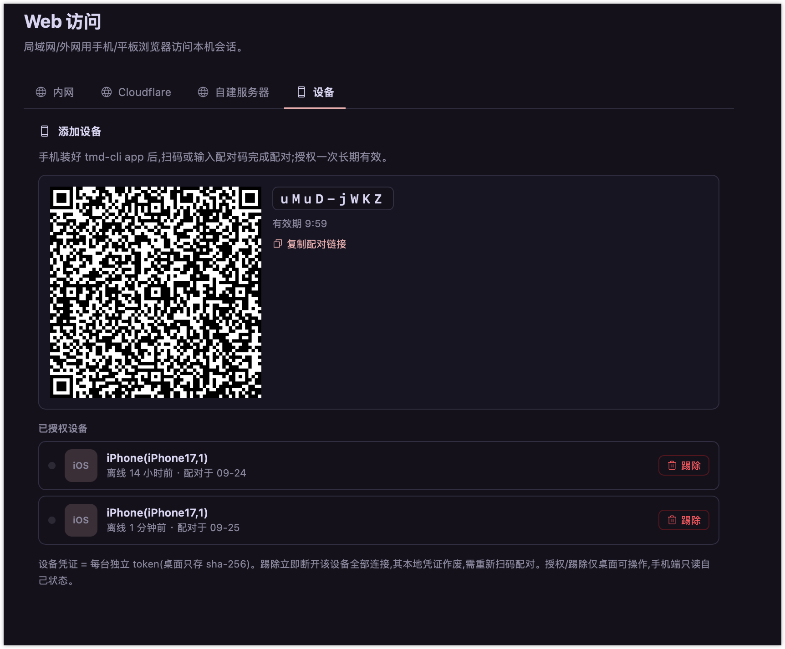

**Web 访问 · 自建中继** —— 一台带公网 IP 的服务器即可:桌面经 SSH 一键部署中继(上传服务 / 现场签发 TLS 证书 / systemd / 健康自检),部署历史一键回填;连接后手机在外网经中继访问本机,中继只搬字节,桥内仍走 token / 设备授权

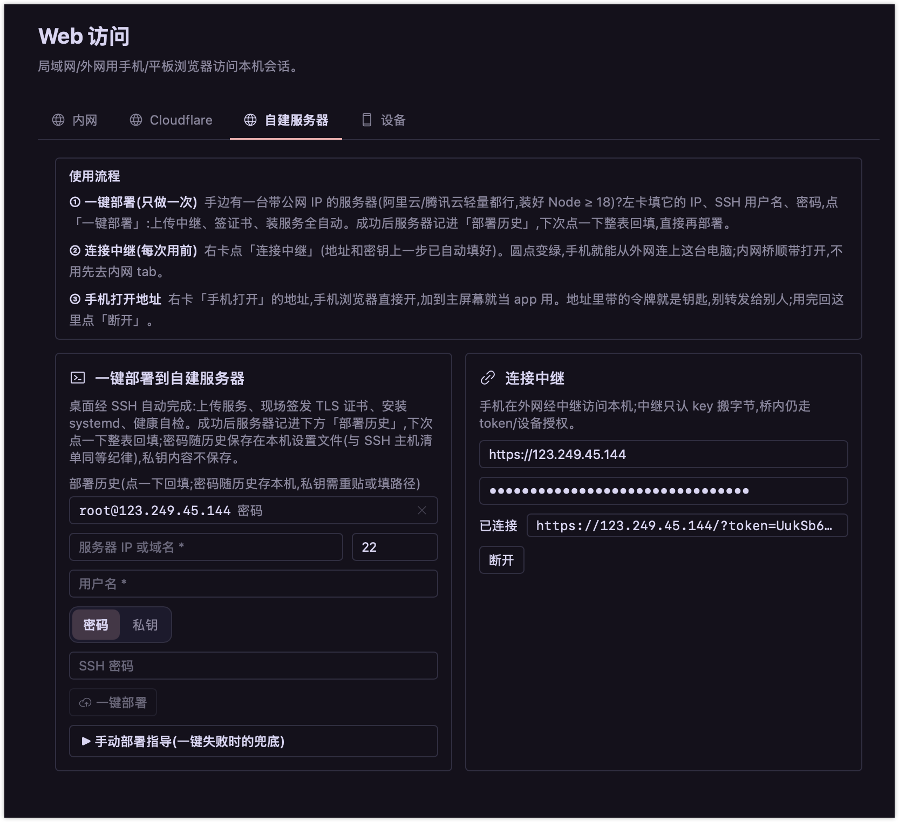

## 核心设计

- **原生 PTY 幕布（硬约束）**：`PTY bytes → pty://out/{sessionId} → xterm.js`，零消息气泡 / Markdown / Diff 二次渲染。⌘/Ctrl+F 幕布内搜索、链接系统浏览器打开;渲染层为 xterm 内建 DOM(弃用 WebGL:WKWebView atlas 长时间运行后静默损坏);右上工具行承载「结构化幕布」切换钮与单会话幕布重建刷新钮。
- **插件化内核**：内核只管窗口外壳、插件生命周期、PTY 生命周期、事件总线和 IPC 边界；插件不互相依赖，通过 `PluginContext` + `EventBus` 协作。
- **会话模型**：`Session = CLI profile + PTY + cwd + CLI 原生 session id`，一个会话固定一个 CLI，恢复由各 CLI 自己的 `resume` 机制承担。磁盘历史扫描 + 身份绑定守护（一个磁盘会话只准一个活会话持有）。
- **会话管理**：工作区侧栏 FLUX 时间轴（状态呼吸灯：绿 = 对话中 / 蓝 = 完成未读 / 灰 = 静止;活会话行 tok/s 响应均速 pill——用量行按行型分派分子 + 近 5 对滑窗平滑、轮结束自动隐藏）、置顶双作用域、自定分组（「移动到组」）、重命名覆盖层、输出落盘 64MB 旋转日志 + 幕布往前翻页；顶栏会话 tab 条最多同屏 4 个会话，一键切换或平铺并排同屏（≥2 个 tab 生效，广播输入可选），× 仅摘除不杀会话；omp 历史会话预热接管秒开（后台预热 + `/resume` 注入热切换 + 早激活，失配降级冷路径）。
- **Composer 富输入**：
  - `$` skill（Codex 原生支持、原样透传；omp/pi/kimi → `/skill:<name>`、claude → `/<name>`、grok → `/skills <name>`，发送时翻译；候选以各 CLI 自身为真相源 —— RPC 副车 / 磁盘扫描，静态表兜底）
  - `/` 命令（原样透传，由 CLI 自己解析；候选来源同 `$`）
  - 截图、拖拽/粘贴文件（落盘为会话临时文件后注入），附件条上限 12 个、缩略图预览
  - 多行文本直发 CR 提交，bracketed-paste 按 profile 声明生效(pi-tui 系,正文包序列防吞回车)
  - 命令抽屉（⌘/Ctrl+K）：命令 / 技能 / MCP / 插件四分区，运行时发现 + 静态表回退
  - Quota 额度 chip：7 类供应商 HTTP 协议适配 + codex 官方 OAuth 本地快照，凭据仅 `$ENV_VAR` 白名单只读解析
- **智能体 / 提示词资产(assets)**：可复用智能体与提示词资产库,Composer 内 `!!`(提示词)/ `##`(智能体)触发消费。
- **CLI 独立配置(cli-config)**：图形化编辑各 CLI 本地配置文件(OMP / pi / Claude Code / Codex)——模型角色路由、撞墙自动回退与回退链、全局思考强度、符号风格等;保存即写回原文件,未知字段原样保留,不用记命令、不用手改磁盘文件。
- **Ask 等待确认与提示音**：内核单点检测 PTY 流中 CLI 阻塞等待确认的界面标记，会话行绿色胶囊标签 + Ask/轮次结束两路提示音，后台失焦也计未读；系统通知（notify 插件）在窗口失焦时把 Ask 等待/轮次结束/会话退出与额度撞墙预警送出窗口（tauri-plugin-notification，仅在失焦时发送，设置页可分类开关）。全部可在设置页配置。
- **异常退出兜底**:PTY 退出码打通,非正常退出弹右下角 toast + 一键续聊(原样 resume);失焦时同步走系统通知。
- **会话卫生清扫**:超期(默认 24h)未活跃会话自动归档、空会话自动删除,挂磁盘扫描结算点零轮询,开关与时窗在设置页。
- **审批收件箱(approval-inbox)**:右栏「审批」页签聚合所有等待确认的会话,一键直达并自由文本应答(纯消费内核 ask 状态位,零新增检测)。
- **增强提示词(prompt-enhancer)**:composer ✦ 一键把草稿交给 CLI 改写,并排对照后回填,不改原始会话。
- **会话历史检索(session-search)**：命令面板发起,按**你输入过的内容**全文检索当前工作区的磁盘历史会话(数据源 = 各 CLI profile 声明的用户消息解析器,与对话锚点栏同源);索引增量后台构建、mtime 缓存,命中即一键续聊。
- **跨引擎接力(session-relay)**：额度撞墙/卡死/想换引擎时,命令一键把当前会话的「最近用户输入摘要」带到新引擎的新会话(同 cwd/工作区);摘要确定性拼装、可预览可编辑再发,零 AI 调用。
- **只读状态栏**：模型 / 思考强度等状态由 CLI 插件声明的 `readSessionStatus` 适配器读取各家私有 session JSONL，内核不理解 CLI 私有格式，缺失时显示 `—`。
- **右栏 Git 面板**：单视图三段(差异 / 分支 / 历史),外观对齐 codemoss;勾选文件 + 写消息 + 提交一次完成,支持 amend 与空提交防线;远端 fetch / pull / push 一键执行;历史视图 Graph 化(泳道拓扑 + ahead/behind「传入/传出」合成行),点击提交/文件开中央 diff tab(双栏并排对位:中央行号槽、红绿同行成对、词级下划线、自动换行开关落盘);commit 执行权仅在面板按钮,composer `/commit <msg>` 仅预填。契约见 `openspec/changes/archive/2026-09-02-git-right-panel/`。
- **审批线(checkpoints)**:AI 改动按轮成批,右栏「审批线 / 时间线」+ 中央批审阅单;整批/按文件回退、应用、反悔恢复;events 双归因,非 git 工作区同样可用;影子对象库只写 blob,永不触碰用户仓库。
- **Worktree 关联管理**:Git 面板常驻「工作树」区(三态卡 + 每树脏净 + 打开/终端/移除)、分支按检出归属三分区(检出中不给误删钮)、「建树」入口预填弹窗;侧栏同仓 worktree 卡归簇共框;新建分支统一 `wt/` 前缀,移除时安全清分支尾巴(未合并保留并说明)。契约见 `docs/architecture/16`。
- **CLI 学堂(academy)**:左栏入口 + 指南 tab + 入门课向导,九家 CLI 的课程数据由各引擎插件经内核注册面供给(kernel 零 CLI 语义),进度本地持久化。契约见 `docs/architecture/15`。
- **技能中心(skill-hub)**:十家 CLI 技能统一管理——ClawHub 商店 / 本地导入 / 商店安装统一写 installed-skills.json 落位记录,已装视图带来源徽标与落位摘要,本地导入支持搜索过滤;技能落公约位 `~/.agents/skills` 并按引擎 symlink;composer `$` 候选 = 安装记录 ∩ 当前 CLI profile 可用技能。
- **MCP 中心(mcp-hub)**:六家 CLI 的 MCP 服务器配置管理,写回走各 CLI 自己的配置文件并预写 `.bak-tmd` 备份;三源商店(官方注册表 / ClawHub / 导入桥),`mcp_probe` 原语探活;引擎导航收口右栏面板可点行。
- **意图画布(intent-canvas)**:Excalidraw 白板——管理页时间分组 / 搜索 / 缩略图 / 批量删除,画布可压缩成结构化 JSON 上下文附加到会话发送;「对话中 AI 直接作画」:composer 左下会话级作画标识默认零注入,AI 产物经收件箱通道导入画布,作画标签绑定形状与分层布局、箭头端点吸附消穿越;入口 ⌘⌥I。
- **会话查看器(session-viewer)**:omp / pi / claude / codex / kimi / dsh 六族转录解析,零 PTY 只读查看;会话行齿轮环形动作(查看 / 置顶 / 复制 ID / 重命名)磁盘 / 活 / 置顶 / 运行四类行统一;思考链短语随组折叠,用户消息内嵌图片(omp fileMention 粘贴图等)直接渲染。
- **结构化会话(structured-session)**:omp / pi `--mode rpc` 无人值守子进程 token 级流式(思考 / 正文 / 工具调用 delta 原地累积),幕布 | 结构化双视图一键切换,审批卡直接作答(confirm 回路)——PTY 零涉及,与原生幕布互补;底层为 Rust `proc_stream` 通用长驻流式原语(内核零 CLI 协议知识,契约见 `docs/architecture/19`)。
- **每日工作日志(daily-journal)**:年 / 月 / 轴三视图日历回溯每日工作;每日一篇 AI 汇总文章(真实 CLI 生成会话直写 md,增量并入留痕,可打开插话干涉);每日便签(空日可写,⌘V 贴截图,与文章独立落盘);后台任务队列(定时 / 手动 / 增量 / 重试统一管理,失焦不中断);节假日关联(holiday-cn 联网缓存,断网周末底纹保底)。
- **SSH 一等会话**：russh 引擎，输出与 PTY 会话同构直进幕布（tab 条/缓冲/翻页零分叉）；右栏面板承载连接卡 / 本地端口转发(-L) / SFTP 远端文件树，远端文件可开编辑 tab（mtime+size 乐观并发写回）；known_hosts 信任卡、断线退避重连、HTTP CONNECT / SOCKS5 代理；主机簿与 `~/.ssh/config` 导入在设置页。
- **WSL 支持(M1)**：本机发行版(UNC 工作区 + `wsl.exe` spawn 包装)与远程 Windows 宿主(SSH 通道 + b64 载荷)双形态;引擎探针 / 远程历史 / 状态观测 / `wslr://` 只读文件通道;git 面板与 checkpoints 按 kind 置灰降级提示不静默。
- **文件树与编辑器**：单层懒展开文件树 + 右键写操作(新建/重命名/废纸篓/访达显示);CodeMirror 6 中央 tab 编辑器(⌘S 保存、脏标记、按扩展名懒加载语言包);文件渲染档案:图片 / PDF / 表格(csv·xlsx) / docx(mammoth 转换 + 大纲) / 结构化预览,二进制显占位;文件 tab 右键菜单与编辑区最大化切换;Markdown 预览(GFM + KaTeX 数学 + Mermaid 图 + 大纲浮窗 + 渐进渲染)。
- **欢迎页(引擎选择器)**：终端窗体造型的无会话首页——↑↓ 选引擎、⏎ 以所选工作区启动新会话、点击 ● 展开凭据额度;引擎全动作行(CLI 探针 + 前置依赖门控 + 一键安装流式日志 + npm registry 版本检查一键更新 + 版本回退菜单(最新 10 个稳定版 + 收藏钉版) + 官方文档外链);页脚三段:RESUME(全工作区 × 已装 CLI 磁盘会话时间倒序 8 条,点击直接续上)/ QUOTA(按供应商去重聚合套餐水位 + 重置倒计时)/ TOKENS(每引擎用量 + 近 7 日图表,数据源为本地会话记录)。
- **内置终端**:右缘面板 rail 一键新建本地默认 shell 会话(kind=shell 第三类一等会话),幕布 / tab 条 / 缓冲 / 翻页全链路复用;生命周期归内核,拔插件不孤儿化会话。
- **全局快捷键**:内核命令注册表 + 逐作用域分发(global / terminal / editor),设置页可视化改键(录制 / 重置 / 冲突检测);macOS 仅 ⌘ 平台分流,Ctrl+M/N/P/W 等按原义透传 PTY 不被劫持。
- **图标装饰与五套组合**:34 个界面图标(面板 / 顶栏 / 工作区行 / composer 工具条与输入轨)独立取色 + 呼吸闪烁;五套图标组合一键切换(现状 / 实心 / 换隐喻 / Lucide 细线 / 细线变体,组合 4↔5 经 morphicons 弹簧变形过渡),中央 tab 徽标与装饰键位随组合联动。
- **主题与设计系统**:31 个 VS Code preset 之外新增六套 tmd 原创低饱和主题(浅色云白 / 雾灰 / 暖帛,深色石墨 / 黛蓝 / 暖炭;默认浅色云白、深色石墨,自带降饱和终端 ANSI 16 色表);设计系统 token 阶梯一次建齐(字号六档正文 12px / 间距 4 栅格 / 圆角五档 / 动效三档),状态三原语(空态 / 加载 / 错误契约三分)全仓统一;原生 confirm/prompt/alert 清零,破坏性操作一律仓内确认弹层。
- **记忆协调(memory-coordinator)**:接入 Magic Context 外部共享记忆库(`~/.magic-context` SQLite,多 CLI 宿主共享,应用零直写);右栏 Memory 面板(FTS 关键词检索 + 项目规则 / 架构 / 约束 / 配置值分类筛选)+ 状态栏 Memory 胶囊 + 控制台中央 tab,二期自动蒸馏 opt-in。
- **版本号弹窗与自动更新**：底栏版本号点击弹更新记录(内嵌 CHANGELOG 分页,条目行内 Markdown 渲染),在线检查 GitHub 最新发布,一键自动更新(updater 签名校验,下载安装后提示重启)。
- **插件市场(插排)**:内置 40 位可视插拔(引擎 10 / 功能 30;核心 3 焊死,另有本机插件加载器),界面功能细分六子组横带铺排,重启生效;core 类焊死,引擎/功能可拔;CLI 品牌字形 + 语义彩色图标;本机插件(local-loader)管理 `~/.tmd-cli/plugins/`——对话造插件、免重启装载、版本回退,附「复制插件开发提示词」一键上手。
- **工作区壁纸(wallpaper)**：流体着色器(WebGL 五运动场,明暗随主题)与本地图库双模式;表面 token 打穿让 chrome 透出壁纸,浮层菜单保实底可读,xterm 幕布透底;拔插件全部下电,kernel 零壁纸语义(契约见 `docs/architecture/11`)。
- **手机 App(native shell)**：iOS(SwiftUI + WKWebView)与 Android(Kotlin + WebView)原生壳,加载独立的 `src/mobile/` 远程 UI 树(与桌面 app-shell 平行,共享 kernel transport 数据面)。扫码配对后:卡片化首页(置顶 / 运行中 / 工作区分组 / 本地 / 归档,审批计数胶囊)、实况会话屏(`PTY bytes` 原样透传的迷你 VT 实况 + CLI 磁盘 jsonl 解析的对话分层——用户气泡 / 助手 markdown 正文 / 工具调用折叠组,2s 增量轮询随流生长)、三态胶囊输入区(常态胶囊条 / 挂图卡 + 提示 chips /「+」四格面板)与相册选图 · 拍照上传、ask 审批卡(允许 / 拒绝 = 同一 `session_write` 通道)、两行大键快捷键条(真实键序列)、横屏、Git 面板、历史只读与「继续对话」(resume 注入,与桌面 openDiskSession 同语义)。iOS WKWebView 自定义 scheme 发不出 ws,连接走原生 URLSession 隧道;直连 WS 双侧心跳保活(15s Ping + pong 死线自愈,治 NAT 静默回收),断线退避 + 多端点竞速自动重连,回前台强制重拨。
- **Web 访问与远程通道**：桌面「设置 → Web 访问」承载手机 / 平板的全部入口。三通道:内网直连(`ws://` 局域网)、Cloudflare 隧道、自建服务器中继(桌面经 SSH 一键部署:上传中继服务 + 现场签发 TLS 证书 + systemd 安装 + 健康自检,部署历史随存回填,另有手动部署兜底指引);自建中继走动态 TLS 证书钉住(pin)。安全模型:设备凭证 = 每台独立 token,桌面只存 sha-256,踢除立即断开该设备全部连接;中继只认 key 搬字节,桥内仍走 token / 设备授权。浏览器直接打开带 token 的地址即用,可加主屏幕当 app;连接态是持续状态(顶栏主机芯片 + 断连 banner),不是一扇门。
- **右缘面板 rail**:右栏面板入口(files / git / marks / checkpoints / 审批 / memory / Skills / MCP / 意图画布 / 会话看板)收进窗口右缘常驻竖排工具条(activity bar 形态),按工作区 / 会话 / 机器 / 能力生态四簇归组分隔,底簇上方竖排手写签名;钉住与 ⋯ 溢出经 rail;面板 icon 可逆开合折叠右栏,hub 类面板联动打开中央 tab、切换清残留。
- **左缘工具 rail 与工作区显隐**(2026-10-04):窗口左缘常驻竖排工具条(右缘 rail 的镜像)——顶簇 会话看板 / 插件市场 / 回到首页 / 工作区切换;网络代理入口在同日迁右缘 rail 底簇。插件入口经 sidebarActions 注册面直挂,壳只渲染注册表。左下角多选菜单控制左栏显示哪些工作区(隐藏清单持久化;勾选恢复显示时活动工作区顺带切一次、右侧文件树跟切但不强绑定);底栏界面缩放组隐藏,⌘+/⌘−/⌘0 键位接管。
- **渲染健康守望**:macOS WKWebView 偶发「吊销粘死」(窗口在前台而像素冻结)的自愈体系——rAF 探针看门狗 + 壳侧 set_focus→reload 阶梯击打,PTY 泵洪水计量(洪水期降级、3 分钟宽限强击)、后台会话输出慢拍降档(无人在视 / 渲染暂停钳 250ms 聚合)、隐藏幕布合帧写入、幕布数据链停滞自动重建;会话 / PTY 跨 reload 存活,自愈不丢现场(契约见 `docs/architecture/17`)。

## 架构分层

```text
React Host
├── src/kernel/       插件契约、生命周期、事件总线、IPC、PTY TerminalView、主题引擎
├── src/app-shell/    外壳(顶栏 / 左栏 / 幕布 / 右栏 / 底部)与挂载点、会话 tab 条
├── src/mobile/       手机远程 UI 树(iOS / Android 壳与浏览器加载;与 app-shell 平行,共享 transport 数据面)
└── src/plugins/      cli-* × 10(omp / pi / kimi / codex / claude / grok / qoder / qoder-cn / dsh / opencode) · session-budget · workspace · files · git · checkpoints · composer · settings · network-proxy · ssh · terminal · memory-coordinator · welcome · assets · cli-config · local-loader · wsl · wallpaper · marks · search · web-access · session-board · intent-canvas · lsp · prompt-enhancer · approval-inbox · academy · notify · session-search · session-relay · skill-hub · mcp-hub · session-viewer · daily-journal · structured-session(共 44 注册)

Tauri Rust (src-tauri/)
├── pty.rs               portable-pty：spawn / read / write / resize / kill
├── session.rs           Session 元数据注册表
├── session_commands.rs  session_* 命令自 lib.rs 拆件(PTY/SSH 会话按 kind 路由)
├── session_log.rs       会话输出落盘(64MB 旋转) + 幕布往前翻页读取
├── session_disk_log.rs spawn 代日志指针与磁盘尾读(磁盘先行回放寻址)
├── fs.rs                文件树读取(只读) + fs_edit.rs 文件写操作
├── fs_walk.rs           全仓文件索引(gitignore 系) + proc_run.rs 通用短进程通道
├── settings.rs          设置持久化(~/.tmd-cli/settings.json，原子写)
├── probe.rs             CLI 探针(found / path / version，8s 超时)
├── installer.rs         CLI 一键安装(npm -g / claude native，流式日志)
├── quota.rs             额度查询通用 HTTP 代理
├── sqlite.rs            通用 sqlite 代读/代写(READ_ONLY + 参数化;CLI 私有库知识在插件侧)
├── mcp_probe.rs        MCP 服务器探活原语(mcp-hub 消费)
├── proxy.rs             进程级代理 env 注入
├── ssh/                 russh SSH 会话引擎(transport/auth/forward/sftp,输出走 pty://out 同构事件)
├── wsl*.rs             WSL 通道原语(发行版 / 远程探测 / 引擎探针 / b64 exec / 文件读取)
├── web/                 Web 访问桥(WS 桥服务器 / dispatch 镜像 / 设备授权 / 外网中继客户端 / 自建中继 SSH 一键部署)
├── lsp.rs + git/ + checkpoints/  LSP 进程通道(Content-Length 组帧)/ libgit2 与 worktree shell-out / 审批线账本 sidecar
```

新增能力的标准路径：

- **UI / CLI 能力** → 新建 `src/plugins/<id>/`，实现 `Plugin` 接口，在 `src/plugins/index.ts` 加一行注册。
- **插件插拔** → 声明 `PluginMeta.category`(engine/feature/core),插件市场写 `settings.disabledPlugins`,重启生效;本机插件放 `~/.tmd-cli/plugins/` 由 local-loader 免重启装载。
- **跨插件基础契约** → 先在 `src/kernel/` 增加稳定类型/原语，再由插件实现。

## 技术栈

| 层 | 选型 |
|---|---|
| 外壳 | Tauri 2（Rust，`portable-pty`） |
| 前端 | React 19 + TypeScript + Vite 8 |
| 终端 | xterm.js + addon-fit |
| 样式 | Tailwind CSS 4 |
| 文件编辑/预览 | CodeMirror 6 · Prism · react-markdown · KaTeX · Mermaid |
| 移动端 | SwiftUI + WKWebView(iOS) · Kotlin + WebView(Android) |
| 测试 | Vitest |
| 图标 | @phosphor-icons/react + CLI 品牌字形 |

## 快速开始

前置：Rust toolchain、Node.js / pnpm，以及本机已安装至少一个目标 CLI（`omp` / `pi` / `kimi` / `codex` / `claude` / `grok` / `qoder` / `qoder-cn` / `dsh` / `opencode`；未装可在欢迎页一键安装）。

```bash
pnpm install              # 安装依赖
pnpm tauri:dev            # 开发模式（Vite dev server + Tauri 窗口）
pnpm tauri:build          # 打包桌面应用
scripts/build-device.sh --install   # 手机壳真机构建 + 安装(前端 dist 与壳同包,自动签名;需 Xcode)
pnpm typecheck            # TypeScript 检查
pnpm test                 # Vitest 单元测试
pnpm build                # 仅构建前端产物
pnpm check:arch-boundary  # 架构边界检查（CI 强制）
pnpm check:file-size      # 单文件 ≤300 行检查（CI 强制）
pnpm check:i18n-keys      # i18n 三语键位校验（CI 强制）
```

## 下载安装

从 [GitHub Releases](https://github.com/chenxiangning/tmd-cli/releases) 获取对应平台安装包。产物由 CI 在推送 `v*` tag 时自动构建(macOS universal / Windows x86_64 / Linux x86_64),以 Draft Release 形式落盘,确认后发布。

当前 v0.2.9 产物矩阵:

| 平台 | 产物 |
|---|---|
| macOS(universal:arm64 + x86_64) | `tmd-cli_0.2.9_universal.dmg`、`tmd-cli_universal.app.tar.gz` |
| Windows(x86_64) | `tmd-cli_0.2.9_x64-setup.exe`(NSIS)、`tmd-cli_0.2.9_x64_en-US.msi` |
| Linux(x86_64) | `tmd-cli_0.2.9_amd64.AppImage`、`tmd-cli_0.2.9_amd64.deb`、`tmd-cli-0.2.9-1.x86_64.rpm` |

当前产物默认未签名 / 未公证:macOS 首次打开需在「系统设置 → 隐私与安全性」手动放行。Release 管道已支持 macOS 代码签名 + 公证(配置 `APPLE_*` repo secrets 即自动启用,见 release.yml);Windows 签名待证书采购形态拍板后接线。

手机端 App 随 Release 附 Android APK(仓内 keystore 自签,侧载可装)与 iOS 未签名包;也可从源码经 `scripts/build-device.sh --install`(iOS,需 Xcode 签名)本地构建,或在桌面开启 Web 访问后手机浏览器直接打开带 token 的地址(可加主屏幕当 app 用)。

## 文档

完整设计文档见 [`docs/`](docs/README.md)（索引表随文档同步登记）：

- `docs/FEATURES.md` — 功能清单，需求变更验收总文档，随代码演进逐条对码
- `docs/brainstorm/` — 需求澄清记录
- `docs/research/` — omp / pi / codex / claude / grok / kimi / qoder 能力矩阵（触发器、会话存储、恢复机制实测）
- `docs/architecture/` — 已落地的架构与契约
- `docs/superpowers/specs/` — 正式设计 spec（Composer 工具栏、checkpoints、插件市场、会话 tab 条等）
- `docs/design/` · `docs/prototypes/` — 交互设计原型 html
- `docs/review/` — 评审记录（架构 / 平台 / 冗余）

进行中的变更契约见 `openspec/changes/`（已归档 `archive/`），正式能力规格见 `openspec/specs/`。

## 参与贡献

欢迎 issue 与 PR:

- 贡献指南(环境前置 / 提交规范 / 架构铁则 / 交付前验证):[`CONTRIBUTING.md`](.github/CONTRIBUTING.md)
- 安全漏洞报告:[`SECURITY.md`](.github/SECURITY.md)(走 GitHub 私密安全报告,勿在公开 issue 描述细节)
- 行为准则:[`CODE_OF_CONDUCT.md`](.github/CODE_OF_CONDUCT.md)

## 交流群

欢迎加入 QQ 群 **Tmd-cli vibecoding**(群号 91944516),交流使用心得与插件开发:

<p align="center">
  
</p>

## 当前状态

已落地:插件宿主与插件市场(44 个注册插件:CLI 引擎 10 + 界面功能 30 + 核心 3 + 本机插件加载器,界面功能六子组横带铺排)、十 CLI profile(omp/pi/kimi/codex/claude/grok/qoder/qoder-cn/dsh/opencode)+ SSH 一等会话(russh 引擎)+ 内置终端(kind=shell)、PTY 全生命周期与会话输出落盘翻页(泵自适应聚合窗 + 后台慢拍降档)、xterm 幕布(右上工具行:结构化切换 / 单会话刷新重建)、工作区 FLUX 时间轴会话列表(呼吸灯/状态 label/tok/s 响应均速 pill/置顶/预算分页/自定分组)、顶栏会话 tab 条与会话 tab 平铺显示、Composer 全量(触发符子串匹配/拖拽/截图/命令抽屉 v3/消息锚点栏/Quota/bracketed-paste/技能与 MCP 直达图标,触发补全以 CLI 为真相源)、智能体/提示词资产库(!! / ## 消费)、CLI 独立配置(图形化编辑各 CLI 配置文件,模型角色路由 / 撞墙回退链)、本机插件(~/.tmd-cli/plugins/ 免重启装载 / 对话造插件 / 版本回退)、Ask 等待确认检测(字节流 + 屏幕态双通道)与双路提示音、发送二次确认(目标卡 + 内容预览,广播并列展示)、右栏 Git 面板全量(差异/分支/历史 Graph 化/提交 diff 中央 tab 双栏并排/远端 fetch/pull/push/PR 一键创建/三区拖选批量与未跟踪删除)、文件树 + CodeMirror 编辑器 + 文件渲染档案(图片/PDF/表格/docx/结构化)+ Markdown 预览、文件 tab 右键菜单与编辑区最大化、审批线(checkpoints 账本:双归因/回退/应用/反悔/影子对象库/高危红标,时间线节点一键复制原文)、主题引擎(31 个 VS Code preset + 六套 tmd 原创低饱和主题)与设计系统 token 阶梯(字号/间距/圆角/动效 + Empty/Spinner/错误契约三原语,原生弹窗清零)、全局界面字号与界面缩放、网络代理、欢迎页引擎选择器(全动作行 / RESUME / QUOTA / TOKENS)、只读 session 状态栏、全局快捷键与可视化改键、版本号弹窗与自动更新、记忆协调(Memory 面板 FTS 检索 / 胶囊 / 控制台)、Git 分支右键菜单与远端操作对话框、会话 tab 右键菜单、WSL 支持(本机 UNC + 远程 SSH 宿主 M1:连接/会话/历史/状态/只读文件通道)、工作区壁纸(本地图库 + 流体着色器,表面 token 打穿 + xterm 透底)、omp 历史会话预热接管秒开、dsh 会话流式输出(幕布钉底光标纪律)、Web 访问与手机 App(设备扫码配对与 token 授权、内网直连 / Cloudflare / 自建中继一键 SSH 部署 + TLS 证书钉住、直连 WS 心跳保活;iOS / Android 原生壳:卡片化首页 / 实况+transcript 对话分层(markdown / 工具折叠组 / 随流生长)/ 三态胶囊输入区与选图拍照上传 / 审批卡 / 两行快捷键条 / 横屏 / Git 面板 / 历史续聊;浏览器带 token 地址即用)、文件标记(marks)、全文搜索与文件快开、会话看板、LSP 语义跳转(cmd+点击 F12/⇧F12/hover,四语言;peek/hover Prism 配色渲染)、会话历史检索 ⌘O、跨引擎接力(含异常退出卡接力)、审批收件箱(omp select/multi 结构化问卷卡 + ask 历史会话绑定)、提示词增强、CLI 学堂(九家课程)、系统通知(notify)、异常退出 toast 与一键续聊、会话卫生清扫、Worktree 关联管理(面板常驻工作树区 + 分支归属三分区 + 侧栏归簇)、技能中心(十家技能扫描 / ClawHub 商店 / 本地导入 / 安装记录闭环)、MCP 中心(六家配置管理与三源商店 / mcp_probe 探活)、意图画布(Excalidraw 白板 / 结构化上下文注入 / AI 作画收件箱闭环 ⌘⌥I)、会话查看器(六族转录零 PTY 只读查看 + 齿轮环形动作四类行统一)、每日工作日志(年/月/轴三视图 + AI 汇总文章 + 便签 + 后台队列)、结构化会话(omp/pi --mode rpc token 级流式,幕布|结构化双视图与审批卡直答,契约见 architecture/19)、渲染健康守望(WKWebView 吊销粘死自愈:rAF 探针 / 壳侧 reload 阶梯 / 洪水降级宽限 / 后台慢拍 / 数据链停滞探针)、图标装饰 34 键取色呼吸与五套图标组合切换(中央 tab 徽标随组合)、右缘面板 rail(四簇归组 + 竖排签名 + 面板 icon 可逆折叠 + hub 联动中央 tab)、左缘工具 rail(看板/市场/回首页/工作区切换 + 底部网络代理)、左下工作区显隐多选与界面缩放 ⌘+/⌘−/⌘0 键位。

进行中:mobile M2 真机验收(余 7 项,openspec/changes/2026-09-22-mobile-app-m2-light-interaction)与 CLI 交互式兼容性验证;签名管道 macOS 就绪待 secrets(openspec/changes/2026-09-26-signing-pipeline);skill-hub / mcp-hub 变更契约待归档;其余已落地契约归档于 openspec/changes/archive/。

## License

本项目基于 [MIT License](LICENSE) 开源。Copyright © 2026 Chen Xiangning。

## Friendship Link

Thanks for the support and feedback from the friends at [LINUX DO](https://linux.do).
