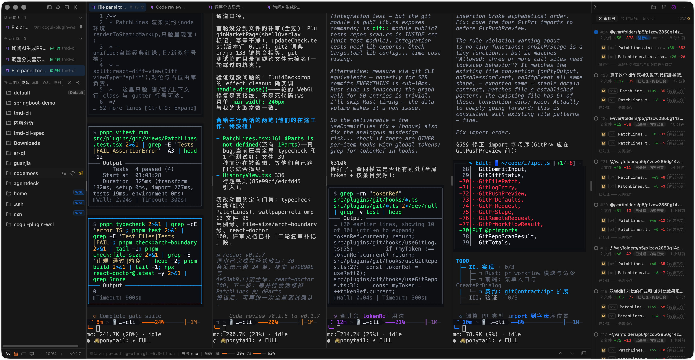
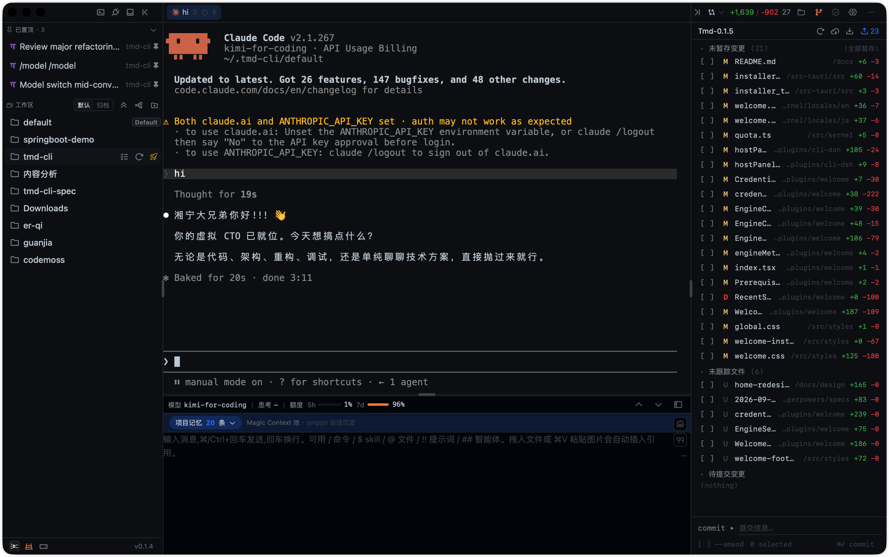

# tmd-cli

<p align="center">
  
</p>

<p align="center">
  <a href="README.md">中文</a> | English
</p>

<p align="center">
  <a href="./LICENSE"></a>
  <a href="https://github.com/chenxiangning/tmd-cli/actions/workflows/ci.yml"></a>
  <a href="https://github.com/chenxiangning/tmd-cli/releases"></a>
  
  
  <a href="https://linux.do"></a>
</p>

<p align="center">
  <strong>A plugin-based desktop client for multiple AI Coding CLIs — one native terminal curtain + one rich composer, uniformly driving 10 CLIs: omp / pi / kimi / codex / claude / grok / qoder / qoder-cn / dsh / opencode, with first-class SSH remote sessions.</strong>
</p>

---

## What is this?

tmd-cli is a desktop app built on **Tauri 2 + React + xterm.js + PTY**. It puts multiple AI Coding CLIs (`omp`, `pi`, `kimi`, `codex`, `claude`, `grok`, `qoder`, `qoder-cn`, `dsh`, `opencode`) into a single window, and can open remote hosts as first-class sessions via its built-in SSH engine. It does **not re-render** the CLI message stream — the central curtain passes through the CLI's native TUI output over a real PTY; all enhancements (model status, file references, skill triggers, Git, file tree) happen outside the curtain.

In one sentence: **CLI output is presented as-is; the input side gets the rich experience.** The client is a power strip, plugins are the plugs — plug in to use, unplug to stop.

## Screenshots

**Main window** — pinned + workspace-grouped session list (status breathing lights) in the left rail, session tab strip on top, native terminal curtain in the center (live omp passthrough), file tree on the right, composer at the bottom (attachments / model / thinking effort / quota status bar)


**Session tiling** — all open session tabs render side by side (active with ≥2); click a pane to focus it; a "broadcast" toggle in the composer feeds one input to every tiled curtain; the right-rail approval line stays available



**Git panel** — one view, three sections (diff / branch / history) in the right rail: per-file change list with +/- stats, pick files + write a message + commit in one pass (amend and empty-commit guards), one-click remote fetch / pull / push; history rendered as a graph with lane topology



**New-session menu** — lists 10 registered CLI engines + SSH connection, per-item refresh; session "move to group" management lives in the same menu


**Checkpoints** — right-rail "approval line / timeline" dual tabs: AI changes grouped in rounds, pending files listed per batch (+/- stats), approve / revert / undo per batch


**Plugin market (power strip)** — 26 built-in plugins with visual plug/unplug (10 CLI engines / 13 UI features / 3 core, welded), effective after restart; local plugins (`~/.tmd-cli/plugins/`) hot-load without restart and auto-rescan on change; online marketplace entry reserved


**Per-CLI configuration** — visually edit each CLI's local config file (OMP / pi / Claude Code / Codex): model role routing, wall-hit auto-fallback with fallback chains, thinking effort; saving writes back to the original file, unknown fields preserved verbatim


**Welcome page (engine selector)** — terminal-window layout: a workspace prompt row + full-action engine rows (version probe / credential ● quota expand / new session / reinstall / version rollback / official docs), footer with RESUME recent sessions / QUOTA plan levels / TOKENS 7-day usage


## Core design

- **Native PTY curtain (hard constraint)**: `PTY bytes → pty://out/{sessionId} → xterm.js`, zero message bubbles / Markdown / diff re-rendering. ⌘/Ctrl+F in-curtain search, links open in the system browser, automatic fallback from WebGL to DOM rendering on context loss.
- **Plugin-based kernel**: the kernel only handles the window shell, plugin lifecycle, PTY lifecycle, event bus, and IPC boundary; plugins don't depend on each other and cooperate via `PluginContext` + `EventBus`.
- **Session model**: `Session = CLI profile + PTY + cwd + CLI-native session id`. One session is bound to one CLI; resume is carried by each CLI's own `resume` mechanism. Disk history scanning + identity-binding guard (one disk session can be held by only one live session).
- **Session management**: workspace sidebar FLUX timeline (breathing lights: green = conversing / blue = finished unread / gray = idle), dual-scope pinning, custom groups ("move to group"), rename overlay, 64MB rotating output logs on disk + curtain back-pagination; top session tab strip switches among up to 4 sessions — or tiles them all side by side (active with ≥2 tabs, broadcast input optional), × detaches without killing; omp disk sessions open instantly via prewarm takeover (background prewarmed process + `/resume` injection hot-switch + early activation, falls back to the cold path on any mismatch).
- **Rich composer**:
  - `$` skills (natively supported by Codex, passed through as-is; omp/pi/kimi → `/skill:<name>`, claude → `/<name>`, grok → `/skills <name>`, translated on send; candidates sourced from each CLI itself — RPC sidecar / disk scan, static table as fallback)
  - `/` commands (passed through as-is, parsed by the CLI; same candidate sources)
  - Screenshots, drag-and-drop/pasted files (written as session temp files then injected), attachment bar capped at 12 with thumbnail previews
  - Multi-line text sent directly with CR, bracketed-paste honored per profile declaration (pi-tui family wraps the body to protect newlines)
  - Command drawer (⌘/Ctrl+K): commands / skills / MCP / plugins in four sections, runtime discovery + static table fallback
  - Quota chip: 7 provider HTTP protocol adapters + codex official OAuth local snapshot; credentials parsed read-only from a `$ENV_VAR` whitelist only
- **Agent / prompt assets**: a reusable library of agent and prompt assets, consumed in the composer via `!!` (prompts) / `##` (agents).
- **Per-CLI configuration (cli-config)**: visually edit each CLI's local config file (OMP / pi / Claude Code / Codex) — model role routing, wall-hit auto-fallback with fallback chains, global thinking effort, symbol style, and more; saving writes back to the original file with unknown fields preserved; no commands to memorize, no hand-editing files on disk.
- **Ask confirmation & sounds**: the kernel detects, at a single point, UI markers of CLIs blocking for confirmation in the PTY stream — green pill on the session row + two sound channels (Ask / turn end); unread counts even when unfocused; all configurable in settings.
- **Read-only status bar**: model / thinking effort status is read by the `readSessionStatus` adapter declared by each CLI plugin from that CLI's private session JSONL; the kernel doesn't understand CLI-private formats and shows `—` when missing.
- **Right-rail Git panel**: one view, three sections (diff / branch / history), styled after codemoss; pick files + write a message + commit in one pass, with amend and empty-commit guards; one-click remote fetch / pull / push; history view rendered as a graph (lane topology + ahead/behind "incoming/outgoing" synthetic rows); clicking a commit/file opens a central diff tab (dual-pane side-by-side: central gutter lane, red/green rows paired, word-level underline, persisted wrap toggle); commit execution lives only in the panel button — composer `/commit <msg>` only prefills. Contract: `openspec/changes/archive/2026-09-02-git-right-panel/`.
- **Checkpoints**: AI changes grouped in rounds; right-rail "approval line / timeline" + central batch review sheet; per-batch or per-file revert, apply, undo-restore; dual attribution via events; works in non-git workspaces; the shadow object store only writes blobs and never touches your repository.
- **First-class SSH sessions**: russh engine, output isomorphic with PTY sessions straight into the curtain (tab strip / buffer / pagination with zero divergence); the right rail hosts connection cards / local port forwarding (-L) / SFTP remote file tree; remote files open in editor tabs (mtime+size optimistic concurrent write-back); known_hosts trust cards, reconnect with backoff, HTTP CONNECT / SOCKS5 proxies; host book and `~/.ssh/config` import live in settings.
- **WSL support (M1)**: dual form — local distros (UNC workspace + `wsl.exe` spawn wrapping) and remote Windows hosts over the SSH channel (b64 payloads); engine probes / remote history / status observation / `wslr://` read-only file channel; the Git panel and checkpoints degrade with explicit hints by kind, never silently.
- **File tree & editor**: single-level lazy file tree + right-click write operations (new / rename / trash / reveal in Finder); CodeMirror 6 central tab editor (⌘S save, dirty marker, per-extension lazy language packs); file render profiles: images / PDF / spreadsheets (csv·xlsx) / docx (mammoth conversion + outline) / structured previews, binaries show a placeholder; file tab context menu and editor maximize toggle; Markdown preview (GFM + KaTeX math + Mermaid diagrams + outline popover + progressive rendering).
- **Welcome page (engine selector)**: a terminal-window home shown when no session is active — ↑↓ picks an engine, ⏎ starts a new session in the selected workspace, clicking ● expands credential quotas; full-action engine rows (CLI probe + prerequisite gating, one-click install with streaming logs, npm registry version check with one-click update, version rollback menu with the latest 10 stable versions and pinned favorites, official docs links); three footer sections: RESUME (latest 8 disk sessions across all workspaces × installed CLIs, click to resume) / QUOTA (per-provider aggregated plan levels with reset countdown) / TOKENS (per-engine usage + 7-day chart, sourced from local session records).
- **Built-in terminal**: one click in the header's left area spawns a local default shell session (kind=shell, the third first-class session kind); curtain / tab strip / buffer / pagination fully reused; lifecycle owned by the kernel — unplugging the plugin never orphans sessions.
- **Global shortcuts**: kernel command registry + per-scope dispatch (global / pty / composer), visual rebinding in settings (record / reset / conflict detection); macOS splits by ⌘ only, Ctrl+M/N/P/W etc. pass through to the PTY untampered.
- **Memory coordination (memory-coordinator)**: integrates the Magic Context external shared memory store (`~/.magic-context` SQLite, shared across CLI hosts, the app never writes directly); right-rail Memory panel (FTS keyword search + per-category filters: project rules / architecture / constraints / config values) + status-bar Memory pill + console central tab; phase-two auto-distillation is opt-in.
- **Version popover & auto-update**: click the version number in the bottom bar for the update history (embedded paginated CHANGELOG with inline Markdown entries), an online check against the latest GitHub release, and one-click auto-update (updater with signature verification, restart prompt after install).
- **Plugin market (power strip)**: 26 built-in plugins with visual plug/unplug (engines 10 / features 13 / core 3), effective after restart; core category is welded, engines/features can be unplugged; CLI brand glyphs + semantic colored icons; the local-loader manages `~/.tmd-cli/plugins/` — build plugins through conversation, hot-load without restart, roll back versions, with a one-click "copy plugin dev prompt" to get started.
- **Workspace wallpaper (wallpaper)**: fluid shader (WebGL, five motion fields, theme-aware) and local image gallery modes; surface-token punch-through lets chrome show the wallpaper while popover menus stay opaque; the xterm curtain turns translucent; unplugging removes everything — the kernel holds zero wallpaper semantics (contract: `docs/architecture/11`).

## Architecture

```text
React Host
├── src/kernel/       plugin contracts, lifecycle, event bus, IPC, PTY TerminalView, theme engine
├── src/app-shell/    shell (top bar / left rail / curtain / right rail / bottom) & mount points, session tab strip
└── src/plugins/      cli-* × 10 (omp / pi / kimi / codex / claude / grok / qoder / qoder-cn / dsh / opencode) · session-budget · workspace · files · git · checkpoints · composer · settings · network-proxy · ssh · terminal · memory-coordinator · welcome · assets · cli-config · local-loader · wsl · wallpaper

Tauri Rust (src-tauri/)
├── pty.rs               portable-pty: spawn / read / write / resize / kill
├── session.rs           session metadata registry
├── session_commands.rs  session_* commands split out of lib.rs (PTY/SSH routed by kind)
├── session_log.rs       session output to disk (64MB rotating) + curtain back-pagination reads
├── session_disk_log.rs spawn-generation log pointer & disk-tail reads (disk-first replay addressing)
├── fs.rs                file tree reads (read-only) + fs_edit.rs file write operations
├── fs_walk.rs           repo-wide file index (gitignore-aware) + proc_run.rs generic short-process channel
├── settings.rs          settings persistence (~/.tmd-cli/settings.json, atomic writes)
├── probe.rs             CLI probe (found / path / version, 8s timeout)
├── installer.rs         one-click CLI install (npm -g / claude native, streaming logs)
├── quota.rs             generic HTTP proxy for quota queries
├── sqlite.rs            generic sqlite read/write proxy (READ_ONLY + parameterized; CLI-private schema knowledge stays plugin-side)
├── proxy.rs             process-level proxy env injection
├── ssh/                 russh SSH session engine (transport/auth/forward/sftp, output via pty://out isomorphic events)
├── wsl*.rs             WSL channel primitives (distro info / remote probe / engine probe / b64 exec / file reads)
└── git/ + checkpoints/  libgit2 primitives / checkpoints ledger sidecar
```

The standard path for new capabilities:

- **UI / CLI capability** → create `src/plugins/<id>/`, implement the `Plugin` interface, add one line in `src/plugins/index.ts`.
- **Plugin plug/unplug** → declare `PluginMeta.category` (engine/feature/core); the plugin market writes `settings.disabledPlugins`, effective after restart; local plugins go in `~/.tmd-cli/plugins/` and hot-load via the local-loader.
- **Cross-plugin contracts** → land stable types/primitives in `src/kernel/` first, then implement in plugins.

## Tech stack

| Layer | Choice |
|---|---|
| Shell | Tauri 2 (Rust, `portable-pty`) |
| Frontend | React 19 + TypeScript + Vite 8 |
| Terminal | xterm.js + addon-fit |
| Styling | Tailwind CSS 4 |
| Editing/preview | CodeMirror 6 · highlight.js · react-markdown · KaTeX · Mermaid |
| Testing | Vitest |
| Icons | @phosphor-icons/react + CLI brand glyphs |

## Getting started

Prerequisites: Rust toolchain, Node.js / pnpm, and at least one target CLI installed locally (`omp` / `pi` / `kimi` / `codex` / `claude` / `grok` / `qoder` / `qoder-cn` / `dsh` / `opencode`; missing ones can be installed from the welcome page).

```bash
pnpm install              # install dependencies
pnpm tauri:dev            # development mode (Vite dev server + Tauri window)
pnpm tauri:build          # package the desktop app
pnpm typecheck            # TypeScript checks
pnpm test                 # Vitest unit tests
pnpm build                # frontend build only
pnpm check:arch-boundary  # architecture boundary checks (CI-enforced)
pnpm check:file-size      # per-file ≤300 lines check (CI-enforced)
```

## Download & install

Grab the installer for your platform from [GitHub Releases](https://github.com/chenxiangning/tmd-cli/releases). Artifacts are built automatically by CI when a `v*` tag is pushed (macOS universal / Windows x86_64 / Linux x86_64), land as a Draft Release, and go live after confirmation.

Current v0.1.7 artifact matrix:

| Platform | Artifacts |
|---|---|
| macOS (universal: arm64 + x86_64) | `tmd-cli_0.1.7_universal.dmg`, `tmd-cli_universal.app.tar.gz` |
| Windows (x86_64) | `tmd-cli_0.1.7_x64-setup.exe` (NSIS), `tmd-cli_0.1.7_x64_en-US.msi` |
| Linux (x86_64) | `tmd-cli_0.1.7_amd64.AppImage`, `tmd-cli_0.1.7_amd64.deb`, `tmd-cli-0.1.7-1.x86_64.rpm` |

Current artifacts are unsigned / unnotarized: on first launch on macOS, allow the app under "System Settings → Privacy & Security".

## Documentation

Full design docs live in [`docs/`](docs/README.md) (the index table is kept in sync):

- `docs/FEATURES.md` — feature inventory, the acceptance master doc, kept line-by-line in sync with code
- `docs/brainstorm/` — requirement clarification records
- `docs/research/` — capability matrix for omp / pi / codex / claude / grok / kimi / qoder (triggers, session storage, resume mechanisms, measured)
- `docs/architecture/` — landed architecture & contracts
- `docs/superpowers/specs/` — formal design specs (composer toolbar, checkpoints, plugin market, session tab strip, etc.)
- `docs/design/` · `docs/prototypes/` — interaction design prototype HTML
- `docs/review/` — review records (architecture / platform / redundancy)

In-flight change contracts live in `openspec/changes/` (archived under `archive/`); formal capability specs in `openspec/specs/`.

## Contributing

Issues and PRs welcome:

- Contribution guide (environment prerequisites / commit conventions / architecture rules / pre-delivery verification): [`CONTRIBUTING.md`](.github/CONTRIBUTING.md)
- Security reports: [`SECURITY.md`](.github/SECURITY.md) (use GitHub's private security reporting; do not describe details in public issues)
- Code of conduct: [`CODE_OF_CONDUCT.md`](.github/CODE_OF_CONDUCT.md)

## Current status

Landed: plugin host & plugin market (31 registered plugins: 10 CLI engines + 17 UI features + 3 core + local plugin loader), ten CLI profiles (omp/pi/kimi/codex/claude/grok/qoder/qoder-cn/dsh/opencode) + first-class SSH sessions (russh) + built-in terminal (kind=shell), full PTY lifecycle & rotating session output logs with pagination, xterm curtain, workspace FLUX timeline session list (breathing lights/status labels/pinning/budget pagination/custom groups), top session tab strip with tile display, full composer (triggers/drag-drop/screenshots/command drawer v3/message anchor bar/quota/bracketed-paste, completions sourced from the CLIs themselves), agent/prompt asset library (!! / ## consumption), per-CLI configuration (visual editing of CLI config files, model role routing / wall-hit fallback chains), local plugins (~/.tmd-cli/plugins/ hot-load / build via conversation / version rollback), Ask confirmation detection (byte-stream + screen-state dual channel) with dual sounds, full right-rail Git panel (diff/branch/graph history/commit diff central tabs (dual-pane)/remote fetch/pull/push/three-zone drag-select batch ops & untracked deletion), file tree + CodeMirror editor + file render profiles (images/PDF/spreadsheets/docx/structured) + Markdown preview, file tab context menu & editor maximize, checkpoints (ledger: dual attribution/revert/apply/undo/shadow object store), theme engine (31 VS Code presets), global UI font size & zoom, network proxy, welcome page engine selector (full-action rows / RESUME / QUOTA / TOKENS), read-only session status bar, global shortcuts with visual rebinding, version popover with auto-update, memory coordination (Memory panel with FTS search / pill / console), branch context menu & remote operation dialogs, session tab context menu, WSL support (local UNC + remote SSH host M1: connect/sessions/history/status/read-only file channel), workspace wallpaper (local gallery + fluid shader, surface-token punch-through & translucent curtain), omp disk-session prewarm takeover for instant open, dsh streaming session output.

In progress: command drawer on-device acceptance (5 `[V]` items left, openspec/changes/composer-command-drawer) and CLI interactive compatibility verification; the git "create PR" workflow is being implemented (spec: docs/superpowers/specs/2026-09-15-git-create-pr-design.md); all other change contracts are archived under `openspec/changes/archive/`.

## License

This project is open source under the [MIT License](LICENSE). Copyright © 2026 Chen Xiangning.

## Friendship Link

Thanks for the support and feedback from the friends at [LINUX DO](https://linux.do).
