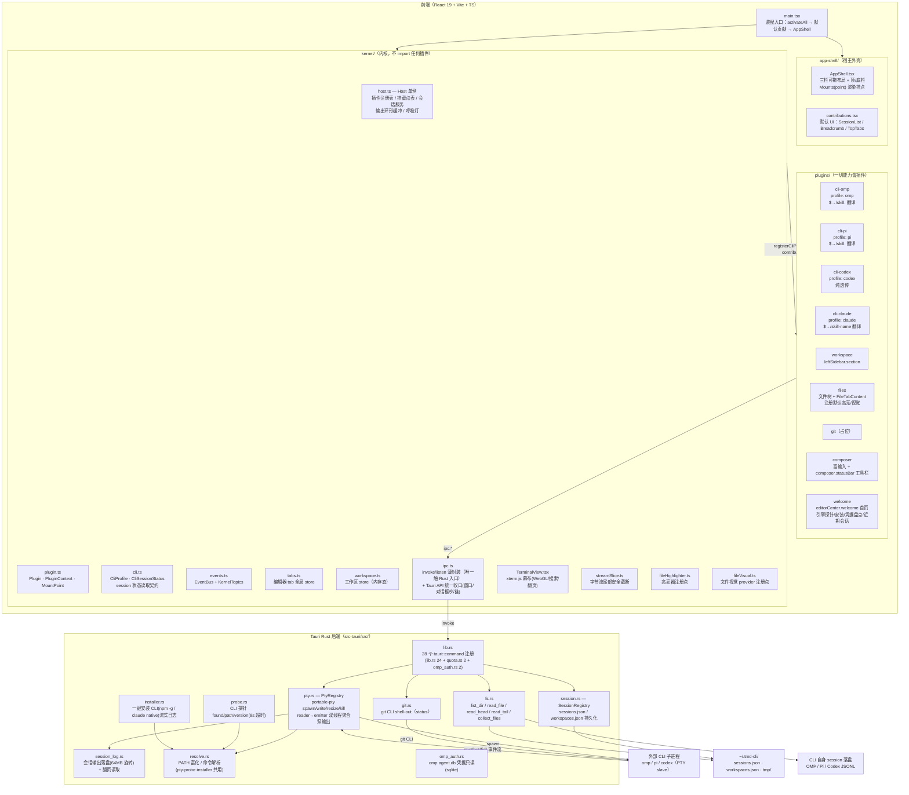
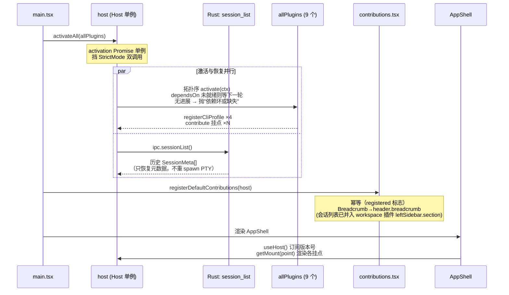
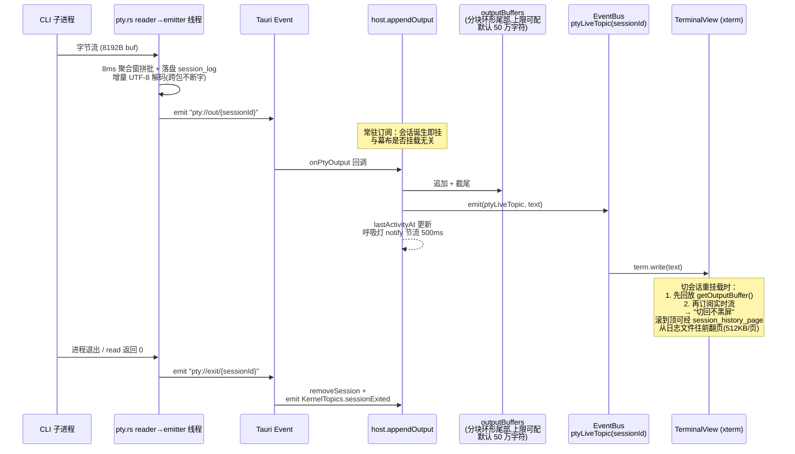
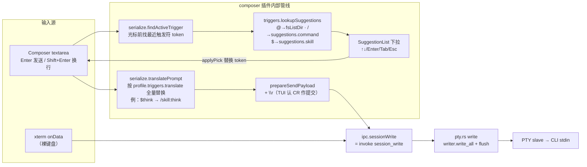
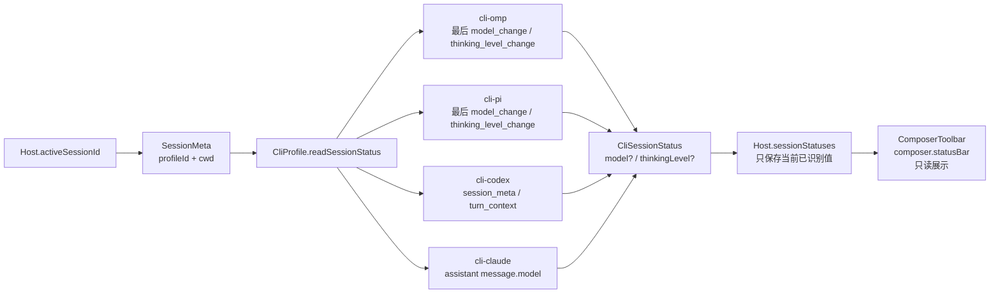
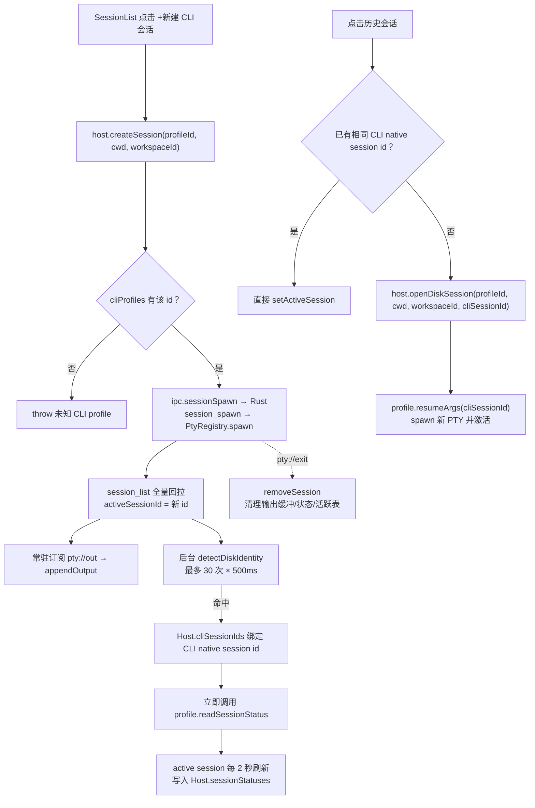
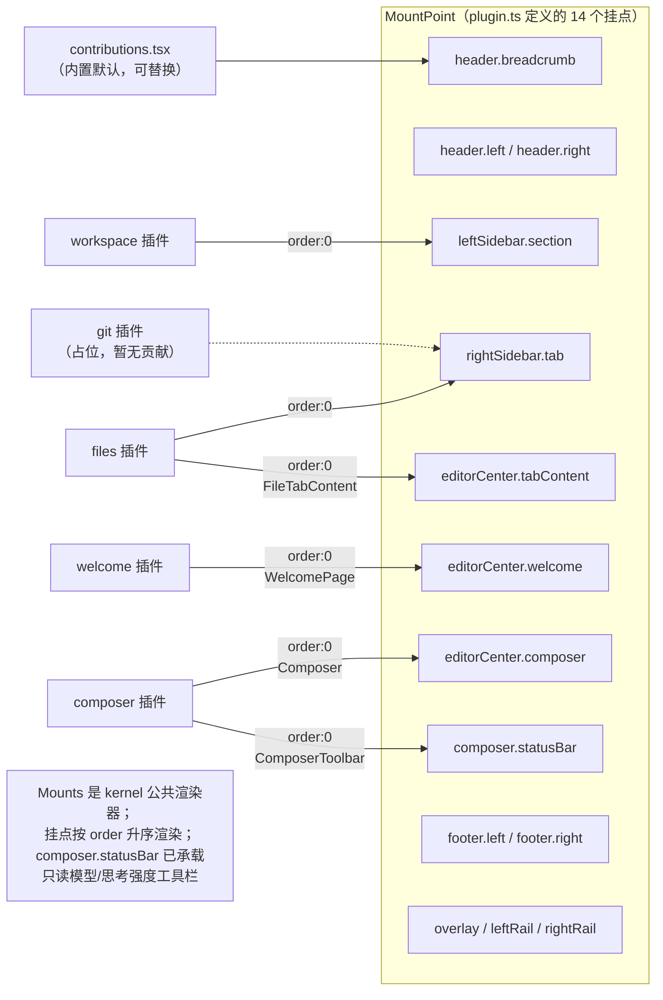

# tmd-cli 代码级架构（当前实现）

- 日期：2026-09-01
- 状态：对应主干当前代码（v0.1.0 骨架）
- 前置阅读：[01-overview.md](01-overview.md)（设计决策层）；本文是**代码事实层**——每个节点都能在仓库里找到对应文件/符号。

## 1. 全景分层

**依赖铁律**（代码中已成立）：

 - 内核 `src/kernel/` 不 import 任何 `src/plugins/`；插件清单唯一入口是 `src/plugins/index.ts` 的 `allPlugins` 数组（编译期注册）。
 - 插件之间**零直接依赖**：协作仅通过 `PluginContext`（`registerCliProfile` / `contribute` / `events`）和两个注册点（`fileHighlighter` / `fileVisual`）；`plugins/cli-shared` 仅是无生命周期的共享格式库，不是插件。
 - 前端触达 Rust 的唯一通道是 `src/kernel/ipc.ts`；插件不直接 import `@tauri-apps/api`。

**文件规模铁则**（2026-09-02 起生效）：

 - **单文件行数不得超过 500 行**（含注释与空行；`.ts` / `.tsx` / `.rs` / `.css` 均受限）。超过即必须结构拆分，禁止以“快完成了”“暂时超一点”为由豁免。
 - 拆分方向按内容性质定：数据表（如主题 preset）按域拆为多个数据文件 + 一个 barrel 重导出；逻辑文件按职责拆为多个模块；UI 组件按子组件/视图拆分。
 - 拆分必须保持公开 API 不变（barrel 重导出原名），既有测试不得修改即应全绿。
 - 豁免仅限自动生成的文件与第三方 vendored 代码，且必须在文件头注释标注豁免理由。
 - 存量超限文件以拆分执行记录为准；新增代码评审时此铁则为一票否决项。

## 2. 启动装配序列

## 3. 核心数据流：PTY 输出 → 幕布（零渲染原则的唯一实现）

## 4. 输入链路：键盘 / Composer → PTY

关键不变量：

- **composer 不做 CLI 语义**——触发符、`translate` 全由 CLI profile 声明；codex 无 `translate` 即原样透传。
- 粘贴/拖拽文件（`handlePaste` / `handleDrop`）先经 `ipc.fsWriteTemp` 落盘 `~/.tmd-cli/tmp/`，再把绝对路径插入草稿。
- 裸 xterm 输入与 composer 发送**汇入同一条** `session_write` 通道。

### 4.1 Composer 状态链路：CLI session JSONL → 只读工具栏

状态刷新只针对 active session：首次绑定 CLI native session id 时立即读取，之后每 2 秒轮询；值未变化不触发 notify。文件不存在、尚未刷盘或字段不可识别时返回空状态，UI 显示 `—`。

边界不变量：

- Host 只编排读取和缓存，不解析任何 CLI 私有 JSONL 格式。
- `cli-*` 插件拥有 session 文件定位和字段解析。
- `fs_read_tail` 是通用 IPC 原语，不携带 CLI 语义。
- Composer 通过 `composer.statusBar` 挂载点消费工具栏，不直接硬编码 CLI 状态组件。

## 5. 会话生命周期与历史恢复

状态读取不会写回 Rust `SessionMeta`。`cliSessionIds` 和 `sessionStatuses` 是 Host 运行时内存态；CLI 原生 session 文件仍由各 CLI 自己维护。

**Session 模型**（Rust `SessionMeta` + Host 运行时绑定）：

| 字段 | 来源 | 用途 |
|---|---|---|
| `id` | `pty.rs` | 事件路由 `pty://out/{id}` |
| `profileId` | spawn 入参 | 找回 profile 做 resume/触发器/状态读取 |
| `cliSessionId` | Host 后台探测，内存绑定 | resume 参数、定位 CLI JSONL |
| `workspaceId` | spawn 入参 | 会话列表按工作区分组 |
| `createdAt` | Rust 注册表 | 列表展示 |

## 6. 挂载点地图（谁贡献了哪块 UI）

## 7. 模块级依赖图（import 事实）

```mermaid
flowchart TD
    M["main.tsx"] --> AS["app-shell/AppShell.tsx"]
    M --> CT["app-shell/contributions.tsx"]
    M --> PI["plugins/index.ts"]

    AS --> KH["kernel/host.ts"]
    AS --> KM["kernel/Mounts.tsx"]
    AS --> KTV["kernel/TerminalView.tsx"]
    CT --> KH
    CT --> KW["kernel/workspace.ts"]

    PI --> P1["cli-omp / cli-pi / cli-codex / cli-claude"]
    PI --> P2["workspace"]
    PI --> P3["files"]
    PI --> P4["git"]
    PI --> P5["composer"]

    KH --> KE["kernel/events.ts"]
    KH --> KI["kernel/ipc.ts"]
    KTV --> KI
    KTV --> KH
    KW --> KI

    P1 --> KI
    P1 --> SH["plugins/cli-shared<br/>共享 JSONL 格式库(非插件)"]
    P2 --> KW
    P3 --> KI & KT & KFH["kernel/fileHighlighter.ts"] & KFV["kernel/fileVisual.ts"]
    P5 --> KH & KM & KI

    KI --> TAPI["@tauri-apps/api<br/>invoke / listen"]

    style KE fill:#1e3a5f
    style KI fill:#1e3a5f
    style KH fill:#1e3a5f
```

蓝底 = 内核三基石：`events.ts`（跨插件通信唯一通道）、`ipc.ts`（触 Rust 唯一入口）、`host.ts`（装配点 + 会话服务）。

## 8. Rust 后端命令面

注册的 28 个 `#[tauri::command]`（lib.rs 24 + quota.rs 2 + omp_auth.rs 2），与 `ipc.ts` 一一对应：

| 命令 | 实现 | 说明 |
|---|---|---|
| `session_spawn` | `pty.rs` + `session.rs` | openpty → spawn 子进程 → reader 线程泵事件 → 注册表落盘 |
| `session_list` | `session.rs` | 内存注册表（启动时从 sessions.json 恢复） |
| `session_write` / `session_resize` / `session_kill` | `pty.rs` | writer 直写 / master.resize / child.kill |
| `session_log_size` / `session_history_page` | `session_log.rs` | 输出日志末尾偏移 / 绝对偏移前翻一页(转义+UTF-8 边界对齐) |
| `cli_probe` | `probe.rs` | PATH 解析 + `--version`(8s 硬超时,spawn_blocking) |
| `cli_install_run` | `installer.rs` | npm -g / claude native 安装,`cli-install://{engine}` 流式日志(300s 超时) |
| `omp_auth_credential` / `omp_auth_providers` | `omp_auth.rs` | omp agent.db 只读:单供应商凭据 JSON / 已登录供应商列表 |
| `quota_fetch` / `quota_env_value` | `quota.rs` | 通用 HTTP 代理(15s 超时) / 只读环境变量 |
| `platform_kind` | `lib.rs` | UA 探测失败时的 OS 兜底 |
| `fs_list_dir` | `fs.rs` | 单层列举，隐藏过滤，目录排前 |
| `fs_read_file` | `fs.rs` | ≤512KB、非二进制、UTF-8 才给预览 |
| `fs_write_temp` | `fs.rs` | 截图/拖拽文件落 `~/.tmd-cli/tmp/` |
| `fs_collect_files` | `fs.rs` | 递归收集指定后缀文件并按 mtime 倒序 |
| `fs_read_head` / `fs_read_tail` | `fs.rs` | 读取 JSONL 头/尾，避免全文加载 |
| `git_status` | `git.rs` | `git rev-parse` + `git status --porcelain=v1 --branch` |
| `config_home_dir` / `config_default_workspace_root` | `session.rs` | 返回配置和默认工作区路径 |
| `config_read_workspaces` / `config_write_workspaces` | `session.rs` | `~/.tmd-cli/` 工作区配置读写 |

## 9. 设计原则 ↔ 代码落点对照

| 原则（01-overview） | 代码证据 |
|---|---|
| 幕布零渲染 | `TerminalView.tsx`：字节流只进 `term.write`，无任何二次解析 |
| 切回不黑屏 | `host.ts` `outputBuffers`（分块环形尾部,上限经设置项 `sessionOutputBufferLimit` 可配,默认 50 万字符;`streamSlice` 保证截断不劈转义序列/surrogate）+ TerminalView 挂载先回放再订阅 |
| 触发符纯透传 | `cli.ts` `translate?` 是唯一例外钩子；`serialize.translatePrompt` 只调用 profile 声明 |
| 一切能力皆插件 | `plugins/index.ts` 是唯一插件清单；内核无插件 import |
| 插件不互相依赖 | 协作仅经 `PluginContext` / `EventBus` / `fileHighlighter` / `fileVisual` 注册点；`cli-shared` 是无生命周期的共享格式库，不是插件 |
| 会话状态只读 | `CliProfile.readSessionStatus` 负责 CLI 私有 JSONL 解析；Host 只缓存/刷新，Composer 通过 `composer.statusBar` 展示 |
| 会话固定一个 CLI | `SessionMeta.profileId` 创建后不变；resume 用同 profile 重 spawn |
| 幂等/防御 | `activateAll` Promise 并发闸；`registerDefaultContributions` registered 标志；`registerCliProfile` 重复即抛错 |

## 10. 已知缺口（代码现状，非设计意图）

- `git` 插件为空壳：`git.rs` 只有 status，前端无贡献。
- `footer.*`、`overlay` 等挂点暂无贡献者。
- Codex 的 session 状态解析采用容错字段匹配，完整 `turn_context` schema 仍需随 CLI 版本验证。
- `prepareSendPayload` 注释声明 v1 不用 bracketed paste（多行粘贴交给 CLI 自理）。
- `composer/index.ts` 注释里的 Step 4/5（触发器下拉已完成；拖拽/截图已进 `Composer.tsx`）。
