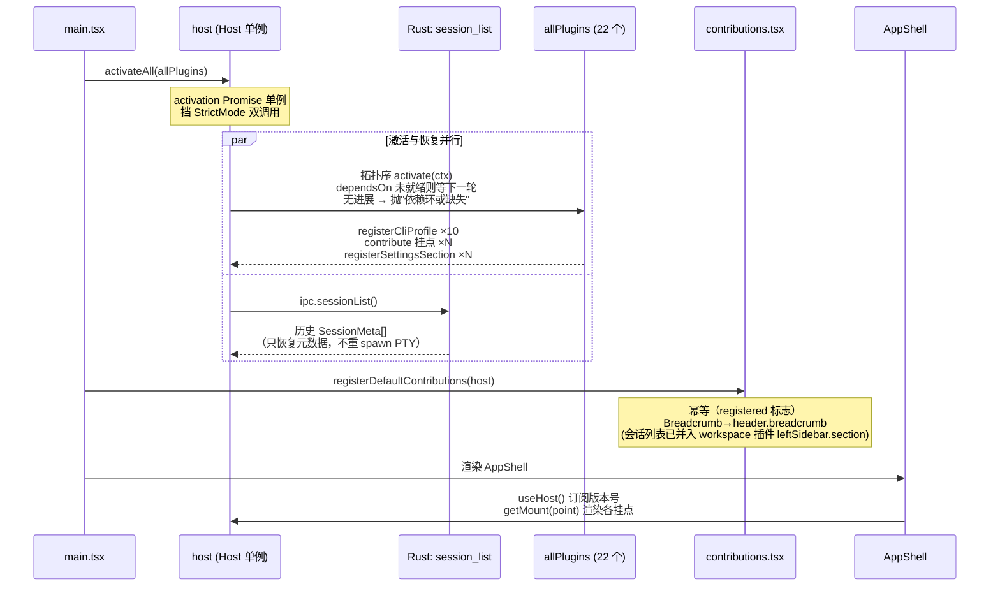
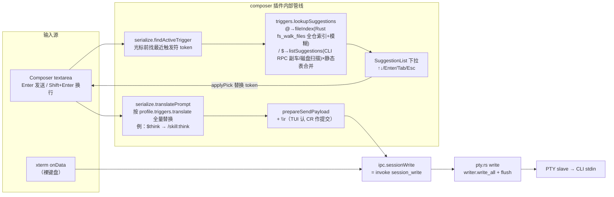
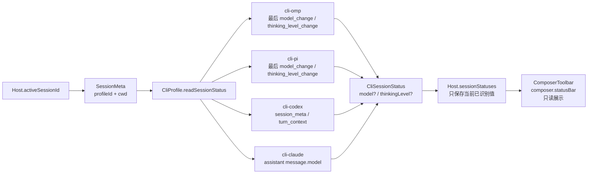
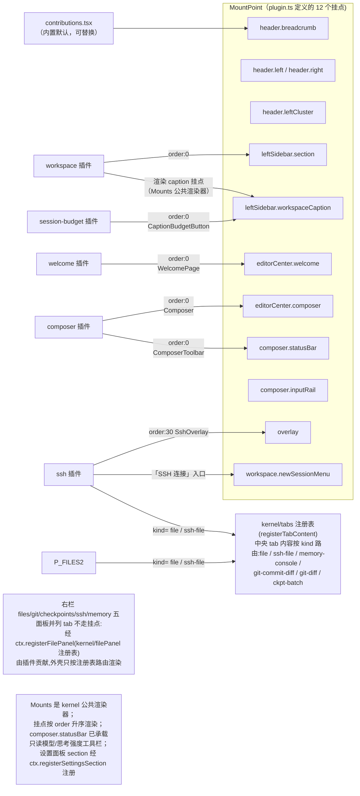

# tmd-cli 代码级架构（当前实现）

- 日期：2026-09-01（2026-09-04、2026-09-06、2026-09-09 按当前代码校准）
- 状态：对应主干当前代码（v0.1.3）
- 前置阅读：[01-overview.md](01-overview.md)（设计决策层）；本文是**代码事实层**——每个节点都能在仓库里找到对应文件/符号。

## 1. 全景分层

```mermaid
flowchart TB
    subgraph FE["前端（React 19 + Vite + TS）"]
        direction TB
        MAIN["main.tsx<br/>装配入口：activateAll → 默认贡献 → AppShell"]

        subgraph SHELL["app-shell/（宿主外壳）"]
            APPSHELL["AppShell.tsx<br/>三栏可拖布局 + 顶/底栏<br/>Mounts(point) 渲染挂点"]
            CONTRIB["contributions.tsx<br/>默认 UI：SessionList / Breadcrumb / TopTabs"]
            SHELLX["app-shell 组件群:EditorCenter(文件预览面板) · SessionTabBar(顶栏会话 tab)<br/>TabContextMenu · editorMaximized · RightPanelToolbar · SidebarSettingsCluster"]
        end

        subgraph KERNEL["kernel/（内核，不 import 任何插件）"]
            HOST["host.ts — Host 单例<br/>插件注册表 / 挂载点表 / 会话服务<br/>输出环形缓冲 / 呼吸灯<br/>(拆分件:hostRegistry · hostSessionServices · hostWatches)"]
            PLUGIN["plugin.ts<br/>Plugin · PluginContext · MountPoint"]
            CLI["cli.ts<br/>CliProfile · CliPrerequisite(前置依赖)<br/>session 状态读取契约"]
            EVENTS["events.ts<br/>EventBus + KernelTopics"]
            TABS["tabs.ts<br/>编辑器 tab 全局 store"]
            WS["workspace.ts<br/>工作区 store（内存态）"]
            IPC["ipc.ts<br/>invoke/listen 薄封装（唯一触 Rust 入口）<br/>+ Tauri API 统一收口(窗口/对话框/外链)"]
            TV["TerminalView.tsx<br/>xterm.js 幕布(DOM 渲染/搜索/翻页)"]
            SS["streamSlice.ts<br/>字节流尾部安全截断"]
            FV["fileVisual.ts<br/>文件视觉 provider 注册点"]
            SA["sidebarActions.ts<br/>侧栏快捷动作注册表"]
            FP["filePanel.ts<br/>右栏面板注册表(通用 tab store,<br/>不预知业务面板)"]
            WATCH["守望组(host 拆分件)<br/>activityWatch·askWatch·editWatch·identityWatch<br/>+ askSound·turnSound"]
            THEME["theme.ts + themeTokens.ts + themePresets/<br/>主题引擎:21 个 VS Code preset → --tmd-*<br/>+ 终端 ANSI 16 色 token(VS Code 官方浅/深表兜底)"]
            SETT["settings.ts + settingsTypes/settingsSanitize(+Sessions)<br/>+ settingsAppearance + settingsRegistry.ts<br/>全局设置 store 唯一事实源(~/.tmd-cli/settings.json)<br/>设置 section 注册表(面板经注册表渲染)"]
            I18N["i18n.ts + locales/&lt;en|ja&gt;/ 域词典 + terminalFonts.ts + uiZoom.ts<br/>gettext 式 t()(zh 源串为键,切换=根树重挂载)<br/>界面缩放引擎(webview setZoom→CSS zoom 兜底)"]
            MA["messageAnchors.ts<br/>用户消息锚点内核(2s 轮询,0 订阅停表)"]
            QUA["quota.ts<br/>QuotaProvider 注册点"]
            SESN["会话面组:sessionTabs · sessionPins · sessionTitles · sessionStatus<br/>diskIdentity · composerStage · gitContract · internalDrag · dropGuard<br/>+ sshSettings/sshTypes · platform · pathUtils · relativeTime<br/>+ shortcuts(全局快捷键) · sessionSpawn/sessionAdopt(spawn 编排)"]
        end

        subgraph PLUGINS["plugins/（一切能力皆插件）"]
            P_OMP["cli-omp<br/>profile: omp<br/>$→/skill: 翻译"]
            P_PI["cli-pi<br/>profile: pi<br/>$→/skill: 翻译"]
            P_CODEX["cli-codex<br/>profile: codex<br/>纯透传"]
            P_CLAUDE["cli-claude<br/>profile: claude<br/>$→/<name> 翻译"]
            P_GROK["cli-grok<br/>profile: grok<br/>npm @xai-official/grok"]
            P_KIMI["cli-kimi<br/>profile: kimi<br/>$→/skill: 翻译<br/>MD5(cwd) 目录会话"]
            P_QODER["cli-qoder / cli-qoder-cn<br/>profile: qoder / qoder-cn<br/>claude 同构存储,共享 qoderSessions"]
            P_WS["workspace<br/>leftSidebar.section<br/>+ leftSidebar.workspaceCaption 渲染"]
            P_SBU["session-budget<br/>显示预算独立插件<br/>leftSidebar.workspaceCaption 贡献"]
            P_FILES["files<br/>文件树 + FileTabContent<br/>注册默认高亮/视觉"]
            P_GIT["git<br/>右栏 Git 面板<br/>(filePanel 注册表)"]
            P_COMPOSER["composer<br/>富输入 + composer.statusBar 工具栏"]
            P_SETTINGS["settings<br/>overlay 设置面板<br/>+ 设置 section 注册表"]
            P_WELCOME["welcome<br/>editorCenter.welcome 首页<br/>引擎探针/前置依赖门控安装/凭据盘点/近期会话"]
            P_CKPT["checkpoints<br/>审批线:右栏时间线 + 中央批审阅单<br/>账本/diff/还原在 Rust checkpoints/"]
            P_NP["network-proxy<br/>网络代理浮层(overlay)<br/>生效率 Rust proxy.rs env 注入"]
            P_SSH["ssh<br/>SSH 一等会话:overlay 主机选择 + 右栏面板(SFTP 树/端口转发)<br/>+ newSessionMenu 入口 + 远端文件 tab(kind=ssh-file)+ 设置 section"]
            P_TERM["terminal<br/>内置终端:header.leftCluster 入口按钮<br/>点击聚焦最新 shell 会话/⌥新建"]
            P_OPE["cli-opencode<br/>profile: opencode<br/>SQLite 单库会话存储(sqlite 代读/代删)"]
            P_DSH["cli-dsh<br/>profile: dsh<br/>会话即 host(PTY 适配器)+ homePanel 连接引导"]
            P_MEM["memory-coordinator<br/>Memory 面板 + 状态栏胶囊 + 控制台 tab<br/>Magic Context 共享库(应用零直写)"]
        end
    end

    subgraph BE["Tauri Rust 后端（src-tauri/src/）"]
        LIB["lib.rs<br/>102 个 tauri::command 注册(git 31 + ssh 21 + checkpoints 11 + commands_fs 13 + fs_edit 6 + session 7 + quota 2 + sqlite 2 + lib.rs 直注册 9)<br/>panic 钩子落盘 panic.log"]
        PTY["pty.rs — PtyRegistry<br/>portable-pty spawn/write/resize/kill<br/>reader→emitter 双线程聚合泵输出"]
        SLOG["session_log.rs<br/>会话输出落盘(64MB 旋转) + 翻页读取"]
        RESOLVE["resolve.rs<br/>PATH 富化 / 命令解析(pty·probe·installer 共用)"]
        PROBE["probe.rs<br/>CLI 探针 found/path/version/npmPrefix(8s 超时)"]
        INST["installer.rs<br/>参数化安装执行器(InstallPlan:npm/script/command)<br/>配方由前端 CliProfile 声明;npm 通道按 npmPrefix 就地更新"]
        SQL["sqlite.rs<br/>只读 sqlite 通用代读(参数化)<br/>CLI 私有库知识在插件侧"]
        SESS["session.rs — SessionRegistry<br/>活会话纯内存表(不落盘)<br/>workspaces.json 持久化"]
        FS["fs.rs<br/>list_dir / read_file / read_head / read_tail<br/>collect_files / write_temp / remove_path(白名单)<br/>read_local_image_data_url(md 预览)"]
        FSW["fs_walk.rs 全仓文件索引(gitignore 系)<br/>proc_run.rs 通用短进程通道"]
        GIT["git/<br/>libgit2 原语(status/diff/branch/log+refs装饰/commit)<br/>commit_view 单提交文件清单+patch(历史 Graph)<br/>远端 fetch/pull/push shell-out(300s 总超时)"]
        SSHB["ssh/ — russh 0.62 引擎(输出走 pty://out 同构事件)<br/>transport·session·auth·known_hosts·control<br/>forward(L 本地转发)·sftp(+transfer/path)·io·proxy·e2e_tests"]
        HASH["hash.rs<br/>md5_hex 通用哈希原语"]
        FSE["fs_edit.rs — 文件写操作<br/>新建/重命名/废纸篓/访达显示/编辑器保存<br/>(绝对路径,禁 .git 段,16MB 上限)"]
        PROXY["proxy.rs — 进程级代理 env 注入<br/>启动按 settings 应用,无 command 面"]
        CKPTR["checkpoints/ — 审批线账本 sidecar<br/>ledger.rs·events.rs·restore.rs·apply.rs·view.rs<br/>capture.rs·diff.rs·attribution.rs·commands.rs"]
    end

    EXT["外部 CLI 子进程<br/>omp / pi / codex / claude / grok / kimi / qoder / qoder-cn / opencode / dsh（PTY slave）"]
    DISK["~/.tmd-cli/<br/>settings.json · workspaces.json<br/>(活会话注册表纯内存不落盘;<br/>临时附件走系统 temp/tmd-cli)"]
    CLIDATA["CLI 自身 session 落盘<br/>OMP / Pi / Codex / Claude / Kimi / Grok / Qoder<br/>/ Opencode(SQLite 单库)"]

    MAIN --> SHELL & KERNEL
    KERNEL -->|ctx 注册面(registerCliProfile/contribute/registerXxx)| PLUGINS
    PLUGINS -->|ipc.*| IPC
    IPC -->|invoke| LIB
    LIB --> PTY & SESS & FS & GIT & SSHB & FSW
    PTY --> SLOG & RESOLVE
    PROBE & INST --> RESOLVE
    PTY -->|spawn| EXT
    EXT -->|"pty://out/{id} 事件流"| PTY
    SESS --> DISK
    FS --> DISK
    FS --> CLIDATA
    GIT -->|git CLI| EXT
```

**依赖铁律**（代码中已成立）：

 - 内核 `src/kernel/` 不 import 任何 `src/plugins/`；插件清单唯一入口是 `src/plugins/index.ts` 的 `allPlugins` 数组（编译期注册）。
 - 插件之间**零直接依赖**：协作仅通过 `PluginContext` 的注册面（`registerCliProfile` / `contribute` / `events` / `registerSettingsSection` / `registerFilePanel` / `registerTabContent` / `registerMarketPanel` / `registerSidebarAction` / `registerFileVisual` / `registerHomePanel` / `registerCommand`，quota 折叠为 `CliProfile.fetchQuota` 由 host 自动接线）——一切贡献经 ctx 登记，无旁路注册表；`plugins/cli-shared` 仅是无生命周期的共享格式库，不是插件。
 - 前端触达 Rust 的唯一通道是 `src/kernel/ipc.ts`；插件不直接 import `@tauri-apps/api`。

**文件规模铁则**（2026-09-02 起生效）：

 - **单文件行数不得超过 300 行**（含注释与空行；`.ts` / `.tsx` / `.rs` / `.css` 均受限）。超过即必须结构拆分，禁止以“快完成了”“暂时超一点”为由豁免。
 - 拆分方向按内容性质定：数据表（如主题 preset）按域拆为多个数据文件 + 一个 barrel 重导出；逻辑文件按职责拆为多个模块；UI 组件按子组件/视图拆分。
 - 拆分必须保持公开 API 不变（barrel 重导出原名），既有测试不得修改即应全绿。
 - 豁免仅限自动生成的文件与第三方 vendored 代码，且必须在文件头注释标注豁免理由。
 - 存量超限文件以拆分执行记录为准；新增代码评审时此铁则为一票否决项。
 - 2026-09-06 发版前评审把阈值由 500 收紧为 300 并全量拆分收官（TS/TSX/CSS/Rust 清零,仅 kernel/ipc.ts 豁免;执行记录见 `docs/review/2026-09-06-prerelease-code-review.md`）,300 行自此为固定铁则,CI 同步把关。

## 2. 启动装配序列



## 3. 核心数据流：PTY 输出 → 幕布（零渲染原则的唯一实现）

```mermaid
sequenceDiagram
    participant CLI as CLI 子进程
    participant PT as pty.rs reader→emitter 线程
    participant EVT as Tauri Event
    participant H as host.appendOutput
    participant BUF as outputBuffers<br/>(分块环形尾部,上限可配<br/>默认 50 万字符)
    participant BUS as EventBus<br/>ptyLiveTopic(sessionId)
    participant TV as TerminalView (xterm)

    CLI->>PT: 字节流 (8192B buf)
    PT->>PT: 8ms 聚合窗拼批 + 落盘 session_log<br/>增量 UTF-8 解码(跨包不断字)
    PT->>EVT: emit "pty://out/{sessionId}"
    Note over H: 常驻订阅：会话诞生即挂<br/>与幕布是否挂载无关
    EVT->>H: onPtyOutput 回调
    H->>BUF: 追加 + 截尾
    H->>BUS: emit(ptyLiveTopic, text)
    H-->>H: 首写闸(activityWatch)通过<br/>才结算呼吸灯;未对话会话<br/>输出直通幕布不进灯<br/>notify 节流 500ms
    BUS->>TV: term.write(text)

    Note over TV: 切会话重挂载时：<br/>1. 先回放 getOutputBuffer()<br/>2. 再订阅实时流<br/>→ "切回不黑屏"<br/>滚到顶可经 session_history_page<br/>从日志文件往前翻页(512KB/页)

    Note over TV: 回放/翻页重写期间上「输入闸」<br/>(terminalInputGate):历史内容里的终端查询<br/>(DSR/DA/OSC 颜色)会被 xterm 重新应答,<br/>闸内丢弃 —— 否则陈旧应答注入活 PTY,<br/>且 writeSession 视同首写锚定对话,<br/>历史会话点开即误走呼吸灯绿→蓝;<br/>闸外终端协议回传(焦点/鼠标/查询应答)<br/>经 isTerminalReport 标 synthetic ——<br/>照写 PTY 但不锚定对话

    CLI->>PT: 进程退出 / read 返回 0
    PT->>EVT: emit "pty://exit/{sessionId}"
    EVT->>H: removeSession +<br/>emit KernelTopics.sessionExited
```

## 4. 输入链路：键盘 / Composer → PTY



关键不变量：

- **composer 不做 CLI 语义**——触发符、`translate` 全由 CLI profile 声明；codex 无 `translate` 即原样透传。
- **补全数据以 CLI 为真相源**——`/` `$` 候选 = profile.`listSuggestions`(omp/pi RPC 副车 `get_available_commands`/`get_commands`,grok `inspect --json`,claude/qoder/codex/kimi 磁盘扫描)与静态表按 value 去重合并,静态 action 保留;`@` 候选 = Rust `fs_walk_files`(gitignore 系语义镜像 pi/omp TUI)+ 客户端模糊,根 = 会话 workspace。协议解析全在 cli-* / cli-shared,kernel 只提供 `fs_walk_files` / `proc_communicate` 通用原语(2026-09-04,spec:2026-09-04-composer-cli-sourced-suggestions-design.md)。
- 粘贴/拖拽文件（`handlePaste` / `handleDrop`）先经 `ipc.fsWriteTemp` 落盘系统临时目录 `temp_dir()/tmd-cli`（受 fs.rs remove 白名单管辖），再把绝对路径插入草稿。
- 裸 xterm 输入与 composer 发送**汇入同一条** `session_write` 通道。
- 终端协议回传（焦点上报 DECSET 1004 / 鼠标上报 / 查询应答）经 `terminalReports.ts`
  识别后以 `synthetic` 标记走同一条 `host.writeSession`：照写 PTY（CLI 在等这些应答），
  但不锚定呼吸灯对话 —— 点一下终端/滚一轮不是用户首写。

### 4.1 Composer 状态链路：CLI session JSONL → 只读工具栏



状态刷新只针对 active session：首次绑定 CLI native session id 时立即读取，之后每 2 秒轮询；值未变化不触发 notify。文件不存在、尚未刷盘或字段不可识别时返回空状态，UI 显示 `—`。

边界不变量：

- Host 只编排读取和缓存，不解析任何 CLI 私有 JSONL 格式。
- `cli-*` 插件拥有 session 文件定位和字段解析。
- `fs_read_tail` 是通用 IPC 原语，不携带 CLI 语义。
- Composer 通过 `composer.statusBar` 挂载点消费工具栏，不直接硬编码 CLI 状态组件。

## 5. 会话生命周期与历史恢复

```mermaid
flowchart TD
    NEW["SessionList 点击 +新建 CLI 会话"] --> CS["host.createSession(profileId, cwd, workspaceId)"]
    CS --> PROF{"cliProfiles 有该 id？"}
    PROF -->|否| ERR["throw 未知 CLI profile"]
    PROF -->|是| SP["ipc.sessionSpawn → Rust<br/>session_spawn → PtyRegistry.spawn"]
    SP --> META["session_list 全量回拉<br/>activeSessionId = 新 id"]
    META --> SUB["常驻订阅 pty://out → appendOutput"]
    META --> ID["后台 detectDiskIdentity<br/>快相位 30 × 500ms → 巡航相位 5s 一格<br/>(预算 10min,不依赖激活态)"]
    ID -->|命中| BIND["Host.cliSessionIds 绑定 CLI native session id"]
    BIND --> STATUS["立即调用 profile.readSessionStatus"]
    STATUS --> POLL["active session 每 2 秒刷新<br/>写入 Host.sessionStatuses"]

    CLICK["点击历史会话"] --> LIVE{"已有相同 CLI native session id？"}
    LIVE -->|是| ACT["直接 setActiveSession"]
    LIVE -->|否| RES["host.openDiskSession(profileId, cwd, workspaceId, cliSessionId)"]
    RES --> RESARGS["profile.resumeArgs(cliSessionId)<br/>spawn 新 PTY 并激活"]

    SP -.->|pty://exit| EXIT["removeSession<br/>清理输出缓冲/状态/活跃表"]
    SP -.->|启动窗口(20s)内秒退| SF["sessionSpawn.emitIfStartFailed<br/>清缓冲前摘幕布尾部剥 ANSI 摘要<br/>广播 kernel.sessions.startFailed"]
    SF --> TOAST["app-shell StartFailureToast<br/>右下角 toast 呈现报错(12s 自动消失)"]
```

状态读取不会写回 Rust `SessionMeta`。`cliSessionIds` 和 `sessionStatuses` 是 Host 运行时内存态；CLI 原生 session 文件仍由各 CLI 自己维护。

spawn 编排（createSession / openDiskSession / adoptSpawned 装配与秒退守望）自 2026-09 起
拆分件 `kernel/sessionSpawn.ts`（host.ts 500 行铁则,同 `sshSessions.ts` 先例）,
Host 保留同名委托方法作稳定入口。秒退守望的动机：`pty://exit` 触发 removeSession
秒删 tab、输出缓冲即清,CLI 配置错误等启动失败原本在界面静默闪退（症状：新建会话直接回退首页）；
spawn 即被拒（命令不存在）同样经 `kernel.sessions.startFailed` 广播。SSH 侧同题由
Rust `fail_session` 在幕布内呈现,两条路径互补。
### 5.1 CLI 会话存储共性（八家实证,新业务功能先查此表）

| 能力 | omp | pi | claude | codex | kimi | grok | qoder / qoder-cn |
|---|---|---|---|---|---|---|---|
| 存储 | `~/.omp/agent/sessions/<slug>/<ts>_<uuid>.jsonl` | `~/.pi/agent/sessions/<slug>/<ts>_<uuid>.jsonl` | `~/.claude/projects/<slug>/<uuid>.jsonl` | `~/.codex/sessions/<YYYY>/<MM>/<DD>/rollout-<ts>-<uuid>.jsonl` | `~/.kimi/sessions/<MD5(cwd)>/<uuid>/wire.jsonl` | `~/.grok/sessions/<encodeURIComponent(cwd)>/<uuid>/`(目录态,内含 wire + summary.json) | `~/.qoder`/`~/.qoder-cn` 下 `projects/<slug>/<uuid>.jsonl`(claude 同构) |
| cwd 分区 | 目录 slug | 目录 slug(规则与 omp 不同!) | 目录 slug | 无,读首行 `session_meta.payload.cwd` 过滤 | MD5(cwd) 目录哈希(会话文件内无 cwd,Rust `md5_hex` 原语计算) | encodeURIComponent(cwd) 目录名 | 目录 slug(claude 同构规则) |
| 原生标题 | 首行 `type:"title"` 记录(定长 pad 覆写) + `title_change` 事件 | `title_change` 事件 + session 行 title | `type:"summary"` 行(部分版本不落) | 无概念 | 无(TUI 内存推导,wire.jsonl 不落标题事件) | 目录内 `summary.json` 是元数据真相(generated_title/session_summary) | 无 title/summary 记录 |
| 标题兜底 | — | — | 首条 `type:"user"` 消息 | 首条 `role:"user"` 的 `response_item` | 首条 `TurnBegin` 用户输入 | —(summary.json 即真源) | 首条用户消息(head 窗口 32KB,容忍前置 snapshot 行) |

共性法则（2026-09 会话列表功能沉淀）：

1. **标题提取统一走 `plugins/cli-shared/diskSessions.ts#extractJsonlTitle`（纯函数）**：
   `title 记录 > session 行 title > summary > 首条用户消息`，逐行 try/catch 容忍 head 截断。
   各插件只声明自己的 head 窗口（omp/pi 8KB / claude 32KB / codex 128KB 且先 4KB meta 过滤再读大窗 / kimi 8KB / qoder 32KB / grok 读 summary.json）。
   （2026-09-04 自 `kernel/diskSessions.ts` 迁入 cli-shared：四家行型知识是 CLI 私有格式，
   内核不得理解 —— 落实 `review/2026-09-02-architecture.md` F7；消费方为 5 个 cli-*
   插件 + workspace 钉选列表。）
2. **手动重命名 = 应用侧覆盖层（`settings.sessionTitles`），禁止写回 CLI 磁盘文件**：
   omp/pi 的 title 记录是定长 pad 覆写格式，改写有长度/并发风险；claude/codex 无原生 rename 概念，
   追加异构行有解析破坏风险。覆盖层 key = `${profileId}:${cliSessionId}`，显示优先级最高。
3. **删除会话 = 双端统一物理删除（`fs_remove_path`，NotFound 幂等成功）**：
   **活会话先 kill PTY 并 await，再物理删除已绑定磁盘文件/目录** —— SIGKILL 后
   进程不再可能按原路径重开文件；反过来删，流式中的 CLI 会在「删完到 kill 生效」
   的缝隙里复活会话文件（2026-09-07 实测「删不掉」根因之一）。快照未命中
   （懒落盘 CLI 首写晚于 spawn 数十秒）时以现扫 `listSessions` 按磁盘身份反查
   兜底，再删不到即视为无盘可删。磁盘会话直接删。kimi 会话是目录
   (`<uuid>/wire.jsonl`)，按整目录删避免 CLI /sessions 留幽灵会话。UI 侧两步确认防误删。
   **删除意图归 tmd-cli 所有**:删除被调用 = 用户意图就是删除。后台删盘失败报错
   不阻塞管理态清理 —— 覆盖层照清,并记 tombstone（`settings.sessionDeleted`，
   `kernel/sessionDeleted.ts`，key 同置顶三段身份，容量 200 逐出最旧）让会话在
   列表全域隐藏、不因重扫复活；磁盘数据保留 + console.warn 诊断。成功路径同样
   在册（会话 id 不复用，残留 key 无害，顺带即时隐藏）。
3b. **归档 = 应用侧覆盖层（`settings.sessionArchive`），key 与置顶同构三段身份**：
   默认视图隐藏归档会话，「归档」视图反向只看归档项；写路径容量 200 条，满额
   **逐出 `archivedAt` 最旧条目**（条目仅可见性时间戳，逐出零损失；曾用「拒绝新 key」
   导致满额后归档静默无效，2026-09-07 实测修复）。归档视图分页水位与默认视图
   **相互独立**（各从 `sessionListBudget` 配额起步、「更多」各自翻倍），共享单值会让
   默认视图翻过的页数放大归档列表（同日修复）。删除会话时同步清命名/置顶/归档
   三个覆盖层。
4. **呼吸灯三态归内核 Host 结算（活动守望 1Hz）**：绿(2s 内有输出) → 蓝(静默结算时未被查看,
   组内置顶) → 点开即清(灰)。UI 只读 `host.isUnread`，不各自实现状态机。
   呼吸灯锚定**用户首写**（activityWatch 首写闸）：首写前的一切输出（spawn 横幅、
   resume 回放、TUI 重绘、迟到异步消息）不亮灯、不标未读、不发结束音 —— 静默不是
   "用户在场"的证据。终端协议回传（焦点/鼠标/查询应答，`terminalReports.ts` 识别）
   照写 PTY 但标 synthetic，不算用户首写。
   轮次开启闸(2026-09-08,spec 见 superpowers/specs/2026-09-08-turn-start-gate-design.md):
   已锚定 ≠ 任意字节可开轮 —— tab 已关且无未应答写入(awaitingTurn)的已了结 CLI 会话,
   异步噪音不开轮、不标未读;在途轮次与 ssh/shell「输出即活动」会话豁免闸门。
4b. **Ask 等待检测三通道 + 重载恢复(ebdccc1)**:①字节流(host.appendOutput 主链,
   1024B 尾窗 + 末 5 行页脚窗 + 内核 y-N/插件 askMarks 正则)②幕布屏幕采样
   (TerminalView 1Hz,需挂载)③回放补观察(重挂载喂内存缓冲尾)。候选确认制:
   首击立候选 → 守望 1Hz 漂移确认(≥1.2s 且漂移 ≤16KB)→ 升级 waiting;写后 8s
   抑制窗,静默 2s 自愈。webview 全量重载(HMR/⌘R)清空内存态 + 输出缓冲 + tab 条,
   关 tab 会话三通道全灭 → `kernel/askWatchRestore.ts` 在 profiles 就绪后读各活会话
   磁盘日志尾 2048B 喂 `feed.restoreTail`(extraMarks 按 profileId 显式携带,??
   ctx.askMarks 回落),恢复后台会话的 Ask 提示。
5. **顶栏会话 tab 条(`kernel/sessionTabs.ts`)**:纯事件驱动 MRU —— 所有打开/聚焦路径
   收敛于 `activeSessionChanged` 广播,host 与调用点零侵入;容量 4、打开次序稳定、
   不持久化(PTY 会话不跨重启存活)。标签标题链 = 手动命名 > 打开时快照 > 短码;
   关闭语义 = 摘 tab 不杀会话(摘活跃 tab 切到剩余最近打开的一个)。

**Session 模型**（Rust `SessionMeta` + Host 运行时绑定）：

| 字段 | 来源 | 用途 |
|---|---|---|
| `id` | `pty.rs` | 事件路由 `pty://out/{id}` |
| `profileId` | spawn 入参 | 找回 profile 做 resume/触发器/状态读取 |
| `cliSessionId` | Host 后台探测，内存绑定 | resume 参数、定位 CLI JSONL |
| `workspaceId` | spawn 入参 | 会话列表按工作区分组 |
| `createdAt` | Rust 注册表 | 列表展示 |

### 5.2 dsh:RPC 代读型引擎(无磁盘 JSONL 的第九家)

dsh(DeepSeek Harness)会话盘是 `session.jsonl.zstd` 压缩流,fs 文本原语读不了,
不进 5.1 表。全部磁盘语义改走 host RPC(`POST /api/<method>`,载荷 =
 `{type:"client-request",rpcId,method,payload:{args:{request:{...}}}}`
斜杠方法面信封,codemoss host.rs 同款)。

- **0.1.2 契约**(实测,以代码为准;rc.1 起定型):全部请求须带 BrowserAuth
  cookie(`dsh-auth-<x>`,自拉起时 host 打印一次性 launch token,GET
  `/?token=` 303 set-cookie 换取;origin 变更即弃凭据);方法面 =
  `session/list` · `session/create` · `session/cancel` · `session/modelCatalog`
  · `session/follow`(mux 流) · `agentPresets/select` · `commands/execute` ·
  `settings/describe` · `settings/set`;**0.1.2 起删除 host.describe /
  session.history / session.models / session.new**(history 与 models 改由
  session/list 自项 `items[].projections` 提供,不再单查)。响应一律 server-response
  信封 `{type,rpcId,result:{ok,value}|{ok:false,error:{code,...}}}`。
- **mux = WS `/api/remote.mux` 双流**(dsh-adapter.cjs:38 `MUX_URL`):
  - 客户端 open 帧 `{type:"open", streamId, endpoint:"session/follow"|"$events", sessionId?}`
    订阅会话事件/全局通知;
  - 服务端帧 `{type:"item"|"open-ok"|"error"|"end", streamId, value|error}`;
  - 会话事件分两源:session/follow 流帧 → 投影(dsh-project 纯函数)→
    ANSI 幕布;`$events` 流承载 host 级事件(审批/提问卡 askWatch 标记);
  - 0.1.2 起**取消 0.1.1 的 `/api/events.mux` 单流形态**,旧 client 同名 socket
    在 0.1.2 host 直接拒接。
- **浏览器侧(dshConnection.ts 配置域 / dshHost.ts 进程域 / dshRpc.ts 经通用
  quota_fetch HTTP 通道,quota_fetch 支持 noRedirect+includeHeaders)**:
  `listHostSessions`(session/list 按 cwd 过滤)/ `readSessionStatus`
  (session/list `items[].projections.modelSelection`)/ `fetchQuota`
  (projections.contextPressure);
  探针 = settings/describe 的 namespaces 里的 agent-default-model。
- **PTY 侧(adapter/*.cjs 适配器,spawnTransform 落盘 `<configHome>/adapters/dsh/`
  后以 node 绝对路径 spawn)**:会话即一条 DSH 对话 —— stdin → session/prompt(经
  session/create 取 id 后),
  mux WebSocket 帧 → 投影(dsh-project 纯函数)→ ANSI 幕布;审批/提问卡
  (askMarks `[DSH 审批]`/`[DSH 提问]` 走 askWatch 检测);底栏 footer 与交互区
  点击(架构契约见 specs/2026-09-07-cli-dsh-pty-adapter-design.md)。
- resume 标记:内核 `resumeArgs` 产 `["--resume", id]`,`spawnTransform` 翻成
  适配器 `--session-id`(内核零 dsh 协议知识)。
- **删除(dshRpc.deleteHostSession)**:host 0.1.2-rc.1 仍无删除 RPC(0.1.2
  typert 清单无 session/delete;0.1.1 实测 session.delete 404),唯一通路 = 会话盘目录;
  host 对 session.list **活扫描磁盘**,
  目录移除后列表当次同步(Web UI 同源跟随)。slug 规则不猜:会话 id 全局唯一,
  扫 `~/.dsh/sessions/<slug>/` 一层定位 `session-<id>`,找不到幂等成功;
  `fs_remove_path` 白名单已放行 `~/.dsh`。
- **blank 空壳不过滤**:host 会在适配器接入时预创建会话,从未发消息即成空壳
  (title 缺失以「空会话」呈现)。dsh Web UI 计数含空壳,tmd-cli 曾过滤造成
  两边数量对不上(实测 springboot-demo 41 = 31 非空 + 10 空壳);空壳可见才可清。
## 6. 挂载点地图（谁贡献了哪块 UI）



## 7. 模块级依赖图（import 事实）

```mermaid
flowchart TD
    M["main.tsx"] --> AS["app-shell/AppShell.tsx"]
    M --> CT["app-shell/contributions.tsx"]
    M --> PI["plugins/index.ts"]

    AS --> KH["kernel/host.ts"]
    AS --> KM["kernel/Mounts.tsx"]
    AS --> KTV["kernel/TerminalView.tsx"]
    AS --> KST["kernel/sessionTabs.ts"]
    CT --> KH
    CT --> KW["kernel/workspace.ts"]

    PI --> P1["cli-omp / cli-pi / cli-codex / cli-claude / cli-grok / cli-kimi / cli-qoder / cli-qoder-cn / cli-opencode"]
    PI --> P2["workspace"]
    PI --> P3["files"]
    PI --> P4["git"]
    PI --> P5["composer"]
    PI --> P6["checkpoints / network-proxy / settings / welcome / session-budget / ssh / terminal / memory-coordinator"]

    KH --> KE["kernel/events.ts"]
    KH --> KI["kernel/ipc.ts"]
    KTV --> KI
    KTV --> KH
    KW --> KI

    P1 --> KI
    P1 --> SH["plugins/cli-shared<br/>共享 JSONL 格式库(非插件)"]
    P2 --> KW
    P3 --> KI & KT & KFV["kernel/fileVisual.ts"] & KFP["kernel/filePanel.ts"]
    P6 --> KFP & KSR["kernel/settingsRegistry.ts"]
    P5 --> KH & KM & KI

    KI --> TAPI["@tauri-apps/api<br/>invoke / listen"]

    style KE fill:#1e3a5f
    style KI fill:#1e3a5f
    style KH fill:#1e3a5f
```



蓝底 = 内核三基石：`events.ts`（跨插件通信唯一通道）、`ipc.ts`（触 Rust 唯一入口）、`host.ts`（装配点 + 会话服务）。

## 8. Rust 后端命令面

注册的 102 个 `#[tauri::command]`（git/commands.rs 31 + ssh/commands.rs 21 + checkpoints/commands.rs 11 + commands_fs.rs 13 + fs_edit.rs 6 + session_commands.rs 7 + quota.rs 2 + sqlite.rs 2 + lib.rs 直注册 9），与 `ipc.ts` 一一对应：

| 命令 | 实现 | 说明 |
|---|---|---|
| `session_spawn` | `session_commands.rs` → `pty.rs`/`session.rs` | PTY:openpty → spawn 子进程 → 双线程泵 → 内存登记;SSH kind 路由 russh 引擎(spawn_blocking,冷路径内联 PATH 富化);kind/title 由调用方声明(内置终端 kind=shell,缺省 cli) |
| `session_list` | `session_commands.rs` | 活会话纯内存注册表(进程重启即空;历史恢复走各 CLI 磁盘扫描;SSH 会话独立分组) |
| `session_write` / `session_resize` / `session_kill` | `session_commands.rs` → `pty.rs` | writer 直写 / master.resize / child.kill(写路径 spawn_blocking 防全局锁卡 UI) |
| `session_log_size` / `session_history_page` | `session_commands.rs` + `session_log.rs` | 输出日志末尾偏移 / 绝对偏移前翻一页(转义+UTF-8 边界对齐) |
| `cli_probe` | `probe.rs` | PATH 解析 + `--version`(8s 硬超时,spawn_blocking;输出带超时收集防孙进程握管道挂死);返回增发 `npmPrefix`:命中副本位于 npm 全局布局(unix `<X>/bin/<bin>` + `<X>/lib/node_modules`,win `<X>\<bin>.cmd` + `<X>\node_modules`)时返回其 prefix,官方原生副本(如 `.kimi-code\bin`)为 null |
| `cli_install_run` | `installer.rs` | 参数化 InstallPlan 执行(npm / script / command 三通道,配方由前端 CliProfile 声明),`cli-install://{id}` 流式日志(300s 超时);npm 通道按探针 `npmPrefix` 加 `--prefix` 就地更新探针命中的副本(双副本遮蔽修复);主引擎安装通道由 welcome 按探针解析(`resolveInstallPlan`:npm 拥有的副本且声明通道非 script → npm,否则声明通道),前置依赖门控在引擎卡:`CliProfile.requires` 声明(如 omp→bun),依赖未就位则安装/更新按钮禁用并引导先装依赖 |
| `sqlite_query` / `sqlite_execute` | `sqlite.rs` | 只读代读(RW 打开 + query_only 连接:重放 WAL 看到未 checkpoint 行)/ 参数化写(opencode 删除会话,foreign_keys 级联);async + spawn_blocking(cli 持写锁时不冻主线程);CLI 私有库路径/表结构知识在插件侧(cli-shared/quota/ompAuth.ts、cli-opencode/db.ts) |
| `quota_fetch` / `quota_env_value` | `quota.rs` | 通用 HTTP 代理(15s 超时) / 只读环境变量 |
| `platform_kind` / `app_restart` | `lib.rs` | UA 探测失败时的 OS 兜底 / 重启应用(插件启停重启生效) |
| `fs_list_dir` | `fs.rs` | 单层列举，隐藏过滤，目录排前 |
| `fs_read_file` | `fs.rs` | ≤512KB、非二进制、UTF-8 才给预览 |
| `fs_write_temp` | `fs.rs` | 截图/拖拽文件落系统临时目录 `temp_dir()/tmd-cli` |
| `fs_collect_files` | `fs.rs` | 递归收集指定后缀文件并按 mtime 倒序 |
| `fs_read_head` / `fs_read_tail` | `fs.rs` | 读取 JSONL 头/尾，避免全文加载 |
| `fs_remove_path` | `fs.rs` | 物理删除文件/目录（会话删除双端统一）,NotFound 幂等成功 |
| `fs_walk_files` | `fs_walk.rs` | 全仓文件索引(gitignore 系语义镜像 pi/omp TUI,cap 上限),composer `@` 候选 |
| `proc_communicate` | `proc_run.rs` | 通用短进程通道(omp/pi RPC 副车、grok `inspect --json`),spawn_blocking |
| `fs_create_dir` / `fs_create_file` / `fs_write_file` | `fs_edit.rs` | 文件树新建目录/文件、编辑器保存(绝对路径,禁 .git 段,写上限 16MB) |
| `fs_rename_entry` / `fs_trash_entry` / `fs_reveal_in_file_manager` | `fs_edit.rs` | 重命名(校验 basename) / 废纸篓(trash crate) / 在访达(Finder)中显示 |
| `read_local_image_data_url` | `lib.rs`/`fs.rs` | md 预览本地图片(白名单 + 20MB 闸) |
| `read_binary_file_base64` | `lib.rs`/`fs.rs` | 二进制字节通道(文件渲染档案:图片/docx/pdf 预览) |
| `md5_hex` | `hash.rs` | 通用哈希原语(kimi 会话目录 `MD5(cwd)`) |
| `checkpoint_anchor` / `checkpoint_seal` / `checkpoint_seal_dead` | `checkpoints/ledger.rs` | 审批线账本:记第 N 轮锚点(隐式封上一轮+CLI 身份回填) / 结算封口固化 turn 条目 / 幽灵窗口(超 24h 未封口)代封 |
| `checkpoint_list` / `checkpoint_batch_diff` | `checkpoints/view.rs` | 账本只读视图(会话隔离+live 分类) / 批 diff(sealed 读账本,open 现算) |
| `checkpoint_record_edit` / `checkpoint_restore` / `checkpoint_apply` / `checkpoint_approve` / `checkpoint_undo_revert` / `checkpoint_prune` | `checkpoints/events.rs` / `restore.rs` / `apply.rs` / `view.rs` 等 | AI 写入事件流式记账(带 ts 迟到守卫;信号源 = PTY 标记或会话磁盘事件流) / 整批或单文件回退(guard 落账) / 已退批按批后像写回 / 通过标记 / 反悔恢复 / 保留策略与对象库 reachability 清理 |
| `git_status` / `git_totals` / `git_ahead_behind` | `git/status.rs` 等 | libgit2 本地读(status 聚合/改动统计/领先落后) |
| `git_diff_file_patch` | `git/diff.rs` | libgit2 patch 生成(前端 PatchLRU 缓存 50 条/20MB) |
| `git_repos_scan` | `git/repos_scan.rs` | workspace 根多仓发现:BFS 有界扫描(深度前端传,默认 2;结果截 32 truncated),submodule(.gitmodules)/worktree(gitdir 指针)分档 |
| `git_stage` / `git_unstage` / `git_discard` / `git_commit` | `git/index_ops.rs` 等 | index 写操作(discard = checkout_index,不经 fs 删除) |
| `git_log` | `git/log.rs` | 历史分页摘要 + 每提交 ref 装饰(附注 tag peel 到提交;HEAD→本地→远端→tag 排序) |
| `git_commit_files` / `git_commit_file_patch` | `git/commit_view.rs` | 单提交文件清单(提交 vs 首父,find_similar rename 检测) / 提交内单文件 patch —— 历史 Graph 展开与提交 diff tab |
| `git_branches` / `git_checkout` / `git_create_branch` / `git_delete_branch` | `git/branch_ops.rs` | 分支操作(全 libgit2) |
| `git_checkout_remote` / `git_smart_checkout` / `git_smart_checkout_undo` / `git_merge_branch` / `git_rebase_branch` / `git_rename_branch` / `git_branch_compare` / `git_branch_worktree_files` / `git_branch_worktree_patch` | `git/branch_ops.rs` / `compare_ops.rs` / `stash_ops.rs` | 分支右键菜单:检出远端 / 脏工作区「暂存并切换」(stash -u → 切换 → pop)与撤销 / 合并 / 变基 / 重命名 / 与当前对比(worktree 文件清单 + patch) |
| `git_pull_push` | `git/remote_ops.rs` | 远端操作 shell-out(300s 总超时,GIT_TERMINAL_PROMPT=0,管道排空不 join) |
| `git_remotes` / `git_push_preview` / `git_remote_request` / `git_commit_message` | `git/remote_ops.rs` / `commit_view.rs` | 远端对话框:远端下拉 / 推送预览(新分支首推识别) / fetch-pull-push 结构化请求(聚合统计) / 提交完整 message(分支对比详情) |
| `ssh_session_create` / `ssh_session_reconnect` | `ssh/commands.rs` + `session.rs`/`auth.rs` | SSH 一等会话建立/重连(认证矩阵 password/PEM+passphrase/KBI 多轮;known_hosts 首连信任卡 120s 超时;重连续取原配置收尾重建,凭据不出后端;会话状态经事件推送,无轮询命令) |
| `ssh_prompt_answer` / `ssh_prompt_cancel` / `ssh_latency` / `ssh_known_hosts_reset` | `ssh/commands.rs` + `control.rs`/`known_hosts.rs` | 交互提示应答(KBI 上限 5 轮,密码类自动代答) / 延迟探测 / 信任重置 |
| `ssh_sftp_list` / `ssh_sftp_read_text` / `ssh_sftp_write_text` / `ssh_sftp_mkdir` / `ssh_sftp_rename` / `ssh_sftp_delete` | `ssh/sftp.rs`(+`sftp_path.rs`) | SFTP 远端文件原语(与终端同连接 subsystem,不重认证;写回带 mtime+size 乐观并发) |
| `ssh_sftp_transfer` / `ssh_sftp_transfer_cancel` | `ssh/sftp_transfer.rs`(+`sftp_transfer_state.rs`) | 递归上传/下载:进度事件 + 取消 + 代际失效(进度全走事件,无状态轮询命令) |
| `ssh_forward_start` / `ssh_forward_stop` / `ssh_forward_list` / `ssh_forward_check_port` | `ssh/forward.rs` | 本地端口转发(-L,127.0.0.1 绑定,端口留空自动分配 49152+,占用预检,会话关闭级联停止) |
| `config_home_dir` / `config_default_workspace_root` | `session.rs` | 返回配置和默认工作区路径 |
| `config_read_settings` / `config_write_settings` | `settings.rs` | `~/.tmd-cli/settings.json` 全局设置读写 |
| `config_read_workspaces` / `config_write_workspaces` | `session.rs` | `~/.tmd-cli/workspaces.json` 工作区配置读写 |

### 8.1 checkpoints 账本模型(审批线底层)

批次 = **工作区 + 会话 + 轮次**三元组下的账本条目,落盘于 `~/.tmd-cli/checkpoints/{md5(cwd)}/`:

| 文件 | 内容 |
|---|---|
| `ledger.jsonl` | 追加写账本。`anchor`(第 N 轮 prompt 发出前的工作区基线)/ `turn`(该轮封口固化的变更集:逐文件前后像 oid + unified diff)/ `guard`(回退前守卫)。同一 `(kind,id)` 多行取最后一行(turn 可修订至下一锚点落地;批发生回退/应用后冻结:修订 = live 重算 ∪ 回补被剔出的封印文件,已退内容不被剔出批、冻结期手改以新后像入修订) |
| `objects.git` | sidecar 裸仓库,只写 blob(内容寻址去重),永不触碰用户仓库 index/refs |
| `states.json` | 审核态覆盖(approved/reverted/reverted_paths/guard_id);done 由 list 现场推导 |

生命周期事件流(前端 `plugins/checkpoints/index.tsx` → 后端原语):

```
promptSent   → checkpoint_anchor(记锚点;隐式先封上一轮,防 turnSettled 丢失)
               ↑ 声明 readSessionEdits 的 CLI(omp)先拉净上一轮磁盘事件尾巴再落锚
turnSettled  → checkpoint_seal(封口:基线→live 的真实变更固化为 turn 条目,零差异不落账)
               ↑ 同类会话先拉最后一批磁盘事件再封,结算完整
sessionExited → checkpoint_seal(兜底,最后一轮落账)
(轮询 4s)    → checkpoint_record_edit(会话磁盘事件流增量落账,open 批实时可见)
```

关键不变量:**归因在封口瞬间定死,list 只读账本不推导**——每轮绑定的文件集合只含本窗口内
  的真实变更,历史轮不再随工作区脏集漂移。归因仲裁规则:

- **双归因信号,events 优先**:归因模式随锚点固化。声明 `editMarks`(PTY 输出标记,
  claude)或 `readSessionEdits`(会话磁盘事件流,omp / pi / codex / grok)的 CLI 走
  **events** —— 事件路径由该会话自己信号源的 edit 行定死,天然按会话隔离;
  `record_edit` 带 ts 守卫,早于锚点的事件(上一轮尾巴的迟到拉取/重放)直接丢弃。
  未声明任何信号的 CLI 回退 **git**
  窗口推断:每个锚点张成窗口 `[锚点 ts, 封口 ts(未封口 = 僵尸封顶)]`,文件按 mtime
  落窗,取**最近提示**(锚点最新)的会话归主,mtime 不可得(删除态)回退"外会话已
  封口认领则不重复归属"。
- **events 是纯事件归因(2026-09-05 泄露回归定约,隔离优先于覆盖面)**:events 会话的
  批内容 = 且仅 = 本会话本轮 edit 行,shell 落盘(cp/脚本/重定向,无事件)不再用窗口
  推断并入。实证:纯提问的 omp 查询会话四个批全部是并行重构会话与外部进程的写入
  (窗口推断只能证明「何时被写」不能证明「谁写的」,「最近提示者赢」在并行轮次重叠期
  是抛硬币)。代价是 shell 落盘盲区:AI 用 bash 写仓库文件不入审批线、不可回退 ——
  用覆盖面换会话独立,用户报的"同工作区并行两会话审批线互相串批"从根上消除。
- **git 归因的三道归属仲裁(宁漏勿串)**:无事件信号的 CLI(kimi/qoder)窗口推断按
  mtime 三道闸 —— ① 认领优先:外会话锚点窗口内已认领的路径(封口批 turn_files ∪
  events 链 edit 行)我方不再归属,同文件多批重复认领与"无信号 CLI 抢事件链文件"根治;
  ② 落窗最近提示者赢;③ 僵尸封顶:开放锚点窗口超 30 分钟视为关闭,昨天的死锚点不吞
  今天的写入。并行轮次重叠期的无主写入归属仍是结构性歧义,出路是各 CLI 声明 events
  信号源;kimi / qoder 磁盘格式具备事件形态但缺真实编辑样本实证,接入随实证跟进。
- **回退/应用的共改精准手术**:逐文件回退/应用的安全闸是「live == 批后像(或批前像)」
  逐字节比对,失配不再一律跳过 —— M/A 文件先走 **diff 精准手术**(`patch.rs` 行级
  补丁引擎):回退 = 把「批后像→批前像」的补丁以精确上下文匹配应用到 live(A 文件
  基线为空 = 摘除本批写入块),应用 = 「批前像→批后像」重放。上下文命中的 hunk 只动
  本批改动,并行会话写入同一文件的其他 hunk 原样保留;上下文失配(他人在同区域改过)
  或窗口内两处及以上命中(重复块歧义,最近启发式可能开错位置)= 改动重叠,跳过并
  显式列出,绝不静默覆盖。D 文件与前像缺失者维持保守跳过。LCS 带格数上限,超大
  文件放弃手术走保守路径。
- **turn 条目身份继承锚点**:封口可能由任意事件触发,调用方的 CLI 身份可能漂移(cli id ↔
  tmd id);落账恒用锚点记账时的身份,链不劈裂,查询按 `(sessionId, tmdSessionId)` 双字段命中。
- **幽灵窗口收口**:崩溃/强退会留下永不封口的锚点窗口;记锚点时对超时未封口的外会话
  锚点代为封口,窗口不再无限吞掉后续写入的归属。
- **账本主键仲裁(绑定竞态兜底,前端 `plugins/checkpoints/identity.ts`)**:并行 spawn/
  磁盘身份扫描竞态会把新会话绑到老会话的 cli 磁盘身份上(2026-09-03 账本实证)。同一 cli
  身份被多个活会话持有时,**先创建者保留**(同毫秒按 id 字典序定全序),后到者回退自己的
  tmd id 起新链 —— 记账与查询同走此仲裁,新会话不再看到老会话的审批线;绑定修复后身份
  回填自动把回退链并入真实身份,无损自愈。

## 9. 设计原则 ↔ 代码落点对照

| 原则（01-overview） | 代码证据 |
|---|---|
| 幕布零渲染 | `TerminalView.tsx`：字节流只进 `term.write`，无任何二次解析 |
| 切回不黑屏 | `host.ts` `outputBuffers`（分块环形尾部,上限经设置项 `sessionOutputBufferLimit` 可配,默认 50 万字符;`streamSlice` 保证截断不劈转义序列/surrogate）+ TerminalView 挂载先回放再订阅 |
| 触发符纯透传 | `cli.ts` `translate?` 是唯一例外钩子；`serialize.translatePrompt` 只调用 profile 声明 |
| 一切能力皆插件 | `plugins/index.ts` 是唯一插件清单；内核无插件 import |
| 插件不互相依赖 | 协作仅经 `PluginContext` 注册面(挂点/CLI profile/设置/面板/tab 内容/侧栏动作/文件视觉)+ `EventBus`;quota 折叠为 `CliProfile.fetchQuota` 由 host 接线；`cli-shared` 是无生命周期的共享格式库，不是插件 |
| 会话状态只读 | `CliProfile.readSessionStatus` 负责 CLI 私有 JSONL 解析；Host 只缓存/刷新，Composer 通过 `composer.statusBar` 展示 |
| 会话固定一个 CLI | `SessionMeta.profileId` 创建后不变；resume 用同 profile 重 spawn |
| 幂等/防御 | `activateAll` Promise 并发闸；`registerDefaultContributions` registered 标志；`registerCliProfile` 重复即抛错 |
| 组件治理(react-doctor 0.9.13) | 当前 710 文件得分 100/100;约束:`only-export-components`(组件文件只留组件,纯函数/常量提同级 *Model.ts)、嵌套交互治理(button 不可嵌 button → 拆 DOM 兄弟 host span,hover/焦点显形吃宿主选择器)、渲染期写 ref → useEffect、自制 `<aside role=dialog>` → 原生 `<dialog open>` 时显式中和 UA `color: canvastext` + `max-width/max-height` 钳制(至少 `color: inherit` 与 `max-w-none max-h-none`);`doctor.config.json` 豁免须带证据注释 |

## 10. 已知缺口（代码现状，非设计意图）

- 挂点准入纪律:只声明外壳真的渲染的位点(footer.*/leftRail/rightRail 死插座已于 2026-09-05 审查删除);`overlay` 由 settings/network-proxy/ssh 三插件贡献常驻浮层。
- CLI 凭据盘点未覆盖 kimi/qoder/qoder-cn（`welcome/credentials.ts` 分支仅 omp/pi/codex/claude/grok/opencode）。
- Codex 的 session 状态解析采用容错字段匹配，完整 `turn_context` schema 仍需随 CLI 版本验证。
- `composer` 命令抽屉(openspec composer-command-drawer)代码已实装,余 5 项 `[V]` 真机验收在途。
