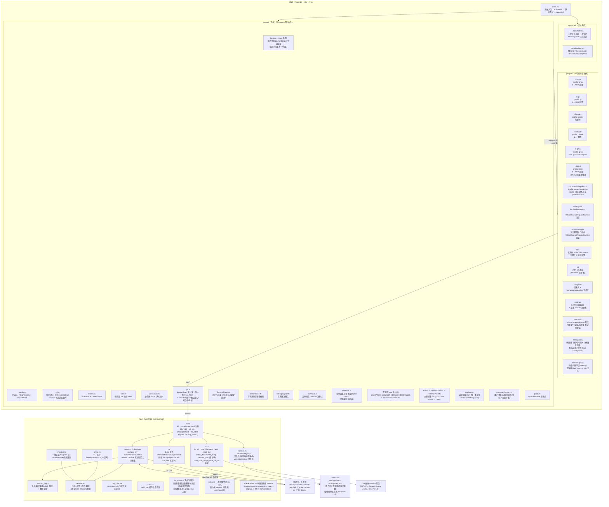
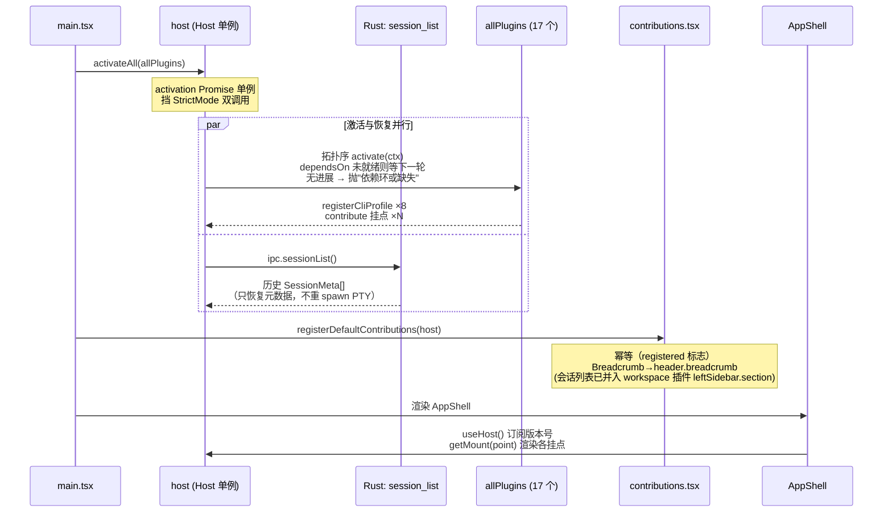
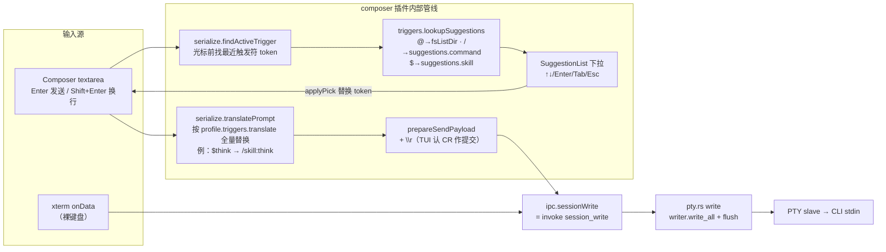
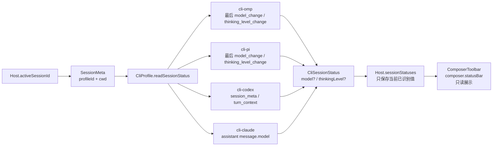
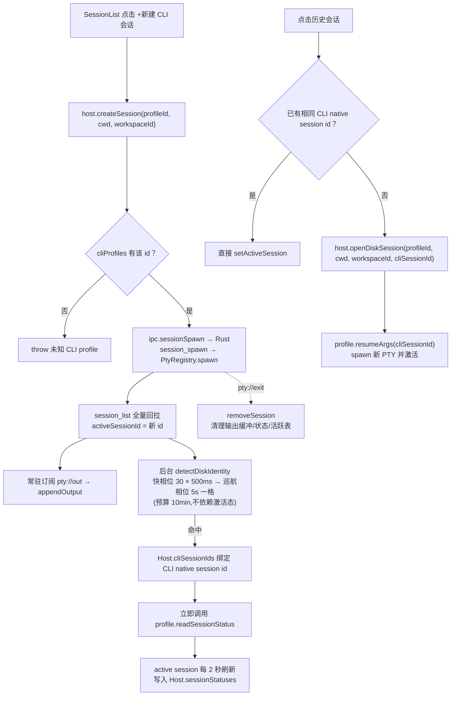
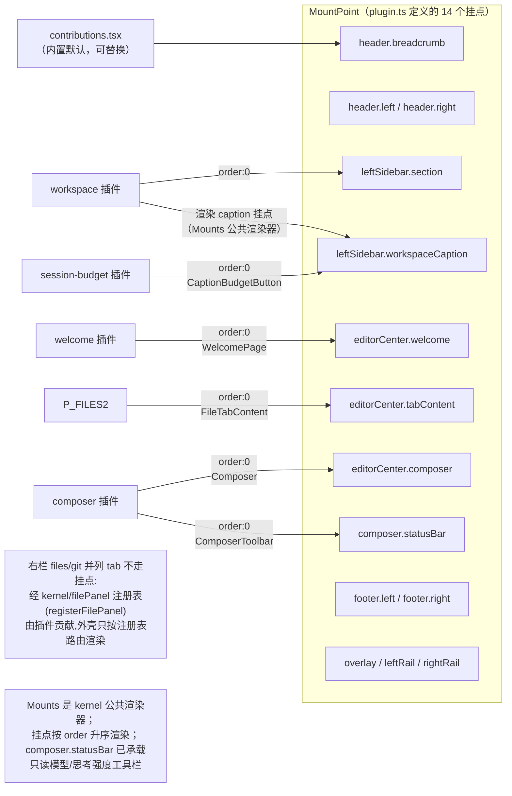

# tmd-cli 代码级架构（当前实现）

- 日期：2026-09-01（2026-09-03 按当前代码校准）
- 状态：对应主干当前代码（v0.1.0 骨架）
- 前置阅读：[01-overview.md](01-overview.md)（设计决策层）；本文是**代码事实层**——每个节点都能在仓库里找到对应文件/符号。

## 1. 全景分层



**依赖铁律**（代码中已成立）：

 - 内核 `src/kernel/` 不 import 任何 `src/plugins/`；插件清单唯一入口是 `src/plugins/index.ts` 的 `allPlugins` 数组（编译期注册）。
 - 插件之间**零直接依赖**：协作仅通过 `PluginContext`（`registerCliProfile` / `contribute` / `events`）和内核注册点（`fileHighlighter` / `fileVisual` / `filePanel`）；`plugins/cli-shared` 仅是无生命周期的共享格式库，不是插件。
 - 前端触达 Rust 的唯一通道是 `src/kernel/ipc.ts`；插件不直接 import `@tauri-apps/api`。

**文件规模铁则**（2026-09-02 起生效）：

 - **单文件行数不得超过 500 行**（含注释与空行；`.ts` / `.tsx` / `.rs` / `.css` 均受限）。超过即必须结构拆分，禁止以“快完成了”“暂时超一点”为由豁免。
 - 拆分方向按内容性质定：数据表（如主题 preset）按域拆为多个数据文件 + 一个 barrel 重导出；逻辑文件按职责拆为多个模块；UI 组件按子组件/视图拆分。
 - 拆分必须保持公开 API 不变（barrel 重导出原名），既有测试不得修改即应全绿。
 - 豁免仅限自动生成的文件与第三方 vendored 代码，且必须在文件头注释标注豁免理由。
 - 存量超限文件以拆分执行记录为准；新增代码评审时此铁则为一票否决项。

## 2. 启动装配序列



## 3. 核心数据流：PTY 输出 → 幕布（零渲染原则的唯一实现）

```mermaid
sequenceDiagram
    participant CLI as CLI 子进程
    participant PT as pty.rs reader→emitter 线程
    participant EVT as Tauri Event
    participant H as host.appendOutput
    participant BUF as outputBuffers<br/>(分块环形尾部,上限可配<br/>默认 50 万字符)
    participant BUS as EventBus<br/>ptyLiveTopic(sessionId)
    participant TV as TerminalView (xterm)

    CLI->>PT: 字节流 (8192B buf)
    PT->>PT: 8ms 聚合窗拼批 + 落盘 session_log<br/>增量 UTF-8 解码(跨包不断字)
    PT->>EVT: emit "pty://out/{sessionId}"
    Note over H: 常驻订阅：会话诞生即挂<br/>与幕布是否挂载无关
    EVT->>H: onPtyOutput 回调
    H->>BUF: 追加 + 截尾
    H->>BUS: emit(ptyLiveTopic, text)
    H-->>H: 首写闸(activityWatch)通过<br/>才结算呼吸灯;未对话会话<br/>输出直通幕布不进灯<br/>notify 节流 500ms
    BUS->>TV: term.write(text)

    Note over TV: 切会话重挂载时：<br/>1. 先回放 getOutputBuffer()<br/>2. 再订阅实时流<br/>→ "切回不黑屏"<br/>滚到顶可经 session_history_page<br/>从日志文件往前翻页(512KB/页)

    Note over TV: 回放/翻页重写期间上「输入闸」<br/>(terminalInputGate):历史内容里的终端查询<br/>(DSR/DA/OSC 颜色)会被 xterm 重新应答,<br/>闸内丢弃 —— 否则陈旧应答注入活 PTY,<br/>且 writeSession 视同首写锚定对话,<br/>历史会话点开即误走呼吸灯绿→蓝;<br/>闸外终端协议回传(焦点/鼠标/查询应答)<br/>经 isTerminalReport 标 synthetic ——<br/>照写 PTY 但不锚定对话

    CLI->>PT: 进程退出 / read 返回 0
    PT->>EVT: emit "pty://exit/{sessionId}"
    EVT->>H: removeSession +<br/>emit KernelTopics.sessionExited
```

## 4. 输入链路：键盘 / Composer → PTY



关键不变量：

- **composer 不做 CLI 语义**——触发符、`translate` 全由 CLI profile 声明；codex 无 `translate` 即原样透传。
- 粘贴/拖拽文件（`handlePaste` / `handleDrop`）先经 `ipc.fsWriteTemp` 落盘系统临时目录 `temp_dir()/tmd-cli`（受 fs.rs remove 白名单管辖），再把绝对路径插入草稿。
- 裸 xterm 输入与 composer 发送**汇入同一条** `session_write` 通道。
- 终端协议回传（焦点上报 DECSET 1004 / 鼠标上报 / 查询应答）经 `terminalReports.ts`
  识别后以 `synthetic` 标记走同一条 `host.writeSession`：照写 PTY（CLI 在等这些应答），
  但不锚定呼吸灯对话 —— 点一下终端/滚一轮不是用户首写。

### 4.1 Composer 状态链路：CLI session JSONL → 只读工具栏



状态刷新只针对 active session：首次绑定 CLI native session id 时立即读取，之后每 2 秒轮询；值未变化不触发 notify。文件不存在、尚未刷盘或字段不可识别时返回空状态，UI 显示 `—`。

边界不变量：

- Host 只编排读取和缓存，不解析任何 CLI 私有 JSONL 格式。
- `cli-*` 插件拥有 session 文件定位和字段解析。
- `fs_read_tail` 是通用 IPC 原语，不携带 CLI 语义。
- Composer 通过 `composer.statusBar` 挂载点消费工具栏，不直接硬编码 CLI 状态组件。

## 5. 会话生命周期与历史恢复



状态读取不会写回 Rust `SessionMeta`。`cliSessionIds` 和 `sessionStatuses` 是 Host 运行时内存态；CLI 原生 session 文件仍由各 CLI 自己维护。
### 5.1 CLI 会话存储共性（八家实证,新业务功能先查此表）

| 能力 | omp | pi | claude | codex | kimi | grok | qoder / qoder-cn |
|---|---|---|---|---|---|---|---|
| 存储 | `~/.omp/agent/sessions/<slug>/<ts>_<uuid>.jsonl` | `~/.pi/agent/sessions/<slug>/<ts>_<uuid>.jsonl` | `~/.claude/projects/<slug>/<uuid>.jsonl` | `~/.codex/sessions/<YYYY>/<MM>/<DD>/rollout-<ts>-<uuid>.jsonl` | `~/.kimi/sessions/<MD5(cwd)>/<uuid>/wire.jsonl` | `~/.grok/sessions/<encodeURIComponent(cwd)>/<uuid>/`(目录态,内含 wire + summary.json) | `~/.qoder`/`~/.qoder-cn` 下 `projects/<slug>/<uuid>.jsonl`(claude 同构) |
| cwd 分区 | 目录 slug | 目录 slug(规则与 omp 不同!) | 目录 slug | 无,读首行 `session_meta.payload.cwd` 过滤 | MD5(cwd) 目录哈希(会话文件内无 cwd,Rust `md5_hex` 原语计算) | encodeURIComponent(cwd) 目录名 | 目录 slug(claude 同构规则) |
| 原生标题 | 首行 `type:"title"` 记录(定长 pad 覆写) + `title_change` 事件 | `title_change` 事件 + session 行 title | `type:"summary"` 行(部分版本不落) | 无概念 | 无(TUI 内存推导,wire.jsonl 不落标题事件) | 目录内 `summary.json` 是元数据真相(generated_title/session_summary) | 无 title/summary 记录 |
| 标题兜底 | — | — | 首条 `type:"user"` 消息 | 首条 `role:"user"` 的 `response_item` | 首条 `TurnBegin` 用户输入 | —(summary.json 即真源) | 首条用户消息(head 窗口 32KB,容忍前置 snapshot 行) |

共性法则（2026-09 会话列表功能沉淀）：

1. **标题提取统一走 `kernel/diskSessions.ts#extractJsonlTitle`（纯函数）**：
   `title 记录 > session 行 title > summary > 首条用户消息`，逐行 try/catch 容忍 head 截断。
   各插件只声明自己的 head 窗口（omp/pi 8KB / claude 32KB / codex 128KB 且先 4KB meta 过滤再读大窗 / kimi 8KB / qoder 32KB / grok 读 summary.json）。
2. **手动重命名 = 应用侧覆盖层（`settings.sessionTitles`），禁止写回 CLI 磁盘文件**：
   omp/pi 的 title 记录是定长 pad 覆写格式，改写有长度/并发风险；claude/codex 无原生 rename 概念，
   追加异构行有解析破坏风险。覆盖层 key = `${profileId}:${cliSessionId}`，显示优先级最高。
3. **删除会话 = 双端统一物理删除（`fs_remove_path`，NotFound 幂等成功）**：
   活会话先删已绑定磁盘文件/目录再 kill PTY；磁盘会话直接删。kimi 会话是目录
   (`<uuid>/wire.jsonl`),按整目录删避免 CLI /sessions 留幽灵会话。UI 侧两步确认防误删。
4. **呼吸灯三态归内核 Host 结算（活动守望 1Hz）**：绿(2s 内有输出) → 蓝(静默结算时未被查看,
   组内置顶) → 点开即清(灰)。UI 只读 `host.isUnread`，不各自实现状态机。
   呼吸灯锚定**用户首写**（activityWatch 首写闸）：首写前的一切输出（spawn 横幅、
   resume 回放、TUI 重绘、迟到异步消息）不亮灯、不标未读、不发结束音 —— 静默不是
   "用户在场"的证据。终端协议回传（焦点/鼠标/查询应答，`terminalReports.ts` 识别）
   照写 PTY 但标 synthetic，不算用户首写。

**Session 模型**（Rust `SessionMeta` + Host 运行时绑定）：

| 字段 | 来源 | 用途 |
|---|---|---|
| `id` | `pty.rs` | 事件路由 `pty://out/{id}` |
| `profileId` | spawn 入参 | 找回 profile 做 resume/触发器/状态读取 |
| `cliSessionId` | Host 后台探测，内存绑定 | resume 参数、定位 CLI JSONL |
| `workspaceId` | spawn 入参 | 会话列表按工作区分组 |
| `createdAt` | Rust 注册表 | 列表展示 |


## 6. 挂载点地图（谁贡献了哪块 UI）



## 7. 模块级依赖图（import 事实）

```mermaid
flowchart TD
    M["main.tsx"] --> AS["app-shell/AppShell.tsx"]
    M --> CT["app-shell/contributions.tsx"]
    M --> PI["plugins/index.ts"]

    AS --> KH["kernel/host.ts"]
    AS --> KM["kernel/Mounts.tsx"]
    AS --> KTV["kernel/TerminalView.tsx"]
    CT --> KH
    CT --> KW["kernel/workspace.ts"]

    PI --> P1["cli-omp / cli-pi / cli-codex / cli-claude / cli-grok / cli-kimi / cli-qoder / cli-qoder-cn"]
    PI --> P2["workspace"]
    PI --> P3["files"]
    PI --> P4["git"]
    PI --> P5["composer"]
    PI --> P6["checkpoints / network-proxy / settings / welcome / session-budget"]

    KH --> KE["kernel/events.ts"]
    KH --> KI["kernel/ipc.ts"]
    KTV --> KI
    KTV --> KH
    KW --> KI

    P1 --> KI
    P1 --> SH["plugins/cli-shared<br/>共享 JSONL 格式库(非插件)"]
    P2 --> KW
    P3 --> KI & KT & KFH["kernel/fileHighlighter.ts"] & KFV["kernel/fileVisual.ts"] & KFP["kernel/filePanel.ts"]
    P5 --> KH & KM & KI

    KI --> TAPI["@tauri-apps/api<br/>invoke / listen"]

    style KE fill:#1e3a5f
    style KI fill:#1e3a5f
    style KH fill:#1e3a5f
```



蓝底 = 内核三基石：`events.ts`（跨插件通信唯一通道）、`ipc.ts`（触 Rust 唯一入口）、`host.ts`（装配点 + 会话服务）。

## 8. Rust 后端命令面

注册的 62 个 `#[tauri::command]`（lib.rs 26 + git/commands.rs 15 + checkpoints/commands.rs 11 + fs_edit.rs 6 + quota.rs 2 + omp_auth.rs 2），与 `ipc.ts` 一一对应：

| 命令 | 实现 | 说明 |
|---|---|---|
| `session_spawn` | `pty.rs` + `session.rs` | openpty → spawn 子进程 → reader/emitter 双线程泵输出 → 内存注册表登记 |
| `session_list` | `session.rs` | 活会话纯内存注册表(进程重启即空;历史恢复走各 CLI 磁盘扫描) |
| `session_write` / `session_resize` / `session_kill` | `pty.rs` | writer 直写 / master.resize / child.kill |
| `session_log_size` / `session_history_page` | `session_log.rs` | 输出日志末尾偏移 / 绝对偏移前翻一页(转义+UTF-8 边界对齐) |
| `cli_probe` | `probe.rs` | PATH 解析 + `--version`(8s 硬超时,spawn_blocking;输出带超时收集防孙进程握管道挂死) |
| `cli_install_run` | `installer.rs` | npm -g / claude native 安装,`cli-install://{engine}` 流式日志(300s 超时) |
| `omp_auth_credential` / `omp_auth_providers` | `omp_auth.rs` | omp agent.db 只读:单供应商凭据 JSON / 已登录供应商列表 |
| `quota_fetch` / `quota_env_value` | `quota.rs` | 通用 HTTP 代理(15s 超时) / 只读环境变量 |
| `platform_kind` / `app_restart` | `lib.rs` | UA 探测失败时的 OS 兜底 / 重启应用(插件启停重启生效) |
| `fs_list_dir` | `fs.rs` | 单层列举，隐藏过滤，目录排前 |
| `fs_read_file` | `fs.rs` | ≤512KB、非二进制、UTF-8 才给预览 |
| `fs_write_temp` | `fs.rs` | 截图/拖拽文件落系统临时目录 `temp_dir()/tmd-cli` |
| `fs_collect_files` | `fs.rs` | 递归收集指定后缀文件并按 mtime 倒序 |
| `fs_read_head` / `fs_read_tail` | `fs.rs` | 读取 JSONL 头/尾，避免全文加载 |
| `fs_remove_path` | `fs.rs` | 物理删除文件/目录（会话删除双端统一）,NotFound 幂等成功 |
| `fs_create_dir` / `fs_create_file` / `fs_write_file` | `fs_edit.rs` | 文件树新建目录/文件、编辑器保存(绝对路径,禁 .git 段,写上限 16MB) |
| `fs_rename_entry` / `fs_trash_entry` / `fs_reveal_in_file_manager` | `fs_edit.rs` | 重命名(校验 basename) / 废纸篓(trash crate) / 在访达(Finder)中显示 |
| `read_local_image_data_url` | `lib.rs`/`fs.rs` | md 预览本地图片(白名单 + 20MB 闸) |
| `md5_hex` | `hash.rs` | 通用哈希原语(kimi 会话目录 `MD5(cwd)`) |
| `checkpoint_anchor` / `checkpoint_seal` / `checkpoint_seal_dead` | `checkpoints/ledger.rs` | 审批线账本:记第 N 轮锚点(隐式封上一轮+CLI 身份回填) / 结算封口固化 turn 条目 / 幽灵窗口(超 24h 未封口)代封 |
| `checkpoint_list` / `checkpoint_batch_diff` | `checkpoints/view.rs` | 账本只读视图(会话隔离+live 分类) / 批 diff(sealed 读账本,open 现算) |
| `checkpoint_record_edit` / `checkpoint_restore` / `checkpoint_apply` / `checkpoint_approve` / `checkpoint_undo_revert` / `checkpoint_prune` | `checkpoints/events.rs` / `restore.rs` / `view.rs` 等 | AI 写入事件流式记账(events 归因主信号) / 整批或单文件回退(guard 落账) / 已退批按批后像写回 / 通过标记 / 反悔恢复 / 保留策略与对象库 reachability 清理 |
| `git_status` / `git_totals` / `git_ahead_behind` | `git/status.rs` 等 | libgit2 本地读(status 聚合/改动统计/领先落后) |
| `git_diff_file_patch` | `git/diff.rs` | libgit2 patch 生成(前端 PatchLRU 缓存 50 条/20MB) |
| `git_stage` / `git_unstage` / `git_discard` / `git_commit` | `git/index_ops.rs` 等 | index 写操作(discard = checkout_index,不经 fs 删除) |
| `git_log` / `git_branches` / `git_checkout` / `git_create_branch` / `git_delete_branch` | `git/log.rs`/`branch_ops.rs` | 历史/分支操作(全 libgit2) |
| `git_fetch` / `git_pull_push` | `git/remote_ops.rs` | 远端操作 shell-out(300s 总超时,GIT_TERMINAL_PROMPT=0,管道排空不 join) |
| `config_home_dir` / `config_default_workspace_root` | `session.rs` | 返回配置和默认工作区路径 |
| `config_read_settings` / `config_write_settings` | `settings.rs` | `~/.tmd-cli/settings.json` 全局设置读写 |
| `config_read_workspaces` / `config_write_workspaces` | `session.rs` | `~/.tmd-cli/workspaces.json` 工作区配置读写 |

### 8.1 checkpoints 账本模型(审批线底层)

批次 = **工作区 + 会话 + 轮次**三元组下的账本条目,落盘于 `~/.tmd-cli/checkpoints/{md5(cwd)}/`:

| 文件 | 内容 |
|---|---|
| `ledger.jsonl` | 追加写账本。`anchor`(第 N 轮 prompt 发出前的工作区基线)/ `turn`(该轮封口固化的变更集:逐文件前后像 oid + unified diff)/ `guard`(回退前守卫)。同一 `(kind,id)` 多行取最后一行(turn 可修订至下一锚点落地) |
| `objects.git` | sidecar 裸仓库,只写 blob(内容寻址去重),永不触碰用户仓库 index/refs |
| `states.json` | 审核态覆盖(approved/reverted/reverted_paths/guard_id);done 由 list 现场推导 |

生命周期事件流(前端 `plugins/checkpoints/index.tsx` → 后端原语):

```
promptSent   → checkpoint_anchor(记锚点;隐式先封上一轮,防 turnSettled 丢失)
turnSettled  → checkpoint_seal(封口:基线→live 的真实变更固化为 turn 条目,零差异不落账)
sessionExited → checkpoint_seal(兜底,最后一轮落账)
```

关键不变量:**归因在封口瞬间定死,list 只读账本不推导**——每轮绑定的文件集合只含本窗口内
的真实变更,历史轮不再随工作区脏集漂移。三条仲裁规则:

- **并行归属按写入时刻,不按封口先后**:每个锚点张成窗口 `[锚点 ts, 封口 ts(未封口 = now)]`,
  文件按 mtime 落窗,取**最近提示**(锚点最新)的会话归主 —— 后提示的会话只对自己锚点之后的
  写入负责,先封口抢不走别人窗口内的改动,open 批也不混入他会在途的工作。mtime 不可得
  (删除态)回退"外会话已封口认领则不重复归属"。
- **turn 条目身份继承锚点**:封口可能由任意事件触发,调用方的 CLI 身份可能漂移(cli id ↔
  tmd id);落账恒用锚点记账时的身份,链不劈裂,查询按 `(sessionId, tmdSessionId)` 双字段命中。
- **幽灵窗口收口**:崩溃/强退会留下永不封口的锚点窗口;记锚点时对超 24h 未封口的外会话
  锚点代为封口,窗口不再无限吞掉后续写入的归属。已知残余歧义:他人长轮次横跨本会话提示
  期间写入的文件,归属最近提示者(纯文件系统事实无法区分谁是写入者)。
- **账本主键仲裁(绑定竞态兜底,前端 `plugins/checkpoints/identity.ts`)**:并行 spawn/
  磁盘身份扫描竞态会把新会话绑到老会话的 cli 磁盘身份上(2026-09-03 账本实证)。同一 cli
  身份被多个活会话持有时,**先创建者保留**(同毫秒按 id 字典序定全序),后到者回退自己的
  tmd id 起新链 —— 记账与查询同走此仲裁,新会话不再看到老会话的审批线;绑定修复后身份
  回填自动把回退链并入真实身份,无损自愈。

## 9. 设计原则 ↔ 代码落点对照

| 原则（01-overview） | 代码证据 |
|---|---|
| 幕布零渲染 | `TerminalView.tsx`：字节流只进 `term.write`，无任何二次解析 |
| 切回不黑屏 | `host.ts` `outputBuffers`（分块环形尾部,上限经设置项 `sessionOutputBufferLimit` 可配,默认 50 万字符;`streamSlice` 保证截断不劈转义序列/surrogate）+ TerminalView 挂载先回放再订阅 |
| 触发符纯透传 | `cli.ts` `translate?` 是唯一例外钩子；`serialize.translatePrompt` 只调用 profile 声明 |
| 一切能力皆插件 | `plugins/index.ts` 是唯一插件清单；内核无插件 import |
| 插件不互相依赖 | 协作仅经 `PluginContext` / `EventBus` / `fileHighlighter` / `fileVisual` / `filePanel` 注册点；`cli-shared` 是无生命周期的共享格式库，不是插件 |
| 会话状态只读 | `CliProfile.readSessionStatus` 负责 CLI 私有 JSONL 解析；Host 只缓存/刷新，Composer 通过 `composer.statusBar` 展示 |
| 会话固定一个 CLI | `SessionMeta.profileId` 创建后不变；resume 用同 profile 重 spawn |
| 幂等/防御 | `activateAll` Promise 并发闸；`registerDefaultContributions` registered 标志；`registerCliProfile` 重复即抛错 |

## 10. 已知缺口（代码现状，非设计意图）

- `footer.left`、`footer.right` 等挂点暂无贡献者（`overlay` 已由 settings 插件贡献设置面板,network-proxy 浮层亦经 overlay 常驻）。
- CLI 凭据盘点未覆盖 kimi/qoder/qoder-cn（`welcome/credentials.ts` 分支仅 omp/pi/codex/claude/grok）。
- Codex 的 session 状态解析采用容错字段匹配，完整 `turn_context` schema 仍需随 CLI 版本验证。
- `composer` 命令抽屉(openspec composer-command-drawer)代码已实装,余 5 项 `[V]` 真机验收在途。
