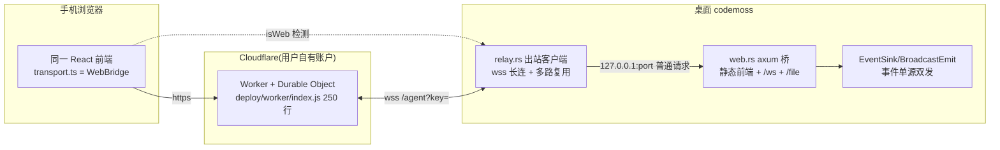

# codemoss Web/远程访问实现源码级分析

> 日期:2026-09-15 · 状态:已完成(源码实读:web.rs 1865 行 / relay.rs 1903 行 / transport.ts / event_sink.rs / deploy/worker/index.js / 治理面 7 组件)
> 配套提案:`openspec/changes/2026-09-15-web-remote-access/`

## 结论先行

codemoss 已把「手机浏览器访问桌面 app」做成完整产品功能,三层解耦、治理闭环:

1. **LAN 桥**(`web.rs`,axum):HTTP 伺服内嵌前端 + WS 桥镜像**全部** Tauri 命令/事件面;LAN 用一次性随机 token 守门。
2. **出站中继**(`relay.rs` + Cloudflare Worker):桌面**主动外拨**一条 WSS 到用户自己部署的 Worker,手机从公网经 Worker 访问;零入站端口、零路由配置;设置页**一键部署** Worker(调 Cloudflare API,连 wrangler 都不用装)。
3. **前端传输抽象**(`transport.ts`):`isWeb = !__TAURI_INTERNALS__` 检测,invoke/listen 接口 drop-in 替换 —— 同一份 React 前端在 webview 与手机浏览器里零改动运行。

安全模型是双层:LAN 只认 URL token;中继流量只认「桌面批准过的设备」(配对密钥 → 设备行 → 桌面人工批准 → HttpOnly cookie)。Worker 本身零策略,所有闸门收在桌面桥内。这套设计对 tmd-cli 几乎全部可直接对标,且 tmd-cli 有两个结构性优势(见「移植映射」):事件发送点只有 6 处、插件语义全在前端 TS。

## 架构总览

LAN 形态更简单:手机浏览器直连 `http://<lan-ip>:<port>/?token=…`,不经过 relay。

## 一、web.rs —— LAN 桥(1865 行,含 ~140 行测试)

### WS 协议

- 客户端 → 桥:`{"type":"invoke","id":N,"cmd":"…","args":{…}}`;桥 → 客户端:`{"type":"response","id":N,"ok":true,"payload":…}`;首帧 hello 带版本号(`web.rs:724`)。
- 事件:桥的 broadcast channel 把 EventSink 的事件流原样推成 WS 文本帧(`WsEmit`,`web.rs:638-651`),前端 `listen` 按事件名分发,与 Tauri event 形状一致。
- 每个 invoke 独立 tokio task(`web.rs:765`):长命令(send_message)不阻塞读循环;重命令内部已有 spawn_blocking。

### dispatch 白名单(`web.rs:1222-1658`,约 70 个命令)

逐命令路由到与 Tauri handler **相同的函数**。刻意排除的类别(注释写明理由):

- `web_access_start/stop`:desktop-only —— 桥不能通过桥自己启动自己(bootstrap 问题);
- storage 写入、`plugin_install_from_marketplace`:desktop-only;
- **但 `web_relay_*` 放行** —— relay 无 bootstrap 问题,已批准设备可以管理中转(`web.rs:1612-1619`);
- 设备管理(approve/revoke)放行:手机端「授权自己」是桌面弹窗之外的合法路径(桌面批准是第一道)。

### 安全闸门(`gate()`,`web.rs:402-449`)

| 路径 | 凭据 | 机制 |
|---|---|---|
| LAN | URL `?token=` | 每次启动铸新随机 token;放 URL 是因为 `` 不能带 header(`web.rs:5-8`) |
| relay | 设备批准 | `relayed()` 双条件 = `x-ccgui-via` 头 **且** peer 是 loopback(`web.rs:373-383`)—— 只信头会让同 Wi-Fi 陌生人伪造中继身份跳过 token |

设备配对流:手机输 8 位配对密钥 → `POST /unlock` → db 落 `web_devices` 行(pending)→ 桌面设置页点「授权」翻 `approved_at` → 发 HttpOnly cookie `ccgui_device`(Lax 不设 Secure:LAN 是明文 http,`web.rs:340-344`)。之后每条 WS 每 5s 复查批准,revoke 即时踢线(`web.rs:755-799`)。配对密钥由后台定时器自动轮换(`lib.rs:117-119`),`rotate_web_pair_key` 命令 desktop-only。

### 值得抄的细节

- `RemoteSession` RAII 计数器(`web.rs:120-166`):有 relayed socket 存活 → 桌面显「远程控制中」徽标;relay 单纯连着不算(隧道常开空闲)。
- `/file` 路由镜像 assetProtocol scope,$HOME 内排除凭据/app-data 目录,canonicalize 防 symlink/`..` 逃逸(`web.rs:895-919`)。
- `lan_ip()`:RFC1918 优先,显式排除 ClashX 增强模式的 198.18.0.0/15 假网卡(`web.rs:1662-1697`)—— VPN 用户二维码不再指向死地址。
- 静态前端复用 Tauri embedded frontendDist,不二次 embed(`web.rs:804-816`);dev 构建回退读磁盘 dist。
- start/stop 经 tokio Mutex 线性化(`WebAccessTransition`),失败回滚只拆自己新建的桥(ownership bit,`web.rs:236-310`)。

## 二、relay.rs + Worker —— 出站中继(1903 + 250 行)

### 线协议(一条 WSS 多路复用,`relay.rs:5-17`)

- 桌面 → Worker:`wss://<worker>/agent?key=<secret>`,一条长连;Worker 端每个 key 一个 Durable Object 持有这条 socket,重连桌面**顶掉**旧 socket,绝不自交(index.js:51-58)。
- Worker → 桌面:`open{id,path,method,headers,ws?}` → `body` → `end`(HTTP)或 `data`(socket);桌面 → Worker:`head` / `data` / `close` / `error`,payload 全 base64。
- 桌面把每条流转成对 `127.0.0.1:<bridge port>` 的普通 HTTP/WS 请求并打上 `x-ccgui-via` 头 —— **桥仍是唯一闸门,Worker 只校验 key 搬运字节**。
- HTTP head 30s 超时兜底(index.js:143-156),防桌面不应答时泄漏流条目。

### 韧性(`relay.rs:34-50`)

- 重拨:1s → 30s 指数封顶,**只有开关关掉才停** —— 「Cloudflare 抽风」与「服务挂了」不可区分,停下等于把抽风变成人工维修。
- 心跳:15s 无 pong 即判死重拨(CF 可能留个半开 socket,开关会假显示「已连接」)。
- 拨号 20s 超时(connect_async 无内建超时,半开 Worker 会把 stop watch 一起卡死)。
- autostart:开关持久化在 settings(`webRelayUrl/webRelayKey`),应用重启自动重连(`lib.rs:139-153`)—— 无人值守可及性是功能本体。

### 一键部署(`relay.rs:360-795`)

- Worker 源码 `include_str!` 内嵌进桌面二进制;`relay_deploy` 直接调 Cloudflare REST:列账户(user token 自动;`cfat_` 账户令牌不能列账户 → 前端改要 Account ID,报错文案点名真因 `relay.rs:587-588`)→ 取 subdomain → 一次上传把 Durable Object 迁移 + 绑定 + 密钥全塞进 metadata,**用户不需要装 wrangler**。
- 密钥永远后端铸造(32 字符无歧义字母表),绝不信任设置字段里的现值。
- 备选:`relay_deploy_pack` 手写 STORE-only zip(~9KB,不引 zip 依赖)导出让用户自己 wrangler —— 字节可审。

## 三、transport.ts + event_sink —— 前端零感知的两块基石

- `transport.ts`(190 行):`isWeb = !("__TAURI_INTERNALS__" in window)`;`WebBridge` 类提供与 `@tauri-apps/api` 相同签名的 `invoke`/`listen`,WS 断线 1s→10s 重连,pending map 按 id 配对。`ipc.ts` 第 2 行 `import { invoke } from "./transport"` —— 868 行 ipc 层与全部页面对运行环境零感知。
- `event_sink.rs`:事件单源。`BroadcastEmit` 扇出 = webview(`app.emit`)+ 任意数量 WS 广播者;`EventSink` 负责**批量**(32ms/64KB flush,chat 事件 16ms)—— PTY 输出类高频事件不逐帧打爆 WS。Rust 侧所有事件只调 sink,不直接 `app.emit`。

## 四、治理面(设置 → 远程访问)

- 分段 tab:内网(启停 + token URL + **二维码** qrcode.react)/ 外网。
- 外网 tab 首次进入弹 `WebWanRiskDialog`(localStorage 记一次性,故意不跨机同步):文案明写「读写文件、运行终端命令、消耗 API 额度,权限与本机完全相同」,接受钮 danger 样式。
- 外网四卡:Deploy(一键部署/导 zip)→ Relay(URL+key+连接+状态点带错误 tooltip)→ Auth(授权开关 + 8 位密钥展示/复制/手动轮换)→ Devices(待授权/已授权列表,批准/改名 IME 安全/踢除)。
- 设置字段仅 4 个:`webAuthEnabled/webAuthKey/webRelayUrl/webRelayKey`,密钥类字段前端只置 null 让后端铸造。

## 五、移植映射:codemoss → tmd-cli

| codemoss | tmd-cli 对应 | 差异与工作量 |
|---|---|---|
| dispatch ~70 命令(codemoss 业务逻辑在 Rust) | tmd-cli 116 命令但**插件语义全在前端 TS**,Rust 是纯原语层(fs/git/pty/ssh/config/settings/sqlite/quota/wsl) | tmd-cli 反而简单:dispatch 按域白名单覆盖原语即可,所有插件逻辑随前端在浏览器里原样运行,零适配 |
| event_sink(6 个事件常量 + 批量) | tmd-cli 仅 **6 处 `app.emit` 调用点**(installer/pty_spawn/pr_workflow/ssh×3/sftp),事件面 = pty://out、pty://exit、ssh://event、ssh://prompt、sftp、cli-install、pr-stage | 收敛成 EventSink 是小改动;pty://out 高频,32ms/64KB 批量直接抄 |
| transport.ts | tmd-cli `src/kernel/ipc.ts` 是 R3 唯一 `@tauri-apps/*` import 点(897 行,6 个 tauri import) | 把 6 个 import 下沉到新 `kernel/transport.ts`,ipc.ts 改从 transport 导入;`check-arch-boundary.mjs` 白名单改一行指 transport.ts —— R3 语义不变,载体换层 |
| 设置治理面 7 组件 | tmd-cli「一切能力皆插件」→ 新 `src/plugins/web-access/` 插件(设置分区 + 「远程控制中」徽标挂点),Rust 机制在 kernel | 符合铁律标准路径;Rust 侧是宿主机制(会话远程可达性),入 kernel 合规 |
| web.rs 1865 行单文件 | tmd-cli 300 行铁则 | 必须拆:`src-tauri/src/web/{mod,state,gate,server,dispatch,devices}.rs` + `web_relay/` 目录;dispatch 按域再拆 |
| /file scope = $HOME 排除凭据目录 | tmd-cli assetProtocol scope 是 `**/*`(tauri.conf.json:19) | web 的 /file 必须**收窄**:$HOME 排除 `~/.tmd-cli`、`~/.ssh`、`~/.aws`、各 CLI 凭据目录;canonicalize 防逃逸照抄 |
| 前端 dist 复用 embedded frontendDist | tmd-cli 同为 `../dist` embed | 直接同款 |
| axum/tokio-tungstenite/reqwest | tmd-cli 已有 reqwest 0.13(rustls)+ tokio(net/io-util/macros/sync) | 新增 axum + tokio-tungstenite 两个依赖;relay 部署调 CF API 复用 reqwest |
| 二维码 qrcode.react | 无 QR 依赖 | 新增 qrcode.react(小组件,无运行时依赖) |
| 桌面专属 API(window/updater/dialog/shell/process) | tmd-cli 同有(uiZoom/更新检查/目录选择/open/relaunch) | transport.ts 提供 isWeb 分支:浏览器端降级 no-op 或隐藏入口;convertFileSrc → `/file?path=` 映射 |

## 六、可借鉴清单(行动项级)

1. **照搬**:WS 协议形状(invoke/response/hello + 事件帧)、设备配对四态(pending/approved/cookie/5s 复查)、`relayed()` 双条件防伪、RemoteSession 徽标计数、relay 重拨+心跳+autostart 三件套、relay_deploy 内嵌 Worker 一键部署、`lan_ip()` VPN 假网卡规避、EventSink 批量参数(32ms/64KB)。
2. **改造**:dispatch 从「逐命令白名单」改为「按域白名单 + 桌面专属排除清单」(tmd-cli 原语面更宽但语义更薄);web server 按 300 行铁则拆目录。
3. **新增**(codemoss 没有,tmd-cli 必须):CSP 响应头(web 表面无 Tauri 注入的 CSP,桥要自己发:`connect-src 'self' ws:` 等);assetProtocol `**/*` 与 /file 收窄的差距要在提案里声明为 trust-boundary 变更并配单测。
4. **不借鉴**:codemoss 把设备管理命令放行给手机端(手机可批准自己之外的设备)—— tmd-cli 提案中 approve/revoke 保持 desktop-only,手机端只读状态,收窄一档。
