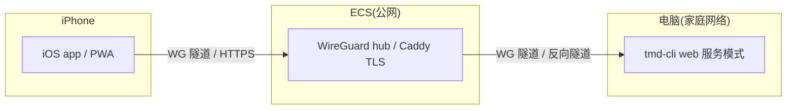

# 手机 App 外网访问 tmd-cli 方案调研

> 日期:2026-09-15 · 状态:调研底稿(方案对比,未拍板)
> 需求:iPhone(iOS)在外网访问家里/公司电脑上的 tmd-cli;有一条带公网 IP 的云 ECS 可用,但也要求覆盖「没有 ECS」的情形;最终形态要做一个 iOS app。

## 结论先行

「手机访问 tmd-cli」拆成三层,各自独立选型、任意组合:

1. **服务面**(电脑上暴露什么):tmd-cli 目前**没有任何 HTTP/WS 服务面**(`src-tauri` 无 web server;ssh 模块的 `TcpListener` 仅做本地转发且绑 127.0.0.1)。正路是新增「web 服务模式」:Rust 侧 axum + WS 镜像 ipc 命令面**子集**,前端复用现有 React 界面。
2. **通道**(怎么跨公网):有 ECS 首选 **WireGuard**(ECS 做 hub,公网只开一个 UDP 端口);无 ECS 首选 **Tailscale**(两端装 app 即通)或 **Cloudflare Tunnel**(免费 + 自带鉴权)。
3. **壳**(iOS 上跑什么):首推 **Tauri 2 iOS 复用整个前端**(React 19 + xterm.js 原栈零迁移);验证期用 Safari/PWA 零成本兜底。

今天就能用的零开发兜底:远程桌面(RustDesk/ToDesk)整屏操作,或 macOS 自带 sshd + iPhone 上 Blink Shell 直连终端 —— 但都绕开 tmd-cli 的 UI,不满足「做个 app」的最终目标。

一个对本项目有利的架构事实:tmd-cli 已有「磁盘先行回放 + 进程惰性拉起」契约(architecture/06)。手机端**断线重连**正好复用同一机制 —— attach 会话 = 先回放磁盘 JSONL,再接管 WS 活流,与桌面打开历史会话完全同构。

## 现状盘点(代码事实)

| 事实 | 出处 | 对方案的影响 |
|---|---|---|
| 无任何对外 HTTP/WS 服务 | `src-tauri/src/` 全量无 web server 符号 | 「手机访问」必须新建服务面,不能假设已有 |
| ssh 模块完整(转发/代理/SFTP) | `src-tauri/src/ssh/*` | 方向是「桌面→远端」,与手机→桌面相反;仅可复用其证书/known-hosts 治理经验 |
| 前端命令面集中在 ipc.ts | `src/kernel/ipc.ts`(R3 唯一 `@tauri-apps/*` import 点,897 行) | 加一个 remote transport 即可让前端跑在手机上,架构已铺路 |
| PTY 幕布 = 原始字节直通 xterm.js | AGENTS.md 幕布铁律 | WS 桥按原样转发字节即可,零转换 |
| 磁盘先行回放契约 | `architecture/06-disk-first-session-open.md` | 手机 attach = 磁盘回放 + 活流接管,天然防断线 |
| xterm.js 移动端触摸是官方承认弱项 | xtermjs/xterm.js#5377「limited touch support ... severely impacts usability」、#1101 | 手机端不能照搬桌面交互;要么轻交互(看 + 发消息),要么自建触摸工具条 |
| 竞品已有 H5 远控先例 | `research/similar-products.md`:codeg 扫码 H5 远控、多家 Telegram/飞书 远控 | 赛道验证过;bot 通道可作零 app 补充 |

## 第一层:服务面(电脑上暴露什么)

### S0 不开发:远程桌面

RustDesk(开源自建/官方中转)/ ToDesk / 向日葵,手机装 app 整屏操作电脑里的 tmd-cli。今天可用,零代码;体验是「遥控屏幕」而非 app,流量大、手机上字小。作为需求验证期兜底。

### S1 不做 app:IM/Bot 通道

参照竞品:Telegram/飞书 Bot → 本机守护进程 → 往运行中会话注入消息 / 回传审批请求。只覆盖「发指令 + 收提醒」,覆盖不了终端实况。与「要做 app」冲突,仅列为远期补充。

### S2 web 服务模式(正路)

Rust 侧起 axum + WebSocket,把 ipc 命令面的**子集**镜像成 RPC(不必 897 行全量):

- v1 必需:会话列表 / 打开会话(磁盘回放)/ PTY 字节流(WS 二进制帧)/ composer 发送 / 审批线事件。
- v2 再补:文件树只读 / git 状态 / 会话管理(归档、删除)。

前端 `ipc.ts` 增加 remote transport(WS + 本地回放),手机壳与桌面共用同一 React 界面。PTY 字节原样透传,符合幕布铁律。

工作量:Rust 桥(命令路由 + 事件推送)+ 前端传输切换 + 鉴权,属「中等」——与 WSL M1 量级相当或略小。这是三条壳路线(C1/C2/C3)共同的依赖;不做 S2,任何「真 app」都无从谈起。

## 第二层:通道(怎么跨公网)

### 有 ECS

| 方案 | 拓扑 | 优点 | 缺点 |
|---|---|---|---|
| **A1 WireGuard(ECS 做 hub,首选)** | 桌面与 iPhone 都拨入 ECS 的 WG 网段,手机访问桌面内网 IP | 公网只开一个 UDP 端口,安全面最小;网络层闭环,服务面只听内网地址;顺带打通 sshd/SFTP(iPhone 装 Blink Shell 也能直连终端);ECS 在国内延迟低 | 要在 ECS 上配 WG(一次性,半小时级);手机换网(蜂窝/Wi-Fi)靠 WG 自动重连 |
| A2 SSH 反向隧道 | 桌面 `ssh -R`(autossh 保活)到 ECS,ECS 上 sshd/Caddy TLS 反代 | 零新增组件(ECS 有 sshd 就行);桌面端一条命令 | 应用层暴露,必须自己做好 TLS + 鉴权;隧道断连体验差于 WG |
| A3 frp | frps on ECS + frpc on 桌面 → ECS 域名 https | 配置面友好,面板生态成熟 | 多一个组件;同样是应用层暴露 |

推荐顺序 A1 > A2 > A3:能网络层闭环就不在应用层裸露。

### 无 ECS

| 方案 | 组成 | 优点 | 缺点 |
|---|---|---|---|
| **B1 Tailscale(首选兜底)** | 两端装官方 app,零配置 | 五分钟可用;WireGuard 加密;免费档(3 用户/100 设备)够个人用;蜂窝网络可通 | 国内连通性一般:控制面/DERP 中转在境外,延迟与偶发抽风;在意则自建 headscale + derp —— 那又需要台服务器,退回 A1 |
| **B2 Cloudflare Tunnel** | 桌面跑 cloudflared 出站隧道 + 自有域名 + Access 鉴权 | 免费;自带 TLS 与身份验证(SSO/邮箱 PIN);支持 WebSocket;无需公网 IP | 国内到 CF 边缘速度一般,域名偶有被墙风险;依赖第三方 |
| B3 家宽 IPv6 + DDNS | 光猫/路由放行 IPv6 防火墙 + DDNS 域名 + WireGuard(iPhone 蜂窝有 v6) | 零第三方、零 ECS、点对点直连延迟最低 | 依赖家宽真的分到可用 v6 且光猫能放行;地址变动靠 DDNS;配置门槛最高 |
| B4 ngrok/zrok 等 | 一行命令暴露本地端口 | 最快临时演示 | 免费档随机域名 + 限流,不适合常驻 |

推荐:B1 打底(立刻能用),B2 当 B1 抽风时的备份;长期在境内认真用,还是 A1 的 ECS 价值最大。

## 第三层:壳(iOS 上跑什么)

| 路线 | 组成 | 工作量 | 评价 |
|---|---|---|---|
| C1 Safari/PWA | 现有前端远程化后,Safari「添加到主屏幕」 | 近零 | 验证期首选;无推送、无图标动效;xterm 触摸问题同样存在 |
| **C2 Tauri 2 iOS(推荐)** | 整个 React 前端跑进 iOS WKWebView,ipc.ts 切 remote transport | 中(壳本身薄,主要工作在 S2) | 与桌面共享一套代码,技术栈零迁移;Tauri 2 已稳定支持 iOS;需要 Apple Developer Program(99 刀/年)才能 TestFlight/长期自装,免费证书 7 天重签 |
| C3 SwiftUI 原生 | WKWebView 壳 + 原生键盘工具条;或全原生 SwiftTerm 重写 | 壳小;全原生大 | 原生键盘 accessory bar(Esc/Tab/Ctrl/方向)是对 C1/C2 触摸短板的关键补强;全原生重写除非追求极致,否则不做 |

### 手机端体验的两个硬风险

1. **xterm.js 触摸**:官方承认移动端触摸支持有限(#5377)。缓解:自建移动键盘工具条 + 选择手势;或产品上把手机定位成「看 + 发消息 + 批审批」的轻交互,重编辑留在桌面。
2. **iOS 后台断连**:进后台 WS 必断。回前台重连 = 磁盘回放 + 活流接管(复用 architecture/06 契约),需在 S2 设计 attach 协议时一并考虑(回放水位 + 增量续传)。

## 安全清单(等同于把 shell 交到公网)

手机能操作 tmd-cli = 能在你电脑上跑任意命令,安全等级按 RCE 对待:

- 传输:全程 TLS(WG 本身加密;A2/A3/B2 由 Caddy/CF 终结 TLS)。
- 鉴权:最低 token;推荐网络层闭环(A1/B1 的 WG 身份),应用层只做第二道。
- 服务面默认绑 loopback/内网地址,「远程访问」作为显式开关,默认关。
- 审计:远程发起的发送/审批落审计日志(可复用 session_disk_log)。
- 只读模式:v1 可先做「只看不发」档,把风险面砍半。

## 推荐路径

1. **本周可用(零开发)**:远程桌面(RustDesk)顶上,同时 iPhone 装 Tailscale 打通网络。
2. **正式做(app 目标)**:
   - S2 web 服务模式(v1 子集:会话列表 / 磁盘回放 / PTY 流 / 发送 / 审批)—— 这是唯一绕不开的自研件。
   - 通道:有 ECS 走 A1 WireGuard;无 ECS 走 B1 Tailscale(或 B2)。服务面只听内网地址。
   - 壳:先 C1 PWA 验证交互,再 C2 Tauri 2 iOS 出正式 app;C3 的原生键盘工具条按 C2 实测痛点再决定是否加。
3. **明确不做**(本轮):IM/Bot 通道(S1)、全原生 SwiftTerm 重写、全量 ipc 命令面镜像。

## 参考资料

- xtermjs/xterm.js#5377 移动端触摸支持受限;#1101 iOS 键盘处理历史
- 竞品远控先例:`docs/research/similar-products.md`(codeg H5 远控;Telegram/飞书 远控矩阵)
- 磁盘先行回放契约:`docs/architecture/06-disk-first-session-open.md`
- 传输唯一入口:`src/kernel/ipc.ts`(R3)
