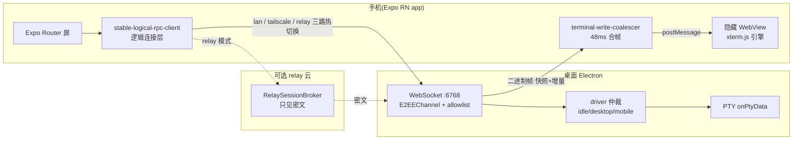

# orca mobile 模块源码级分析(tmd-cli mobile app 的对标蓝本)

> 日期:2026-09-21 · 状态:已完成(源码实读:orca 仓库 mobile/ 与 src/main/runtime,四路并行侦察)
> 前置:`research/mobile-remote-access.md`(通道选型底稿)、`research/codemoss-web-remote.md`(LAN 桥/中继已移植为 tmd-cli web-access 插件)
> 需求:为 tmd-cli 添加 mobile app;本文回答「orca 怎么做的、哪些值得学、tmd-cli 还缺什么」。

## 结论先行

orca 的 mobile 是一个 **React Native (Expo) 原生配套 app**,与桌面 Electron 之间跑**自带 E2EE 的 WebSocket RPC**:手机扫码配对(offer 内嵌桌面 Curve25519 公钥)→ 裸 ws:// 上跑 nacl box 端到端加密 → 加密通道内验每设备独立 token;终端流走**自研二进制帧协议**(序列化 xterm buffer 快照 + 增量帧),手机端用隐藏 WebView 跑 xterm.js 渲染。LAN 直连与云 relay 中继共用同一套认证协议,relay 只见密文。

与 tmd-cli 现状对照:**服务面与通道两层 tmd-cli 已有**(web-access 插件 = axum LAN 桥 + Cloudflare relay 出站中继 + 前端 isWeb 双态,移植自 codemoss,见 codemoss-web-remote.md)。真正缺的是三块:

1. **壳**:orca 是原生 app(推送/钥匙串/相机扫码/触感/后台管理);tmd-cli 目前只有手机浏览器。
2. **应用层安全**:orca 的 QR 配对 + per-device token + E2EE + 公钥 pin + 可吊销设备表;tmd-cli 现在是「一次性 URL token」单层,relay 通道 Cloudflare 可见明文(HTTP 帧在 wss 里)。
3. **移动化的工程细节**:终端占用仲裁(driver/presence-lock/桌面收回)、多客户端准入与心跳、协议版本门控、以及整套无设备开发基建(mock server 真跑 E2EE 握手、787 个 golden 回放、浏览器路线、协议层 repro 脚本)。

学习优先级(tmd-cli 视角):**先抄「协议与安全模式」(配对/E2EE/设备表/仲裁,协议层与壳无关),壳选型单独拍板**(PWA 强化 → Tauri 2 iOS,见文末);RN 原生 app 路线是 orca 全家桶,工作量与收益都要按 orca 的代码量认清(仅 mobile/ 即近 500 个 ts 文件)。

## 一、架构总览

- 桌面同时跑两条传输:本地 Unix socket(渲染层/CLI,共享 token)与 0.0.0.0/loopback WebSocket(手机,per-device token + E2EE)。
- RPC 请求形如 `{id, method, params, deviceToken?}`,JSON 请求-响应 + 流式订阅;终端大流量走独立二进制帧,不复用 WS 文本通道。

## 二、配对与安全(最值得整段学的一块)

### QR 配对 offer

- 格式:`orca://pair?code=` + base64url(JSON),也可裸粘字符串;字段 `{v:2, endpoint, deviceToken, publicKeyB64(桌面 Curve25519 公钥), pairedDeviceId?, scope:'mobile'|'runtime', relay?}`;zod schema + superRefine 强校验(公钥 canonical base64 32 字节往返、offer 长度上限防 QR 爆炸)。
- 锚点:`src/shared/pairing.ts:7-27`、`src/shared/mobile-relay-pairing-offer.ts:39-91`;手机侧镜像 `mobile/src/transport/pairing.ts`(Metro 不解析 mobile/ 外部,用 atob 手动补 padding)。

### 信任模型(威胁模型驱动)

- **公钥 pin = host 身份**:手机侧 hostId 由桌面公钥派生,重连必须出示同一公钥,否则 host-identity-mismatch;relay 场景 relayHostId 也从公钥派生——QR 扫码那一刻的 TOFU 是全链路信任根。
- **E2EE 握手**:e2ee_hello(带客户端公钥)→ ECDH → 加密通道内发 `{type:'e2ee_auth', deviceToken}` → e2ee_authenticated;10s 握手超时(4002)、连续 5 次解密失败断连(4003)。v2 session 带 transport context 防跨通道重放。锚点:`src/main/runtime/rpc/e2ee-channel.ts:44-200`。
- **per-device token 注册表**:桌面 `userData/orca-devices.json`(每设备独立 token/scope/lastSeenAt,writeSecureJsonFile 收权限)+ `orca-e2ee-keypair.json`(**读到不可达时拒绝重生成**——重生成等于静默解绑所有设备,`e2ee-keypair.ts:52-60`);手机凭证进 expo-secure-store(WHEN_UNLOCKED_THIS_DEVICE_ONLY,不进 iCloud 备份;Android keystore 坏有 8 代轮换机制)。
- **撤销即断连**:revoke = 删注册表行 + relay 撤销走持久 outbox(先记云端再轮换本地)+ push token 注销 + terminateDeviceConnections;未配对设备 4001 节流(UnpairedDeviceAuthThrottle,60s 内 ≥3 次触发桌面 UI 提示重新配对)。
- **relay 信任**:relay 只转发密文(e2eeFraming:2 强制),resume token 只存 hash(CAS 轮换),inviteToken 10 分钟 TTL,外层 relay 授权不能替客户端选本地设备身份。connectionMode 两档:local-only / automatic(默认,双路竞速谁先通用谁,直连成功可升级)。
- 明确不防:QR 被旁观者拍走(pending token 未扫前有效,rotate 是唯一缓解)。

### 协议版本门控

- 双侧镜像版本常量(desktop 侧 `src/shared/protocol-version.ts`、mobile 侧 `mobile/src/protocol-version.ts`,Metro 解析不了仓库外部所以物理双份)+ `evaluateCompat` 纯函数;blocked 时手机渲染硬 block 屏(指向 App Store / GitHub Releases)。
- 版本门控之上还有 ~60 个 capability 字符串(如 `terminal.paired-parking.v1`)做特性级协商——**版本只管硬 block,特性降级全走 capability probe**,比单版本号精细得多。
- 动机:App Store 审核使手机端更新滞后桌面 24-48h,协议必须容忍代差。
- bump 规则注释(protocol-version.ts:1-26)值得整段搬来当团队规约:破坏性改动(删 RPC/改语义/换加密帧)才 bump,加方法/加可选字段不 bump。

## 三、桌面 server 侧(与 tmd-cli web 桥对标)

| 机制 | orca 做法 | 锚点 | tmd-cli 现状 |
|---|---|---|---|
| 端口稳定 | 默认 6768,被占则读写 userData fallback 端口文件,重启后 endpoint 稳定(配对手机不失效) | ws-fallback-port-store.ts(STA-1511) | web 桥随机端口 + QR 每次重扫;可抄 fallback 文件 |
| 绑定地址 | 未配对过设备只绑 loopback,配对后才 widen 到 0.0.0.0(原地重绑须复用同一 wiring 实例) | runtime-rpc-lifecycle.ts:97-121(STA-2370) | web 桥恒 0.0.0.0;默认 loopback + 显式开启更稳 |
| 方法面裁剪 | scope='mobile' 必须命中 ~285 项 allowlist(单文件 Set);桌面 runtime client 不受限 | runtime-rpc-mobile-method-allowlist.ts | dispatch.rs 镜像全量命令(仅排除 app_restart);按域收窄值得做 |
| 准入 | 消息 1MB 上限、长轮询总 cap + ask 子 cap(超限回 runtime_busy)、WS 连接 128/TCP 256 | runtime-rpc-request-admission.ts:41-49、ws-transport.ts | 无(事件 32ms/64KB 批量除外);移动网络下一等公民 |
| 心跳 | server 15s ping,连续 3 次(90s)未 pong 才 terminate;系统睡眠后停滞 tick 免记 miss | remote-runtime-server-heartbeat.ts:55-60 | WebBridge 客户端侧重连;server 侧无心跳 |
| 客户端断连 | 撤文件 grant、取消订阅副作用、最后订阅者离开时 PTY 恢复桌面布局 | orca-runtime-on-client-disconnected.ts | 无对应物(桌面/浏览器同时看,无占用概念) |
| 电源恢复 | powerMonitor resume 唤醒 relay;WS 启动失败降级不阻断桌面 | main-process-runtime-launch.ts:275 | relay 已有重拨退避 + 心跳(codemoss 同款) |

## 四、终端在手机上(渲染与仲裁)

- **渲染方案**:不用 RN 原生文本视图——把 @xterm/xterm + webgl addon 用 esbuild 打成 chrome74 目标的单文件 JS,**postinstall 构建后注入隐藏 WebView**;RN 侧只做壳与输入。手机与桌面 xterm 前端同一份逻辑。
- **数据流**:桌面 PTY onPtyData → 序列化/分帧 → E2EE 加密 → WS 二进制帧(16B 头:kind/ver/opcode/rsv/streamId/seq)→ 手机 RN 层 48ms 窗口合帧 → postMessage 进 WebView。初始 = 序列化 xterm buffer 快照(SnapshotStart/Chunk/End),之后增量 Output 帧;未知 opcode 老客户端忽略(能力协商护新 opcode)。锚点:`src/shared/terminal-stream-protocol.ts:12-49`。
- **订阅降级链**:二进制订订(强制)→ 旧 JSON 订阅 → 无 PTY 时一次性 JSON tail 后 end。mobile join 时服务端把 PTY resize 到手机尺寸并记 previousCols/Rows 基线。
- **占用仲裁(presence-lock)**:每 PTY 单一 driver(idle/desktop/mobile);手机 subscribe → driver=mobile + 缩到手机尺寸,桌面输入/resize 被 IPC 层 + 服务端双重拒写;桌面「Take back」= reclaimTerminalForDesktop(强制恢复尺寸、无条件释放锁);多手机同行者按 lastActedAt argmax 移交;soft-leave 250ms 宽限吸收快速重订阅。锚点:orca-runtime-core.ts:296、orca-runtime-reclaim-terminal-for-desktop.ts:11-33。
- **客户端探活**:空闲 20s 发探针、8s 超时、3 次未归判死(mobile 侧 rpc-session-liveness-watchdog.ts:5-7)。
- 对 tmd-cli:幕布铁律(PTY 字节原样透传 xterm.js)与 orca 的「序列化 buffer 快照 + 增量」是两种模型——tmd-cli 若复用现有 WebBridge 事件面,pty://out 直接透传即可零转换;序列化快照只在「会话未活流(磁盘回放)」时才需要,而 tmd-cli 已有 architecture/06 磁盘先行回放契约,天然覆盖。

## 五、开发基建(让「无手机/无桌面」也能开发)

| 基建 | 做法 | 锚点 |
|---|---|---|
| mock server | 独立 WS server,**真跑同一套 E2EE 握手**(tweetnacl,X25519 → e2ee_ready → 加密 e2ee_auth),手机端代码零分支;密钥对可持久化避免重装即重配对 | mobile/scripts/mock-server.ts:1-138 |
| scenario 控制 | 环境变量控规模/延迟:MOCK_REPO_COUNT、MOCK_RPC_DELAY_MS、按方法粒度 MOCK_RPC_DELAY_<METHOD>_MS(不动 UI 代码复现卡顿);控制文件可在会话中翻转行为 | mock-server-rpc-handlers.ts:85 |
| golden 回放 | 787 个 json = RPC 交互场景录制回放桩,五重 hash 钉录制树(baseline commit/lockfile/recorder/adapter/scenario);**pin-guard:corpus 相关路径没动的 PR 免重录**——体系可持续的关键 | scripts/rpc-recording.mts、rpc-recording-pin-guard.mts |
| 浏览器路线 | RN 屏挂 react-native-web 在浏览器跑,仅替换 transport/secure-store/audio 三个 native gap;.web.* 替代文件逐条登记 + 测试双向锁清单 | mobile/web-entry/、web-overrides.json |
| 协议层 repro | test-subscribe.ts(裸 tweetnacl+ws 最小客户端)、repro-terminal-colors.ts 等:**绕过 RN 直接打协议层,把 server bug vs UI bug 隔离成判据**(A→B→A 快照 SGR 计数一致 = 数据没丢、bug 在渲染层) | mobile/scripts/ |
| 测试 ratchet | test 文件被 Metro 排除 → tsconfig.test.json 单独 tsc + 只缩不涨的 baseline(127 个历史欠账);新增错误或基线外文件出错 CI 即挂 | check-tests-typecheck-ratchet.mjs |
| 真机 UI 测试 | 桌面自带 orca snapshot/click/fill/screenshot CLI 驱动真机(元素 ref 定位) | README.md:85-91 |

tmd-cli 若做 mobile,基建优先级:**P0** = 协议层最小客户端脚本 + scenario 环境变量(或直接复用现有浏览器桩配方);**P1** = 传输替换点的双向锁清单(学 web-entry 的登记纪律);**P2** = golden 回放(先对 checkpoint 归因这类核心流做 pilot)。tmd-cli 已有独特优势:浏览器桩目检配方(memory #15 系)即天然 mock server,只是缺协议级(非 DOM 级)客户端。

## 六、tmd-cli 学习清单(按行动粒度)

### 直接照抄(协议层,与壳选型无关)

1. **配对 offer schema**:zod + 版本字面量 + 长度上限 + canonical 编码往返校验,结构照 `mobile-relay-pairing-offer.ts`。
2. **每设备 token 注册表 + 撤销即断连**:替代现在的一次性 URL token;`web/gate.rs` 旁加 devices 表(sqlite 或 json),approve/revoke 桌面专属(codemoss 调研已建议手机端只读)。
3. **密钥文件「读不出即拒绝重生成」纪律**:任何唯一信任根文件必须这条。
4. **协议门控两层**:hello 帧已有 version(tmd-cli 侧 serverVersion),补 evaluateCompat 纯函数 + capability 字符串;为将来壳(Store 审核 lag)铺路。
5. **端口 fallback 文件 + 默认 loopback、配对后 widen**:web 桥启动策略微调。
6. **准入与心跳三件套**:消息上限/长轮询 cap/连接 cap + server 心跳(手机后台半开连接是常态,不是异常)。

### 改造后用

7. **终端占用仲裁**:tmd-cli 暂无「手机占用终端」需求,但 WebBridge 已是多客户端广播——一旦做手机控制,driver 模型(idle/desktop/mobile + 桌面收回)是现成蓝本;与幕布铁律不冲突(仲裁在幕布外)。
8. **E2EE over relay**:tmd-cli relay 现在靠 TLS(桌面→CF→手机),CF 可见明文;orca 证明 E2EE(tweetnacl,ECDH + per-session key)做在桥协议层成本可控(桌面 Rust 加密帧,客户端 WebCrypto/nacl)。若 mobile app 走 relay,值得升一级;浏览器 PWA 用纯 JS nacl 也可。
9. **开发基建**:mock server 的「真跑握手」原则 + 协议层 repro 判据(绕 UI 打协议层)。

### 明确不抄

10. **RN/Expo 全家桶作为 tmd-cli 的壳**:orca mobile 近 500 个 ts 文件、自定义 native module(postinstall 构建引擎)、App Store 发布链;对 tmd-cli 是整条新代码栈。tmd-cli 的前端是同一份 React,浏览器/Tauri 2 壳路线(见 mobile-remote-access.md C1→C2)可复用全部插件语义,移动端短板(xterm 触摸)orca 也是用 WebView xterm + 自建工具条解决的,并没有 magic。
11. **285 项 allowlist 的粒度**:tmd-cli 原语面宽但语义薄,按域收窄(fs 只读/git 状态/会话列表)比逐命令枚举更省。
12. **stable-logical-rpc-client 多路径热迁移**:tmd-cli 现阶段 LAN + relay 二选一即可;迁移窗口重放订阅的复杂度等真实断线痛了再上(YAGNI)。

## 七、mobile app 形态与下一步

结合 mobile-remote-access.md 的结论,壳路线不变:**C1 浏览器/PWA 验证交互 → C2 Tauri 2 iOS 出正式 app**;orca 调研新增的输入是:

- 若走 C2,Tauri iOS 壳内跑**远程模式前端**(isWeb 恒真 + WebBridge 指向桌面 LAN/relay URL),插件语义零改;推送通知(Tauri 2 无官方 push 插件)是 C2 相对 RN 的最大功能缺口,v1 可用「会话审批/完成」轮询 + 本地通知降级。
- 学习清单 1-6 是无论哪条壳都要做的「mobile 就绪」协议/安全底座,可先行落地为独立 openspec change(与壳解耦,桌面浏览器态也受益)。
- orca 的 native chat(聊天气泡渲染 agent transcript + 图片/权限/语音)是 RN 独占收益;C2 路线对应物 = 现有 composer/审批线在移动端的自适应布局,不引入双渲染面。
