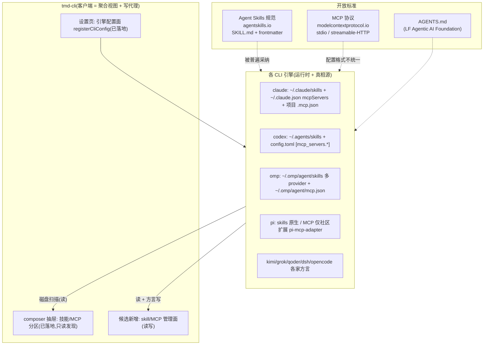

# Skill 与 MCP 集成架构调研:客户端独立管理 vs 委托各 CLI

> 调研日期:2026-09-28。方法:仓库代码事实(scout)+ 各家官方文档/源文件核对(researcher,URL 随条)+ 本机 `~/` 实况取证。
> 结论先行:**skill 走「委托 CLI + 借道 `~/.agents/skills` 公约」,tmd 不做真相源;MCP 走「CLI 为真相源 + tmd 做聚合写面板(按方言代理写入)」,同样不做独立真相源。** 独立管理(自有库 + 分发)被否决,理由见「方案取舍」。

---

## 1. 三者关系:谁拥有数据,谁消费数据

关键区分:**skill/MCP 的「格式与所有权」属于 CLI,「发现与展示」才属于 tmd-cli。**

三层职责:

| 层 | 拥有 | tmd-cli 的角色 |
|---|---|---|
| 开放标准(Agent Skills / MCP / AGENTS.md) | 中立基金会/发起方 | 消费格式知识,**绝不发明私有格式** |
| 具体 CLI | 其配置文件的真相源、加载器、运行时(`--resume`、`/mcp`、`$skill` 唤起、审批、OAuth) | 读聚合;写只经该 CLI 原生格式或 `mcp add` 类子命令代理 |
| tmd 客户端 | 跨引擎统一视图 + 批量操作 + 自身插件(`src/plugins/`,与 CLI 的 skill 是两套体系,勿混) | 管理面宿主 |

一句话:**tmd 是「多引擎的驾驶舱」,不是「多引擎的配置中心」。** 驾驶舱读仪表、拨开关,但不复制一份发动机参数到自己肚子里另存真相。

## 2. tmd-cli 现状(代码事实)

skill/MCP 的**只读发现链已经相当完整**,缺的是「管理(写)」面:

| 能力 | 现状 | 位置 |
|---|---|---|
| 技能发现 | ✅ claude/codex/kimi/qoder(×2)走 `scanSkillDirs`(claude 式目录 + kimi 式平铺双形态);grok 走 `grok inspect --json` | `cli-shared/skillDirs.ts`、各 `cli-*/scanSuggestions.ts` |
| 技能唤起 | ✅ composer `$` 触发符按引擎 translate(claude `/name`、omp/pi/kimi `/skill:name`、grok `/skills name`、codex 原生 `$`) | `kernel/cliProfile.ts`、`kernel/profileSend.ts`、docs/research/cli-trigger-and-session-matrix.md |
| MCP 发现 | ⚠️ 仅 claude(`~/.claude.json` + 项目覆盖)与 codex(TOML)两家 `listMcpServers` | `cli-claude/index.tsx`、`cli-codex/index.tsx` |
| MCP 唤起/引用 | ✅ 抽屉 MCP 分区(codex `$name` insert / claude `/mcp` send) | `composer/drawerItems.ts` |
| 写 CLI 私有配置 | ✅ 成熟先例:`cli-config/io.ts` 三态读壳 + `.bak-tmd` 备份;claude/codex channelApply 行级合并写 settings;omp models.yml;memory-coordinator 写各家 magic-context.jsonc | 各插件 |
| 跑 CLI 子命令采集 | ✅ `queryCliRawJson` / `CachedCliQuery` / `createRpcSuggestionSource` | `cli-shared/cliQuery.ts` |
| 兼容层目录 | ✅ kimi/codex/qoder 扫描清单里已带 `~/.agents/skills` 与项目 `.agents/skills` | scanSuggestions 各文件 |
| skill/MCP 的「管理写」 | ❌ 无任何代码;`mcp` 全库唯一写路径为零 | — |
| tmd 自有插件市场 | ✅(与本题无关的平行体系:`kernel/localPlugins.ts` + `marketPanel`,omp 二级面板有先例) | `app-shell/PluginMarketPage.tsx` |

架构铁律约束(AGENTS.md §1):kernel 不理解 CLI 私有格式;跨插件共享格式进 `cli-shared/`(准入 = ≥2 cli-* 插件消费);新增能力的标准路径 = 插件目录 + `allPlugins` 一行 + `ctx` 注册面。

## 3. 各家 CLI 事实矩阵(2026-09-28,官方文档核对)

### 3.1 Skills —— 已形成事实标准

统一格式 = **agentskills.io 的 `<name>/SKILL.md` + YAML frontmatter(name/description 必填)**,几乎所有家采纳。差异只在**磁盘位置与兼容读取范围**:

| CLI | 用户级位置 | 项目级 | 读 `~/.agents/skills`? | 唤起语法 | 来源 |
|---|---|---|---|---|---|
| claude | `~/.claude/skills` | `.claude/skills` + 插件 skills | ❌(只认自家目录) | `/name` | https://code.claude.com/docs/en/skills |
| codex | `~/.agents/skills`(官方!) | `.agents/skills`(cwd 向上到 repo 根) | ✅ 原生即此 | `$name` / `/skills` | https://developers.openai.com/codex/skills/ |
| gemini | `~/.gemini/skills` 或别名 `~/.agents/skills` | `.gemini/skills` / `.agents/skills` | ✅ 文档明示互操作路径 | `/skills` + activate_skill | https://geminicli.com/docs/cli/skills/ |
| opencode | `~/.config/opencode/skills` + 兼容 `~/.claude/skills`、`~/.agents/skills` | `.opencode/skills` + 同兼容 | ✅ | 原生 skill 工具 | agentskills.io client 列表 |
| pi | `~/.pi/agent/skills` + `~/.agents/skills` | `.pi/skills`、`.agents/skills` | ✅ | `/skill:name` | https://github.com/badlogic/pi-mono …/docs/skills.md |
| omp | `~/.omp/agent/skills` 多 provider 合并(claude/codex/agents/opencode/github 全兼容) | `.omp/skills` 等 | ✅ | `/skill:name` | https://raw.githubusercontent.com/can1357/oh-my-pi/main/docs/skills.md |
| kimi | `~/.kimi-code/skills`(另有平铺 `.md` 形) | `.kimi-code/skills`、`.agents/skills` | ✅ | `/skill:name` | moonshotai.github.io/kimi-code |
| grok | `~/.grok/skills` + `[skills] paths` + `~/.claude/skills` 复用 | `.grok/skills`(向上到 repo 根) | ✅ | `/skills <name>` | 官方 README(xAI Grok Build) |
| qoder | `~/.qoder/skills`(+兼容层) | `.qoder/skills` | ✅(本机实证;tmd 已按此扫) | `/name` | docs.qoder.com 网络不可达,SDK README + 本机取证 |
| dsh | `~/.dsh/skills` + `~/.agents/skills` | `.dsh/skills`、`.agents/skills` | ✅ | plugin 化(skill-filesystem) | deepseek-harness 文档 |

本机实况佐证(`~/.agents/skills` 公约真实生效):用户把 `ccgui-plugin-creator` 一份放 `~/.agents/skills` 即被 omp/pi/kimi/grok/dsh 等共用;`brainstorming` 在 `~/.claude/skills`/`~/.codex/skills` 下是**指向 `~/.codeg/skills` 的 symlink**(Claude 官方支持 skill 目录 symlink)。omp/pi 甚至原生跨读 claude 目录,无需 symlink。

### 3.2 MCP —— 协议统一,配置方言分裂(三方言 + 两特例)

| CLI | 用户级配置 | 项目级 | 子命令 | 传输 | 来源 |
|---|---|---|---|---|---|
| claude | `~/.claude.json` `mcpServers`(local scope) | 仓库根 `.mcp.json`(需 trust) | `claude mcp add/add-json/list/get/remove` | stdio/SSE(dep.)/HTTP/ws | https://code.claude.com/docs/en/mcp |
| codex | `~/.codex/config.toml` `[mcp_servers.*]`(TOML) | 受信项目 `.codex/config.toml` | `codex mcp add/list/login` | stdio/streamable-HTTP(OAuth) | https://developers.openai.com/codex/mcp/ |
| gemini | `~/.gemini/settings.json` `mcpServers` | `.gemini/settings.json` | `gemini mcp add/list/remove` | stdio/SSE/HTTP + OAuth | https://raw.githubusercontent.com/google-gemini/gemini-cli/main/docs/tools/mcp-server.md |
| opencode | `~/.config/opencode/opencode.json` `mcp` 段(`type:local/remote`,**键名不同**) | `opencode.json` | `opencode mcp auth/list/debug` | local/remote + OAuth | opencode.ai/docs |
| omp | `~/.omp/agent/mcp.json` | `.omp/mcp.json` / `.omp/.mcp.json` | 无 shell 子命令;**TUI `/mcp` 管理面板(17 子命令,仓库 academy 实证)** | stdio/HTTP;并**自动导入** claude/cursor/gemini/codex 等外来配置 | oh-my-pi docs/config-usage.md + cli-omp academy |
| pi | ❌ 核心无 MCP;靠社区扩展 `pi-mcp-adapter`(npm 月下载 ~1.12M) | — | — | 由扩展决定 | https://www.npmjs.com/package/pi-mcp-adapter |
| kimi | `~/.kimi-code/mcp.json`(新居;`~/.kimi/config.toml` 仅 `[mcp.client]` 超时残留,无服务器存储) | `.kimi-code/mcp.json` | 无 shell add;TUI `/mcp`(状态面板)+ `/mcp-config`(配置面,本机 dist 双实证) | stdio/HTTP/SSE + deferred | moonshotai.github.io/kimi-code + 本机 dist 取证 |
| grok | `~/.grok/config.toml` `[mcp_servers.*]`(TOML) | `.grok/config.toml` 逐级向上 | `grok mcp add/list/remove/doctor`(shell);**TUI `/mcps` 状态面板(复数,仓库 academy 实证)** | stdio/HTTP + OAuth;兼容导入 claude/cursor | 官方 README + cli-grok academy |
| dsh | Cordis YAML patch(`~/.dsh/cordis.patch.yml`),**非 mcpServers 形状** | profiles 级 | 无 add(走 patch) | stdio/streamable-HTTP | deepseek-harness 文档 |
| qoder | `~/.qoder/shared_client/mcp.json`(标准 `mcpServers` 形状,**本机实证**,非 settings.json) | unknown | unknown | stdio/SSE/HTTP | 本机取证 + SDK README(unpkg) |

分发/集中机制各家自建且互不兼容:Claude plugins+marketplaces、OpenAI plugins、Kimi plugins(`kimi.plugin.json`)、Grok plugins/marketplaces、Gemini extensions、omp plugins、dsh Cordis。**不存在跨厂商 skill/MCP 分发标准。**

## 4. 方案取舍

### 选定方案:委托 CLI(tmd = 聚合视图 + 方言写代理)

**Skill**:真相源永远在 CLI 自己的目录。tmd 做三件事:① 把只读发现补齐到十家(抽屉/右栏统一「技能」视图,含来源徽标:用户级/项目级/插件缓存/兼容层);② 安装 = 按用户选择落进**目标引擎的目录**,或公约位 `~/.agents/skills` 一份多家用(grok/omp 系自动吃到;claude 用户可在管理页勾选「建 symlink 进 `~/.claude/skills`」,这是 Claude 官方支持的行为);③ 启停 = 复用各家原生禁用机制(codex `[[skills.config]] enabled=false`、gemini `/skills disable`、omp frontmatter `hide`),tmd 不自造第二套开关。

**MCP**:真相源在各家配置文件。tmd 新增统一「MCP 服务器」管理页:读 = 十家方言解析(新增 `cli-shared/mcpFormat.ts` 一类共享层,准入天然满足);写 = 每条方言一个适配器,能走 CLI 子命令的优先走子命令(`claude mcp add-json`、`codex mcp add`、`gemini mcp add`、`grok mcp add`),没有子命令的(kimi/omp/opencode/dsh)走文件合并写,复用 `cli-config/io.ts` 的三态读 + `.bak-tmd` 备份纪律;项目级写(仓库根 `.mcp.json` / `.codex/config.toml`)进工作区维度。**tmd 不做任何「tmd 私有 MCP 库」,也不做 MCP 客户端。**

### 否决 A:独立管理(tmd 自建 skill/MCP 库 + 分发安装到各家)

- 违反仓库铁律「单插件/单引擎语义不入 kernel」精神,更违反「内核不理解 CLI 私有格式」——但真正的死因不是架构洁癖:
  1. **双真相源必然漂移**:各家 CLI 的加载是热态(claude `/reload-skills`、dsh 目录 watch、omp provider 优先级、codex 2%/8000 字符预算截断)。tmd 库改了,CLI 不知道;CLI 侧改了(用户手改、`/plugin install`、claude.ai 账号同步、marketplace 升级),tmd 不知道。同步协议要写十份,且各家优先级规则不同(项目级遮蔽、`.agents` 与 `.gemini` 同层谁优先),tmd 复刻这套规则 = 永远追错。
  2. **MCP 独立管理还多一层**:tmd 若持自有注册表,「添加即十家生效」需要往十份方言文件分发写——这等于把方案 B 的适配器全写一遍,**还倒贴一个真相源漂移问题**。分发是 B 的超集,B 免费提供。
  3. **运行时语义不在 tmd 手里**:MCP 审批(`mcp__server__tool` 权限、per-tool approval)、OAuth/pi-mcp-adapter 这类扩展态、enabled/deferred 字段,只有 CLI 自己能执行;tmd 独立库管不了「生效」,只能管「存在」。
- 先例教训同 `2026-09-08-assistant-assets-design.md` 否决 B 的逻辑:各家覆盖极不均 + 双真相源。

### 否决 B':独立管理 + 只装不追(库只做「源」,安装后不管)

比 A 轻,但「一次安装十家生效」仍需十份方言写适配器;而 skill 侧的 agentskills.io 格式统一,装完确实不用追——**skill 可以这样,因为 skill 就是文件**;MCP 不行,因为启停/审批/OAuth 态在 CLI 手里。保留其精华作为 A 失败后的降级路径(见 §6 分阶段)。

### 否决 C:tmd 内置 MCP 客户端(直连各家 mcpServers 配置,自起 stdio/HTTP 进程)

tmd 自己当 MCP host,向 composer 暴露工具。代价:十家 OAuth 流(`codex mcp login`、gemini DCR/RFC9207、kimi `/mcp-config login`)要在客户端复刻;工具审批语义、`CLAUDE_PROJECT_DIR` 注入、trust 模型各家不同;而**模型侧消费者仍是 CLI**,tmd 起的进程模型根本看不见。纯负收益,YAGNI。唯一例外场景(未来若有):tmd 右栏面板想直接展示某 MCP server 的工具清单做探活——用一次性 stdio `tools/list` 冒烟即可,不是常驻客户端。

### 否决 D:经 PTY 驱动各家 `/mcp`、`/skills` 面板完成管理

弹层驱动脆弱(状态机各异、PTY 无回读契约)、不可批量,与「composer 纯透传铁律」冲突。管理操作走文件/子命令,PTY 只留给对话。

## 5. 两方案优缺点对照(核心问题正脸回答)

| 维度 | 委托 CLI(选定) | 独立管理(否决) |
|---|---|---|
| 真相源 | 单一 = CLI 磁盘文件,天然与 CLI 实时一致 | 双份,需同步协议;claude 账号同步/marketplace 升级等旁路写无法追踪 |
| 实现面 | 读适配器 10 + 写适配器 10(其中 6 家可走官方 `mcp add` 子命令,写量骤减);零 kernel、零 Rust 改动(复用 fs_* + queryCliRawJson) | 同样要写 10 份方言(分发=写),再加库存储、冲突合并、漂移检测——B 的全集+债 |
| 启停/审批/OAuth 语义 | 复用各家原生机制,UI 只是代理 | 必须复刻各家规则且永远滞后 |
| 跨引擎「一次配置到处用」 | skill:借 `~/.agents/skills` 公约(已是事实标准,多数家原生吃);MCP:「同步到…」按钮 = 显式复制写适配器(用户拍板每次同步范围),不维护常驻映射 | 理论可全局分发,实际败在漂移与优先级冲突 |
| CLI 格式变更风险 | 坏一个适配器,读面降级为空(现有契约:失败 = 分区空) | 同一风险 + 库迁移风险(存量数据格式要转换) |
| 离线/远程可管性 | 经既有 ssh/wsl/relay 通道对远端文件同样成立 | 库在桌面,远端 CLI 吃不到 |
| 符合仓库铁律 | 是(插件 + cli-shared,内核零知识) | 勉强(独立库若进 kernel 违「跨插件契约」定义;留插件侧则十插件共一份真相,仍要跨插件契约) |

## 6. 落地路径(建议分三段,均为标准插件改动面)

1. **发现补齐(最小)**:各家补 `listMcpServers`(omp/kimi/grok/qoder/opencode/dsh 六家)+ 共享方言解析进 `cli-shared/`(准入满足)。纯读,零写风险,先把「十家 MCP 实况」看全。
2. **MCP 写代理**:新设置 section(registerSettingsSection)+ 统一列表(按来源分组、全局/项目两 scope、启用态徽标)+ 每条方言一个 `addServer/removeServer`,优先子命令其次合并写(`io.ts` 备份纪律)。新增 `mcpManagement` 贡献点进 CliProfile(同 `listMcpServers` 声明式:未声明 = 该引擎无此能力)。
3. **Skill 管理页**:列表(十家来源视图)+ 安装(git URL/本地目录/zip → 目标目录或 `~/.agents/skills`)+ 启停(代理各家原生机制)+ claude symlink 勾选。安装器是纯 fs 复制,无格式转换(agentskills.io 同一规范)。

桩目检与验证:按 `docs/research/cli-trigger-and-session-matrix.md` 先例,每个方言适配器配纯函数单测(样本取自本机真实文件的脱敏 fixture);写路径必须先走 `.bak-tmd` 备份再落盘,失败回滚。

## 7. 风险与未知项

- qoder 官方文档不可达,但用户级 MCP 真相源本机实证为 `~/.qoder/shared_client/mcp.json`(标准 `mcpServers` 形状),格式零未知;TUI 命令仍待复核。
- omp 无 **shell** `mcp add` 子命令,但 TUI `/mcp` 面板实存(17 子命令,仓库 academy 目录实证,2026-09-28 评审复核);管理写面可走 `/mcp` 交互或文件写两条路。
- gemini → Antigravity CLI 迁移(2026-06-18 起)契约是否原样继承:unknown;且 tmd 现无 gemini 插件,暂不影响落地。
- pi 无原生 MCP:管理页对 pi 应显式显示「无(靠 pi-mcp-adapter 扩展)」,不做猜测兜底——对齐内核铁律「缺失显示 `—`」。
- 各家热重载差异(见 4.A.1):写完后不承诺生效时点,UI 提示「下次会话或 `/reload-skills` 生效」即可。
- 安全:MCP 条目可含 env 密钥,管理页展示需脱敏(对齐 settingsRelay 的 sanitize 纪律);写远端机配置走 ssh 通道时同样只读密码不落新盘。

## 8. 参考来源

- 仓库:`docs/superpowers/specs/2026-09-04-composer-cli-sourced-suggestions-design.md`(skill/command 发现设计源头)、`2026-09-08-assistant-assets-design.md`(资产类功能的方案否决先例)、`docs/research/cli-trigger-and-session-matrix.md`(唤起语法实证)。
- 外部:agentskills.io;code.claude.com/docs/skills 与 /mcp;developers.openai.com/codex/skills 与 /mcp;geminicli.com/docs/cli/skills 与 gemini-cli docs/tools/mcp-server.md;opencode.ai docs;github.com/badlogic/pi-mono skills.md;github.com/can1357/oh-my-pi docs/skills.md 与 config-usage.md;moonshotai.github.io/kimi-code customization/plugins;xAI Grok Build README;github.com/deepseek-ai/deepseek-harness;agents.md;npmjs.com/package/pi-mcp-adapter。
