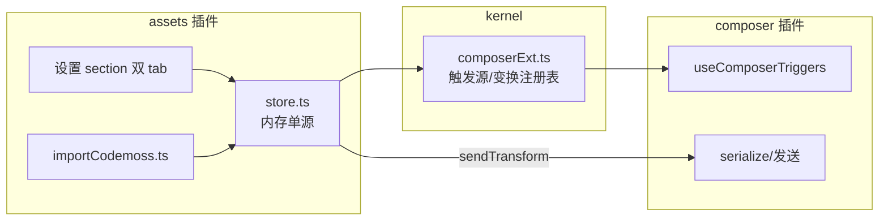

# 智能体 / 提示词资产:composer 双触发 + 设置管理

日期:2026-09-08
状态:已落地(实现随 fa24fa3 提交,7e38156 补漏提类型声明;实现对照与遗留标记见文末)

## 背景与目标

对标 codemoss(~/code/AI/github/codemoss)「智能体 / 提示词」模块:私有 `~/.ccgui/agent.json` + 每词一个 md 提示词库,composer `#` / `!` 消费,发送时做文本注入(智能体尾拼角色块 / 提示词展开),零协议、任意引擎可吃。

tmd 是 10 引擎多 CLI 客户端,完全复刻有三处硬伤:

1. codemoss 全局提示词建在 `~/.codex/prompts` —— codex 自 ~0.117 已废弃 custom prompts,本仓库 `cli-codex/scanSuggestions.ts` 已标「死配置不扫」;
2. tmd 的 composer 已把各 CLI 原生 commands / skills 经 `/` `$` 接入(claude commands 本质就是带参数的提示词模板),再建私有库须划清边界,避免双真相源;
3. codemoss 内置 248 个智能体目录(打包资源 + manifest + sha256 校验)是重资产。

目标(v1):

1. **提示词库**:全局 + 工作区两级,composer `!!` 触发,选中把正文插入输入框,`$NAME` 占位符手填;
2. **智能体**:composer `##` 触发选中(徽章挂 composer 工具栏),发送时在文本尾拼角色块,全引擎零协议生效;
3. **codemoss 数据导入**:一键合并 `~/.ccgui/agent.json` + `~/.codex/prompts/*.md`,另给目录自选导入兜底;
4. **输入框右侧两个唤醒图标**:不记触发符也能用。

## 方案取舍

**选定:tmd 私有资产库 + kernel `composerExt` 契约。** 新插件 `src/plugins/assets/` 经 kernel 注册表向 composer 贡献两个触发源与一个发送变换;存储全走既有 `fs_*` 通用原语,**Rust / kernel 既有模块零改动**(仅新增一个契约文件与一个挂载点成员)。

**否决 A:完全复刻 codemoss。** 理由即背景三条:废弃目录、双真相源、重资产目录;且 `#` / `!` 单字符与 claude REPL 原生语义(bash 模式 / memory 快捷)冲突(用户裁决,改双字符)。

**否决 B:只做 CLI 原生资产管理(claude subagents / commands 等)。** 各家覆盖极不均(codex prompts 已废弃、kimi / grok 无原生提示词概念、智能体仅 claude / omp 系有),与 tmd 多引擎统一定位冲突;原生 commands / skills 已由 `/` `$` 良好消费,无需再管。

**否决 C:codemoss 的 `/prompts:<name> K=V` 键入式展开与发送时 `$ARG` 展开。** 有 `!!` 选择器后属第二入口,占位符手填已够用;YAGNI。

**否决 D:codemoss 块里的 `Agent Icon:` 行。** 对模型无语义,图标只在 UI 展示。

## 架构



- 新插件 `src/plugins/assets/`,一切贡献(设置 section / 触发源 / 发送变换 / inputRail 图标 / statusBar 徽章)经 `activate(ctx)` 注册;`src/plugins/index.ts` 的 `allPlugins` 加一行。
- kernel 新增 `src/kernel/composerExt.ts`(约 60 行):纯注册表,零插件私有知识,符合「跨插件基础契约进 kernel」。
- 存储:`~/.tmd-cli/` 平铺,全部经 `ipc.fsReadFile / fsWriteFile / fsCreateDir / fsTrashEntry / fsWalkFiles` 通用原语,路径知识留插件侧。

### 存储布局

| 资产 | 路径 | 格式 |
|---|---|---|
| 智能体 | `~/.tmd-cli/agents.json` | `{agents: Record<id, Agent>, selectedBySession: Record<sessionId, id>}` |
| 提示词 · 全局 | `~/.tmd-cli/prompts/<name>.md` | frontmatter `description` / `argument-hint` + 正文 |
| 提示词 · 工作区 | `~/.tmd-cli/workspaces/<wsId>/prompts/<name>.md` | 同上 |

```ts
interface Agent {
  id: string;            // 创建时 `agent-${crypto.randomUUID().slice(0, 8)}`(ssh 插件先例)
  name: string;
  icon?: string;         // 单个 emoji 字符;缺省渲染 phosphor Robot
  prompt: string;        // 角色正文
  createdAt: number;
}
```

- 提示词文件名即显示名:禁 `/` `\` 与控制字符,trim 后非空;大小写不敏感判重。
- 工作区目录按 **tmd workspace id**(workspaces.json 的 id)分目录,不写入用户仓库;composer 侧以 cwd(root)反查 wsId(kernel/workspace 模块状态),查不到 = 仅全局级。
- 内存 store 单源:`activate` 时 load,设置页写操作落盘并同步内存,composer 只读内存;外部手改文件不 watch,重开生效(v1)。
- 原子性:文件均小,`fsWriteFile` 整写即可,不做临时文件周转。

### kernel/composerExt.ts 契约

```ts
/** CLI 无关的 composer 触发源(资产/片段等),与 profile.triggers 并行合并。 */
export interface ComposerTriggerSource {
  /** 触发符,支持多字符。例:"!!" / "##"。 */
  char: string;
  /** 候选面板分区名。 */
  label: string;
  /** 同步返回候选(读内存 store);cwd 供工作区级过滤。 */
  list(cwd: string): CliSuggestion[];
  /** 选中后替换 token 的文本;缺省 = char + value。提示词 = 正文(cwd 供工作区级解析)。 */
  insertText?(s: CliSuggestion, cwd: string): string;
  /** 选中副作用(智能体 = 置选中不写文本);声明后 insertText 缺省改空串。 */
  onPick?(s: CliSuggestion, sessionId: string | null): void;
}

/** 发送前文本变换,在 translatePrompt 之后、CR / bracketedPaste 包装之前执行(注册序)。 */
export type ComposerSendTransform = (text: string, sessionId: string | null) => string;

/** 唤醒桥:composer 挂载时交接 useComposerTriggers 的 wakeTrigger;inputRail 图标经它拉起候选,未挂载(欢迎页)= null。 */
export const composerWakeRef: { current: ((char: string) => void) | null } = { current: null };

export function registerComposerTriggerSource(src: ComposerTriggerSource): () => void;
export function registerComposerSendTransform(fn: ComposerSendTransform): () => void;
export function composerTriggerSources(): readonly ComposerTriggerSource[];
export function composerSendTransforms(): readonly ComposerSendTransform[];
```

### composer 插件改动面(5 处小改,均向后兼容)

1. `serialize/serialize.ts` `findActiveTrigger`:单字符比较(`before[i] === char`)改 `lastIndexOf` 取最后一次出现、token 内含空白即无效 —— 支持多字符触发符,单字符行为不变;`serialize.test.ts` 补 `!!` `##` 用例。
2. `useComposerTriggers.ts`:`triggerSpecs = profile.triggers ∪ composerTriggerSources()`;新增 `wakeTrigger(char)`:在光标处插入触发符并聚焦 textarea,候选面板自然弹出;模块级 `autoInsertedRef` 记录,Esc / blur 未选中且 needle 仍为空 → 回收插入字符(用户手敲的触发符不回收)。
3. `applyPick`:charSpec 判定改 `startsWith`(多字符);命中 ext source 走 `insertText` / `onPick`。
4. `triggers/suggest.ts`:`lookupSuggestions` 以 `"list" in triggerSpec` 前置识别 ext source,同步 `list` + 前缀过滤(extMatches,与静态表共用 `MAX_CANDIDATES` 上限)。
5. `serialize.ts` `prepareSendPayload(profile, text, transforms = [])`:translate 之后、包装之前依序执行 transform。**仅 `Composer.sendCurrent`(用户自然语言消息)传 `composerSendTransforms()`;抽屉 `sendFromDrawer` 与工具栏 `sendSlash` 发送的是 `/model` 一类命令,不传 transform**;`agentBlock` 自身再带「wire 以 `/` 开头 = 跳过」守卫(用户手敲 `/clear`、`$skill` 经 translate 变 `/skill:*` 等命令形态一律不拼角色块)。

### MountPoint 扩展

`src/kernel/plugin.ts` 联合新增一员:

```ts
| "composer.inputRail"   /** composer 输入区右缘竖向图标列(唤醒入口)。 */
```

Composer 在 textarea 容器右上角渲染 `<Mounts point="composer.inputRail" />`(绝对定位 `right-2 top-2`,flex-col);与 AnchorRail(右缘锚点 dash 导航)垂直错开,实现时目检避让。`composer.statusBar` 既有挂载点承接智能体徽章。

## 消费行为

### `!!` 提示词

- 候选:工作区级在前、全局在后(同作用域按名称排序);同名(大小写不敏感)时工作区条目**覆盖**全局条目(实现定稿行为,见文末实现对照);`value` = 名称,`description` = `desc`(有 hint 时追加 ` · 参数: <hint>`)。
- 选中:`insertText` = 提示词正文,替换 `!!token`;`$NAME` 大写占位符原样保留,用户手填。
- 与 shell / claude bash 模式无冲突:弹窗只是候选,未选中发送 = 原文透传;裸 `!!` 弹全量候选(与裸 `/` 一致,唤醒图标正依赖此行为),shell 历史展开 `!!` 场景照打 Esc 或继续输入即可,文本不被改写。

### `##` 智能体

- 候选:`value` = 名称,`description` = prompt 首行截断(60 字)。
- 选中:不写文本(token 回收),徽章出现在 `composer.statusBar`(icon + 名称 + × 清除);选择按 sessionId 持久化到 `agents.json` 的 `selectedBySession`,切会话各自记忆。
- 发送变换:有选中 → `text + "\n\n## Agent Role and Instructions\n\nAgent Name: <name>\n\n<prompt>"`(codemoss 块格式,去 icon 行)。
- 选中 agent 被删:transform 静默跳过(fail-open 发原文),徽章同时消失(store 订阅)。

### 唤醒图标(inputRail 双图标)

- phosphor `Robot`(智能体 `##`)/ `Quotes`(提示词 `!!`),tooltip 附触发符提示。
- 点击 = `wakeTrigger("##" / "!!")`(见 composer 改动 2)。

## 设置 section(「智能体 / 提示词」,内部双 tab)

经 `ctx.registerSettingsSection` 注册,布局对齐 codemoss 截图:

- **智能体 tab**:列表(icon + 名称 + prompt 首行)/ 新建 / 编辑(名称、icon、prompt)/ 删除(确认后整写 agents.json)。
- **提示词 tab**:作用域筛选(全部 / 全局 / 工作区)+ 搜索(名称 / 描述);新建 / 编辑(名称、描述、参数提示、正文)/ 删除(`fsTrashEntry` 进废纸篓)/ **移到工作区 ⇄ 全局**(读 + 写 + 废纸篓三步,`fsRenameEntry` 只支持同目录)。
- **「从 codemoss 导入」**(section 顶部):
  1. 自动合并 `~/.ccgui/agent.json`(id 冲突换新 id、名称加 `(2)` 后缀;`selected_agent_id` 不迁);
  2. 自动扫 `~/.codex/prompts/*.md` 拷入全局库(撞名跳过);
  3. 「从目录导入…」:`pickDirectory` 选任意 md 目录(codemoss 工作区级在其 app-data 内、bundleId 不可知,由此兜底),全部拷入全局库;
  4. 结果行内反馈:导入 N 条、跳过 M 条。

## 插件内部件(300 行铁则拆分)

```
src/plugins/assets/
  index.tsx            activate:注册双触发源 / transform / 徽章 / 双图标 / 设置 section
  store.ts             agents.json + prompts 两级目录读写、内存单源 + 订阅
  promptMd.ts          md ⇄ 提示词序列化(复用 cli-shared/frontmatter 的 parseFrontmatter)
  agentBlock.ts        角色块拼接 + transform 实现
  importCodemoss.ts    三源导入合并
  view/AgentTab.tsx    智能体列表 + 编辑器
  view/PromptTab.tsx   提示词列表 + 编辑器
  view/WakeIcons.tsx   inputRail 双图标
  view/AgentBadge.tsx  statusBar 选中徽章
```

## 明确不做(v2 候选)

内置智能体目录(打包 248 agent);通用导出 JSON;右栏快捷面板;命令抽屉分区;使用热度排序;`K=V` 结构化传参与发送时展开;外部手改文件的 watch 热更;`selectedBySession` 的失效会话清理(文件增长可忽略)。

## 验证

- 单测:`findActiveTrigger` 多字符(单字符回归不破);composerExt 注册 / 反注册;store 读写与坏文件兜底;`promptMd` frontmatter 往返;`agentBlock` 拼块与 agent 被删 fail-open;`importCodemoss` 合并 / 撞名跳过;`applyPick` 的 `insertText` / `onPick`。
- 全链:`pnpm typecheck && pnpm test && pnpm check:arch-boundary && pnpm check:file-size && pnpm build`。
- 桩目检(1421 + `__TAURI_INTERNALS__` 桩,`fs_*` 兜底):设置页双 tab CRUD、`!!` / `##` 触发与过滤、双图标唤醒 + Esc 回收、徽章选中 / 清除、导入按钮;发送文本断言(桩截 `host.writeSession` payload 验证尾拼块)。
- `pnpm tauri:dev` 真窗口全流程,claude 会话实测 `##` 注入与 `!!` 插入。
- 顺手:composer placeholder 双变体文案补「!! 提示词 / ## 智能体」提示(t() 源串,字典随 i18n 线同步)。

## 实现对照(2026-09-08,基于 fa24fa3 + 7e38156 + 工作区在途)

v1 范围全部落地:双触发源 / 发送变换 / 状态栏徽章 / 双唤醒图标 / 设置双 tab / codemoss 三源导入 / placeholder 双变体提示(验证节「顺手」项已完成)。单测 44 例绿(assets 4 文件 + serialize 多字符用例)。

### 重大差异(⚠ 按实现为准)

1. **同名提示词:工作区覆盖全局** —— spec 原稿只约定「工作区级在前、全局在后」;实现 `visiblePrompts` 按名称(大小写不敏感)去重,同名时工作区条目**隐藏**全局条目(`promptSuggestions` 与 `promptContent` 共用同一可见性规则,候选与插入内容不会不一致)。行为增强,按实现验收,已回写上文消费行为节。
2. **提示词命名 sanitize 而非拒绝** —— 本 spec「禁 `/` `\` 与控制字符」原意非法即拒;原实现 `sanitizePromptName` 把非法字符剥除后判空(`a/b` 落盘为 `ab`),编辑弹窗无警示。**已收紧(2026-09-09)**:`promptMd.isValidPromptName` 在 `savePrompt` 入口拒绝(返回 false),弹窗报「名称含非法字符…」;sanitize 剥离版保留给导入路径。
3. **实现未经独立评审与目检** —— 午后全量代码评审范围 `83dbfd5..7389929` 不含 fa24fa3;fa24fa3 提交时 HEAD 类型检查断裂(`composer.inputRail` 挂载点类型声明漏提,7e38156 补修),说明提交前全链未跑全。**处置(2026-09-09)**:验证节桩目检已全场景执行通过(记录见文末「桩目检记录」);单测缺口与持久化静默已修;`pnpm tauri:dev` 真窗 claude 实测与独立代码评审仍待(需用户环境 / 另行安排)。

### 小差异(记录备查)

- 契约微调(已回写上文):`insertText` 增 `cwd` 参数(工作区级正文解析需要);kernel 新增 `composerWakeRef` 唤醒桥;`suggest.ts` 以 `"list" in triggerSpec` 前置识别 ext 源而非 switch default 分支。
- 导入入口按 tab 分置(智能体 tab 导 `~/.ccgui/agent.json`,提示词 tab 导 `~/.codex/prompts` 与「从目录导入…」),非原稿的「section 顶部」单入口。
- agent 导入恒生成新 id(原稿「id 冲突换新 id」实现为不保留原 id,结果等价);设置 tab 名「提示词库」;`fsWalkFiles` 上限 2000 条;`view/AssetsSection.tsx` 未建(双 tab 直接经 `registerSettingsSection.tabs` 注册,少一个文件);composer 侧 `DragOverlay.tsx` 自 Composer.tsx 拆出系 300 行铁则的顺带重构。
- 徽章 icon 仅 `\p{Extended_Pictographic}` 命中才渲染 emoji,非 emoji 串回退 Robot;徽章样式同期改扁平文字态(工作区在途,未提交)。

### 遗漏处置(2026-09-09)

1. ~~`composerExt` 注册/反注册、`applyPick` 的 insertText / onPick、`wakeTrigger` 注入与 Esc 回收均无单测~~ **已补(2026-09-09)**:`kernel/composerExt.test.ts`(注册序 / 反注册 / 唤醒桥)+ `useComposerTriggers.test.ts`(applyPick/wake/dismiss 抽为纯函数 `pickReplacement` / `wakeInsert` / `dismissRecovery` 直接测;hook 装配层维持无渲染测试惯例)。
2. ~~持久化失败静默~~ **已修(2026-09-09)**:`saveAgent` 写盘失败回滚内存并返回 null,`savePrompt` 写盘失败返回 false(此前是向上 throw,还会炸断导入循环),导入侧按跳过计数;两弹窗与移动按钮均有失败文案,store.test 补 3 个失败路径用例。
3. ~~桩目检~~ **已执行(2026-09-09,1421 + `__TAURI_INTERNALS__` 桩,场景见文末)**;真窗 claude 实测仍待。

### 桩目检记录(2026-09-09,headless Chromium + 1421 dev server)

全部通过:设置双 tab 断言;智能体新建(小张 / 🤖 / prompt)→ 卡片 + `agents.json` 落盘;提示词新建、非法名 `a/b` 拒绝并报错文案、搜索过滤与空态、移到工作区(文件物理挪至 `workspaces/ws1/prompts/`)⇄ 移回全局、删除;placeholder 双变体提示;`!!` 唤醒 → 候选(deploy / 标准部署流程)→ 选中正文替换 token(`$NAME` 保留);唤醒注入后 Esc 一字未改回收;`##` 候选(prompt 首行描述)→ 选中 token 回收 + 状态栏徽章(🤖小张)+ × 清除(同步清 `selectedBySession`);发送断言 `session_write` 载荷 = `消息\n\n## Agent Role and Instructions\n\nAgent Name: 小张\n\n<prompt>\r`,`/` 命令形态与无选中均不拼块。

桩配方新增(后续复用):`session_list` 必须回**完整 SessionMeta**(`profileId` / `cwd` / `kind`,spawn 装配链以 Rust 注册表为准刷新,只回 `{id,pid}` 会让 composer 拿不到 profile 而整条触发链静默失效);齿轮菜单只认真实鼠标坐标点击,程序化 `.click()` 会被外点关闭逻辑吞掉;长流程必须单胞内完成(菜单/弹层态活不过 `tab.run` 胞边界)。
