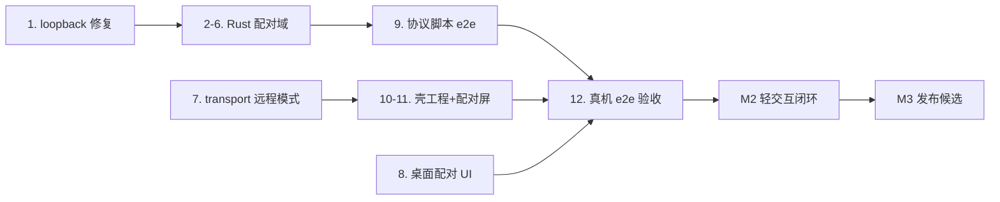

# mobile app 实施总计划(总纲)

> 日期:2026-09-21 · 状态:生效中(**M1 已收口** 2026-09-22:LAN/relay 双通道 e2e + iPhone 真机扫码配对全绿,提案已归档;M2 细化中,M3 待 M2 收口)
> 上游:设计 spec `2026-09-21-mobile-app-design.md`(已评审通过);M1 提案与任务分解 `openspec/changes/archive/2026-09-21-mobile-app-m1-pairing/`
> 本文 = 贯穿整体任务的总计划:终态定义 → 里程碑切分 → 关键路径 → 风险。每个里程碑各有一份 openspec 变更提案承载实施细节。

## 终态(执行完毕的验收面)

一句话:**iPhone 装上 tmd-cli app 后,经外网(蜂窝 × relay)或内网(同 Wi-Fi × LAN)连上桌面,spec v1 定义的轻交互业务功能全部正常操作。**

终态验收清单(真机实测,全绿才算整体任务完成):

1. **安装与配对**:开发者签名侧载安装;扫码或粘贴完成配对;桌面人工授权;凭证持久(app 重启免重配)。
2. **双通道**:同 Wi-Fi 走 LAN 直连;蜂窝/外网走 relay;两条路各自连通可用,支持自动竞速 + 手动切换。
3. **业务功能(spec v1 轻交互)**:
   - 会话列表:工作区分组、引擎字形、状态点、审批徽记,与桌面同一份数据;
   - 会话实况:磁盘先行回放 + 活流旁观,终端字节原样透传,手机只读不写 PTY;
   - composer 发送:与桌面同一条 RPC,Enter 发送;
   - 审批应答:ask 卡允许/拒绝,与幕布按键同一条应答 RPC;审批线摘要只读可见。
4. **韧性**:切后台回前台自动重连,按磁盘水位回放补齐错过的输出,内容零丢失;断连期列表快照可见。
5. **安全**:每设备独立凭证、桌面可随时撤销,撤销即 4001 掉线回配对屏;AppDevice 命令域裁剪(不可写 fs/git、不可 spawn 会话、不可 SSH);手机端永远不能自批配对。
6. **协议治理**:hello version/capabilities 不满足壳最低要求 → block 屏明说;审批请求/会话空闲在 app 前台或短暂后台时弹本地通知。

## 里程碑总览

| 里程碑 | 范围 | 通道 | 出口条件 | 变更提案 |
|---|---|---|---|---|
| **M1 配对底座** | 桌面身份/设备表/配对流/双凭据 gate/dispatch scope/hello caps/桌面配对 UI/壳脚手架 + transport 远程模式 + 配对屏(粘贴先行)/协议脚本;前置修复 relay loopback 断链(P1 存量) | LAN + relay 双通 | tasks.md §12 验证全绿:真机粘贴配对→授权→远程 home 列表→实况;两通道各通;撤销 4001;门禁全绿 | `openspec/changes/2026-09-21-mobile-app-m1-pairing/`(已出) |
| **M2 轻交互闭环** | 移动断点 UI(侧栏折叠/composer 自适应/ask 审批卡/RemoteHostBar 通道切换)/本地通知/相机扫码(若 M1 降级)/凭证 app-data + iOS 钥匙串/徽标设备名 hover/审批线摘要只读 | 双通 + 手动切换 UI | 终态清单 3、4、6 全绿 | M1 收口后另起 |
| **M3 v1 发布候选** | 真机矩阵(主力 iPhone × iOS 版本)/长会话与大回放 soak/relay 自有 CF 部署文档化/architecture/12 契约定稿/版本发布/Android 壳评估(评估不承诺) | 双通 | 终态清单 1-6 全绿 + 发布物(侧载 ipa + 更新日志) | M2 收口后另起 |

M1 收口后的业务面达成度:**能连上、能看列表与实况**(UI 未移动化打磨);M2 收口后:**业务功能全可操作**;M3 收口后:**达终态、可发布**。

## 关键路径与依赖

- 行政依赖(容易卡关键路径,提前办):Apple 开发者账号可用、bundle id 与签名团队(M1 任务 10.3 前就绪);relay 用自有 Cloudflare 账号(已有,web-access WAN 同款)。
- 并行面:Rust 配对域(2-6)与 transport/壳(7/10-11)可并行;桌面 UI(8)独立;协议脚本(9)是 Rust 域的首个验收者。

## 风险登记

| 风险 | 影响 | 对策 |
|---|---|---|
| relay loopback 修复牵出 Worker 侧问题 | M1 收口顺延 | 概率低(隧道 generic 已实读);协议脚本第一时间实测 |
| iOS webview localStorage 被系统清理 | 凭证丢 → 重新配对 | M1 接受(代价=重配一次);钥匙串归 M2,若频发则提前 |
| 相机扫码插件集成不顺 | 扫码体验降级 | M1 粘贴/手输保底不阻塞;扫码归 M2 |
| 真机签名/证书行政阻塞 | e2e 验收敛后 | 模拟器先行开发;真机验收可迟但不跳过 |
| 大回放场景性能未知 | M3 soak 才发现 | M2 末用真实大会话(90 天级)提前摸底 |

## 变更提案落点

- M1:`openspec/changes/2026-09-21-mobile-app-m1-pairing/`(proposal + tasks 已出,待评审开工)。
- M2/M3:各起 `openspec/changes/YYYY-MM-DD-mobile-app-mN-*/`,在前一里程碑收口后细化;本总纲随里程碑推进回写状态。
