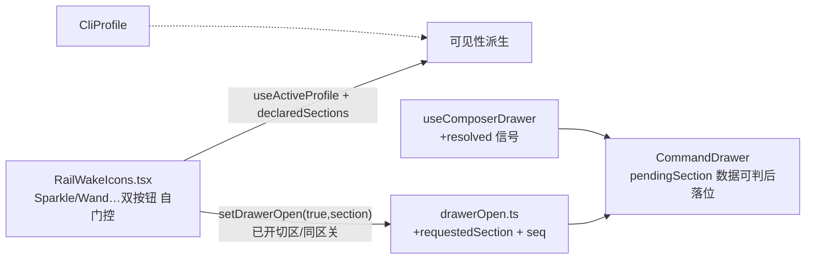

# Composer 底栏技能/MCP 唤醒双图标(输入轨直开抽屉分区)

<!-- 2026-09-28 批次 A 评审回写:qoder 行字序统一为「仅展示 · 无引用语法」;新增发现层 i18n 纪律(description 存源串,渲染期 t)。 -->

日期:2026-09-28(同日经双视角评审裁决修订为 v2,记录见 `docs/review/2026-09-28-composer-skill-mcp-rail-review.md`)
状态:已实现(两批次实施评审见 `docs/review/2026-09-28-skill-mcp-rail-implementation-review.md`;真机目检待大仙)

## 背景与目标

前提裁决(见 `docs/research/skill-mcp-integration-architecture.md`):skill/MCP 管理委托各 CLI,tmd 不做独立真相源;本 spec 只解决**引用/触发的交互面** —— 让用户在对话框附近一步够到技能与 MCP,不管理、不写盘。

现状:composer 底部输入轨(`composer.inputRail` 挂点)已有 4 个图标 —— assets 唤醒双图标(智能体 `##`、提示词 `!!`,order 0)、图块广播(order 40)、提示词增强(order 50)。技能与 MCP 的引用入口藏在命令抽屉(⌘K / 工具条开关)之后。数据链已通:`CliProfile.listSuggestions("skill")` 多数引擎有磁盘发现,`declaredSections()` 按 profile 声明派生分区,抽屉条目点击已走 `$name` insert / translate 全管线。

目标:

1. 输入轨 4 图标后新增 2 个图标:技能、MCP;点击 = 弹出命令抽屉并**直接定位到对应分区**(即「小弹窗」);
2. 图标可见性与引擎能力严格同步(**图标诚实性**):声明了技能触发符且有 `listMcpServers` 才亮;远程引擎会话(`isRemoteEngineSession`)本机磁盘数据不可信 → 双图标不出现;
3. 发现补齐到 **omp / kimi / grok / qoder**(qoder 经共享工厂覆盖国际+国内双分发版)—— 四家格式均已本机实证,零未知项。

**可见性矩阵(实施与目检照此对表):**
技能图标 = 除 dsh(`triggers: []`)/ opencode(仅 `/` `@`)外的八家;**qoder 已声明 `$` skill 触发(契约测试钉死)**。
MCP 图标 = claude/codex(现有)+ omp/kimi/grok/qoder(本 spec 补齐)六家。
两图标都不亮 = dsh / opencode;仅技能不亮 = 无(技能亮的八家里 MCP 六家不亮时只出单枚)。
非目标:管理写面、tmd 私有库、MCP 客户端、远程会话扫描修复(既有洞,另案)。
## 方案取舍

**选定:双图标 = 抽屉分区的唤醒入口;落位 = 数据可判后一次性落位(评审 P0-1 裁决)。**
交互 = 点击 → `setDrawerOpen(true, "skill"|"mcp")`;**不**在打开瞬间消费一次性状态 —— 抽屉数据两阶段(先静态后异步),claude/codex 静态技能表为空,打开瞬间判定「无条目」必然误回落。改为:CommandDrawer 持 `pendingSection`;`useComposerDrawer` 暴露动态解析完成信号;已解析且分区有条目 → 落该分区,否则回落「全部」;items 变化时当前 tab 不在新 sections 内 → 顺手归一「全部」。
键盘(↑↓/Enter)、两阶段加载、三动作全继承,抽屉本体即小弹窗。
**否决 A:** 复用 assets `wakeTrigger("$")` —— 注入脏草稿、技能触发符非十家通用、MCP 无触发语法。
**否决 B:** 独立浮层 —— 抽屉已带全部能力,双真相交互。
**否决 C:** 置灰 —— 违反「缺失不猜测兜底」;隐藏才诚实。
**图标裁决(评审 P0-2):** 技能 = `Sparkle`(与抽屉 `SECTION_TAB_ICONS.skill` 同源锚点,不动);MCP = `HardDrive`(同源锚点,不换)。**撞形方让路**:`prompt-enhancer/EnhanceButton`(order 50)同用 Sparkle 且无条件渲染 → 改 `Wand`(Phosphor,语义=改写/增强),同步其对话框与插件市场元数据图标。同排两枚同形异义图标禁止。

## 架构

改动面(**行数账已核,300 铁则不破**):
| 文件 | 改动 | 行数账 |
|---|---|---|
| `state/drawerOpen.ts` | 加 `requestedSection` + emit seq;带 section 时绕过 `open===next` 早退并 emit;关闭即清 | 39 → ~70 |
| `view/RailWakeIcons.tsx` | 新增:`useActiveProfile()` + `declaredSections()` + 远程会话闸,组件内直接派生(**不建 railSections store**,Composer.tsx 299 行零改动) | 新 ~60 |
| `view/CommandDrawer.tsx` | pendingSection 落位机制 + tab 归一 + `aria-expanded` | 260 → ~285 |
| `view/useComposerDrawer.ts` | 暴露动态解析完成信号 | +~6 |
| `index.ts` | `ctx.contribute("composer.inputRail", { order: 60, component: RailWakeIcons })` | +1 |
| `src/styles/composer-anchors.css` | `.composer-rail-btn`(~15 行,抄 `.assets-wake-btn`,归属正确:composer 铬类样式进此文件先例 = `.composer-broadcast-btn`) | 232 → ~247 |
| `locales/en` + `ja` | title「技能($)」「MCP 服务器」×2 + 适配器描述串(「仅展示 · 无引用语法」等) | — |
| `cli-shared/tomlMcp.ts` | 新增:`[mcp_servers.*]` TOML 段提取纯函数(准入 = codex 重构消费 + grok 新消费);契约单测 | 新 ~50 |
| `cli-codex/index.tsx` | 重构消费共享解析器 | -10 |
| `cli-omp` / `cli-kimi` / `cli-grok` / `cli-shared/qoderPlugin.tsx` | 各加 `listMcpServers` 适配器(模式照 `extractClaudeMcpServers`) | 各 +~35,均远低于线 |
| `prompt-enhancer/EnhanceButton.tsx` + `index.ts` | Sparkle → Wand | ±3 |

**已开状态机(评审 P1-3 裁决,单测覆盖):**
① 抽屉关 → 点图标:开 + 落指定分区(数据可判后);
② 抽屉已开@A → 点 B:即时切 B(带 section 的 set 绕过早退并 emit,抽屉订阅即时切区);
③ 抽屉已开@A → 点 A:关闭(对齐 ⌘K/工具条 toggle 惯例);
④ 任何关闭(×/Esc/⌘K/点外)清 `requestedSection`,不许悬留到下次开合。

## 四家引擎发现细节(纯读,解析失败 = 空数组)
| 引擎 | 真相源 | 条目点击语义(均有实证) |
|---|---|---|
| omp | `~/.omp/agent/mcp.json` + 项目 `.omp/mcp.json` / `.omp/.mcp.json`(`mcpServers` 键) | **send `/mcp `**(academy 实证 17 子命令,管理面板入口,同 claude 语义) |
| kimi | `~/.kimi-code/mcp.json` + 项目 `.kimi-code/mcp.json`(旧居 `~/.kimi/` 无服务器存储,**不扫**) | **send `/mcp `**(dist 取证 = "Show MCP server status";`/mcp-config` 为配置面,非本入口语义) |
| grok | `~/.grok/config.toml` `[mcp_servers.*]` + 项目 `.grok/config.toml`(cli-shared 解析器) | **send `/mcps `**(academy 实证,注意复数) |
| qoder | `~/.qoder/shared_client/mcp.json`(标准 `mcpServers` 形状,本机实证;经 `qoderPlugin.tsx` 工厂一次覆盖双分发版) | TUI 命令未实证 → **展示性条目**:description 前置「仅展示 · 无引用语法」,验证后升级 |

## 验证
1. 单测:`drawerOpen` 三路径(开→换区/开→同区→关/关闭清请求态);CommandDrawer 落位决策(**claude 形状**:静态空 + 异步有条目,断言最终停技能;指定分区无条目回落「全部」;tab 归一);`cli-shared/tomlMcp.ts` 契约;omp/kimi/grok/qoder 解析各 1 组脱敏 fixture。
2. 1421 桩目检:claude 会话 → 轨上 6 图标,点 Sparkle → 抽屉开停技能区;点 HardDrive → 停 MCP 区;连点换区/同区关;↑↓/Enter 与 insert/send 不回归;dsh 会话两图标均不出现。
3. stale:点 MCP 图标 → 切 qoder 会话(图标消失)→ ⌘K 重开必须回落「全部」;抽屉保持打开切会话,tab 归一。
4. 远程会话(桩带 engine):双图标不出现。
5. prompt-enhancer Wand 换形后增强对话框/市场元数据图标一致性目检。
6. `pnpm typecheck && pnpm test && pnpm check:arch-boundary && pnpm check:file-size && pnpm build` 全绿;`npx react-doctor@latest -y` 100。
7. 真机 `pnpm tauri:dev`:claude/codex/omp 各引用一条走通。
## 风险与遗留(评审裁决后余量)

320px 窄屏目检确认 nowrap 无溢出即可,**不加** flex-wrap(换行垂直跳动更糟)。
远程会话下抽屉本体的本机扫描错误属既有洞,图标隐藏已止血,修复另案。
dsh/opencode 无图标态的抽屉 ⌘K 入口不受影响(无会话时 ⌘K 本就 when 门控禁用,非本入口退化)。
omp 项目级双文件名(`.omp/mcp.json` 与 `.omp/.mcp.json`)按 omp 文档双扫,同名项目覆盖全局。
